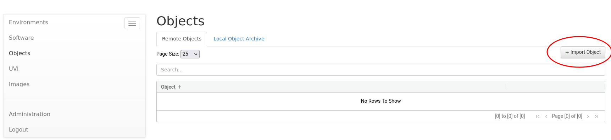
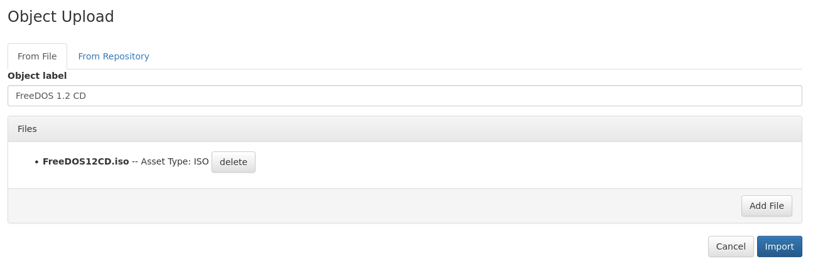
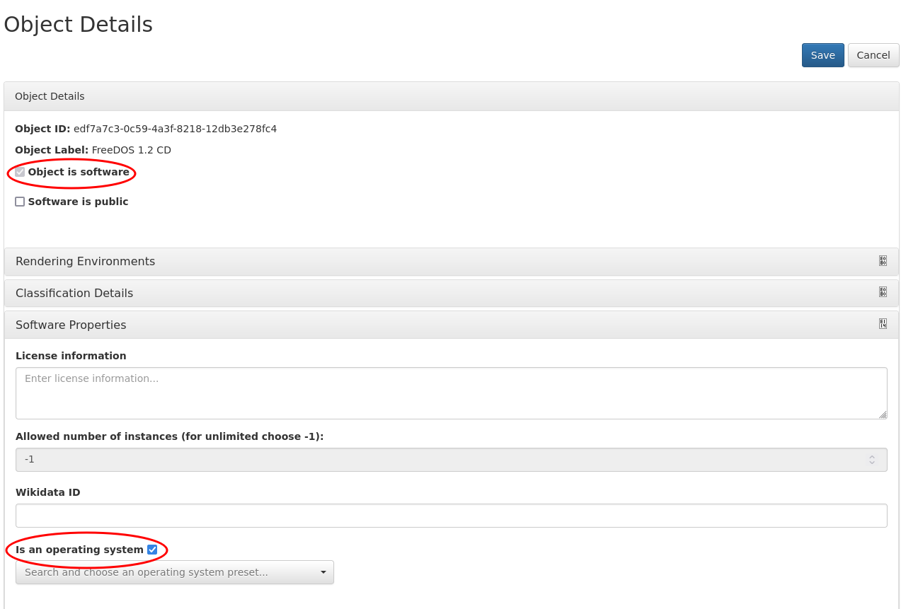
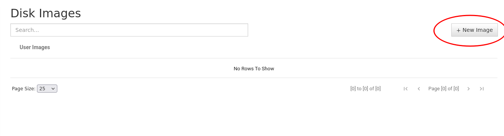
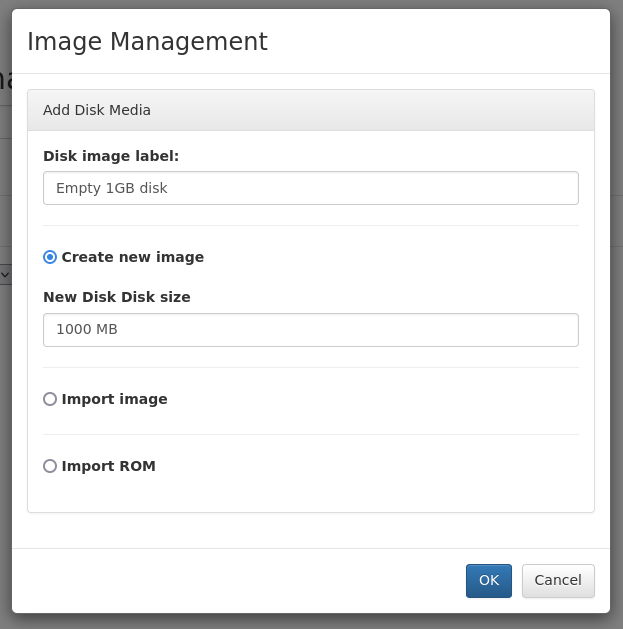
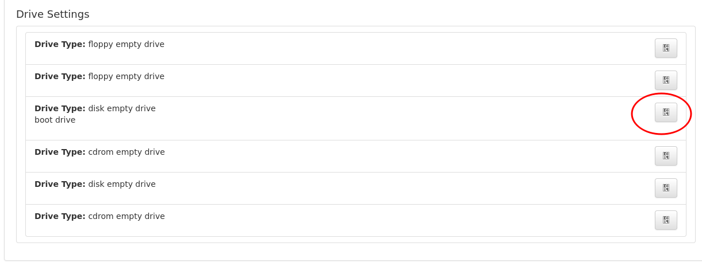
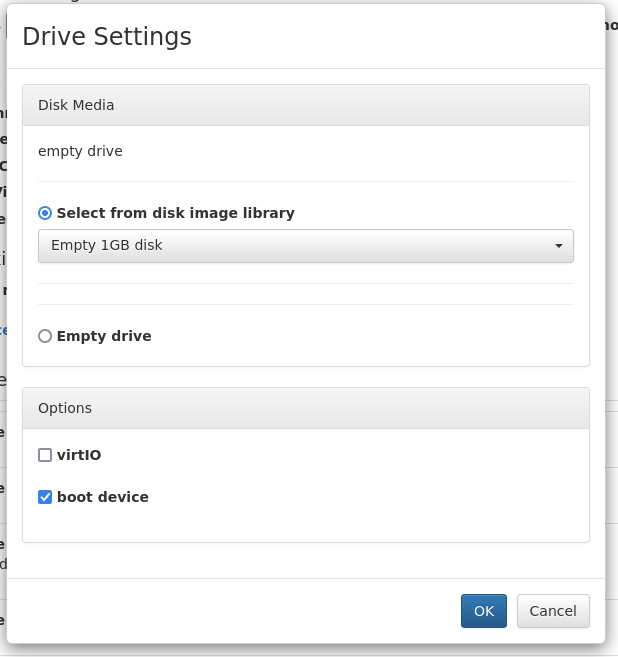
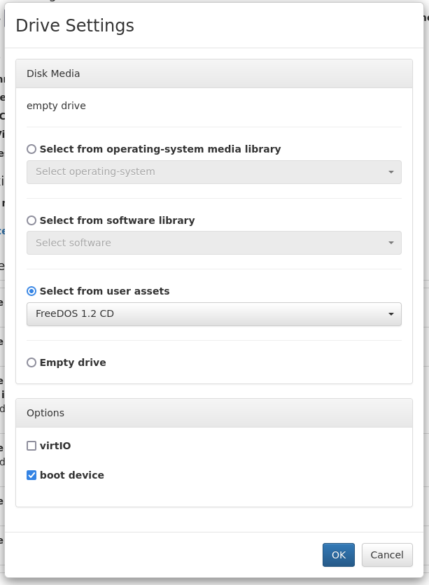
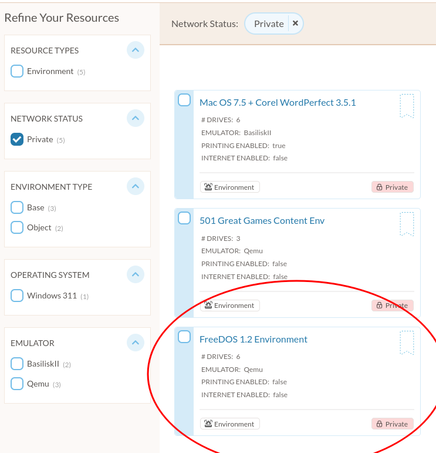
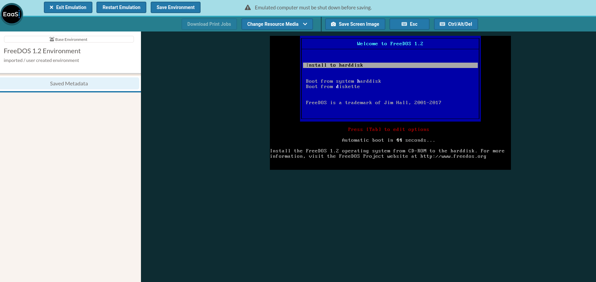

.. Notes for using demo UI to make new environment from scratch

.. _make_new_environment:

New Environments from Scratch
==============================

Users in the EaaSI Network are encouraged to make new environments using the :ref:`emulation-project` menu and the existing corpus of pre-configured :term:`base` environments published to the Network to reduce redundant dependencies and troubleshooting. However, this is not an acceptable solution for self-hosted EaaSI users outside of the EaaSI Network or another consortial partnership.

Functionality to create new environments completely from scratch is under development for the Emulation Project interface with expected release date in the first half of 2023. In the meantime, EaaSI users can create new environments using the follow work-around, temporarily accessing their installation's Demo UI at ``<https://<your-eaasi-url>/admin``.

Import Bootable Object
------------------------

Assuming you have not done so already: to create a new environment, you must first obtain a piece of bootable software (e.g. installation media) and upload it to EaaSI.

Log in using your same Admin user credentials at ``https://<your-eaasi-url>/admin>``.

Navigate to the "Objects" menu, then click on "Import Object":

Name and then use the "Add File" menu to select your bootable software, including the appropriate Media Type for the object file(s) (Floppy, ISO, or arbitrary set of Files). Here is an example configuration using the ISO installation media for FreeDOS 1.2:

Select "Import" and allow Emulation-as-a-Service to complete the object upload.

**Optional**: If your bootable object is installation media, you may wish to use the Demo UI to further classify your uploaded object both as a :term:`Software` resource and as an operating system installer. The object can be used to run and create a new Environment *either way*; marking an object as Software and an operating system installer just helps organize your resources and can help you find your bootable object more quickly in a later step.

To do so, on the "Objects" page, find your just-uploaded bootable object under the "Local Object Archive" tab and select "Details" from the "Choose Action" dropdown. First check the box that says "Object is software", then, when the "Software Properties" section appears, expand it and check the box that says "Is an operating system":

Create Blank Image
-------------------

This step is optional if you only wish to emulate a "live" computing environment (i.e. run from temporary, bootable media like a Linux Live CD). However, assuming you would like to actually install a fresh operating system and/or have some persistent storage available in your new environment, it is recommended to follow these steps to create a blank disk image to install your bootable system on.

Select "New Image" on the Images menu:

On the "Image Management" modal, select the "Create new image" radio button, and select a size for the new (blank) disk image under "New Disk Disk Size", using MB.

Also give the new disk image a descriptive label (blank disk images can be re-used for installing/creating multiple environments later):

Select "OK" and wait for Emulation-as-a-Service to finish creating the new, blank disk image. We will now use this blank disk image to create a new environment.

Create New Environment
-----------------------

Navigate to the "Environment" section of the Demo UI, then select "Create Environment":

.. image:: ../images/demo_ui_create_environment.png

Select the general "family" of operating systems that you would like to install or run in your new environment:

.. image:: ../images/choose_system.png

Name the Environment you want to create, then use the "Select operating system/System" dropdown menu to select the closest equivalent of your specific operating system. These options are templates that will auto-populate your Environment with an appropriate :term:`hardware configuration`. (To have templates in this menu, you must have imported Emulator images first; see :ref:`Managing Emulators <managing_emulators>` and :ref:`emulator compatility <emulators>` for process and recommendations)

.. image:: ../images/machine_name.png

Scroll down to the "Drive Settings" section. If you will be installing an operating system from scratch in the new environment, click on the drive labeled "**Drive Type**: disk empty drive, boot drive" (should be the third drive in the list).

Under "Drive Settings", click the "Select from disk image library" radio button and use the dropdown menu to select the blank disk image created earlier:

Click OK to save the image selection for that drive. Now find the first appropriate drive type to match the bootable object you uploaded earlier (e.g. the first "floppy empty drive" if it was a Floppy-type object; "cdrom empty drive" if it was either an ISO or Files-type object).

Again, using that drive's settings menu, use one of the dropdown menus as appropriate to find and select your bootable object.

(If you marked the object as Software, it should be available under the "software library" dropdown; if you marked it as an operating system it should be available under the "operating-system media library"; if you did neither, the object should still be available under the "user assets" dropdown)

It is also recommended here to check the "boot device" option, to make sure it is communicated to the emulator when running the environment that the external media drive (floppy or cdrom) contains bootable media; emulator/environment behavior may be unpredicatble otherwise.

Click OK to save the object selection for the drive. Then click "Save" at the bottom of the menu to complete the process of saving/creating a new environment using all of your selections.

Wrapping Up
-------------

At this point, the user will be returned to the Environments overview in the Demo UI. You should see the newly created Environment in both the Demo UI Environments overview *and*, returning to the EaaSI UI (by navigating to ``https://<your_eaasi_url>``), it should also be available in the user's account as a "Private" Environment:

You can now use the EaaSI UI to run, complete operating system installation, save derivative environments, add the environment to the Emulation Project interface, or complete any other Environment action as usual.

