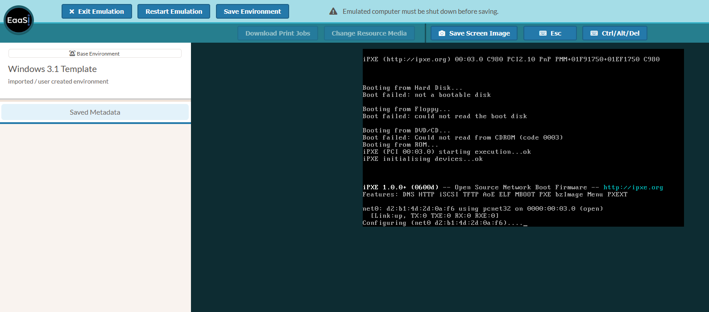
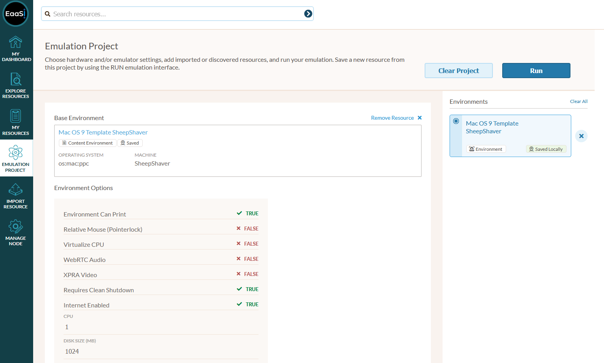
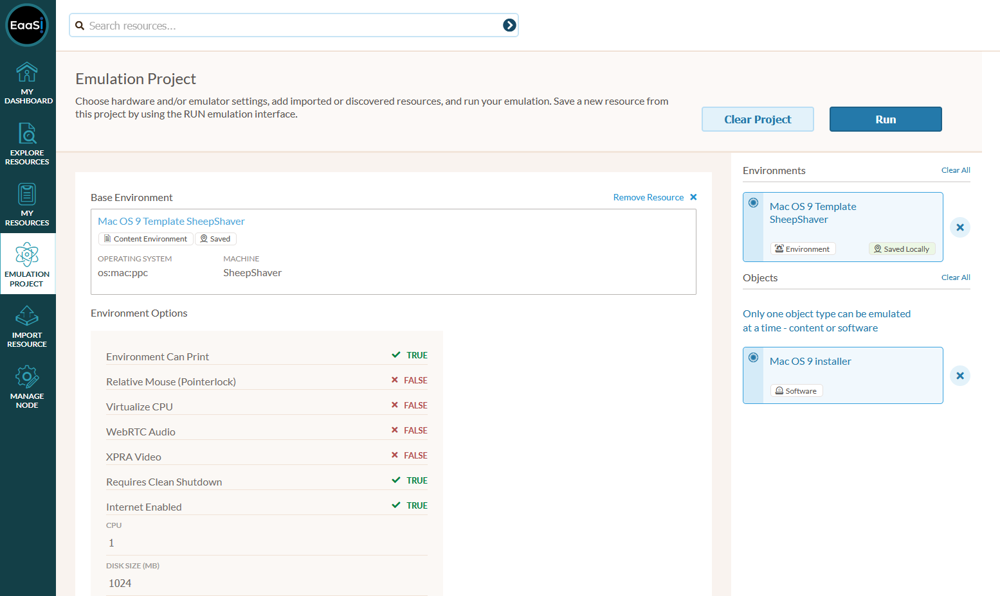
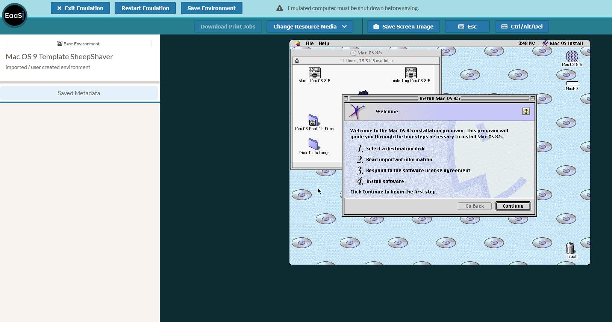
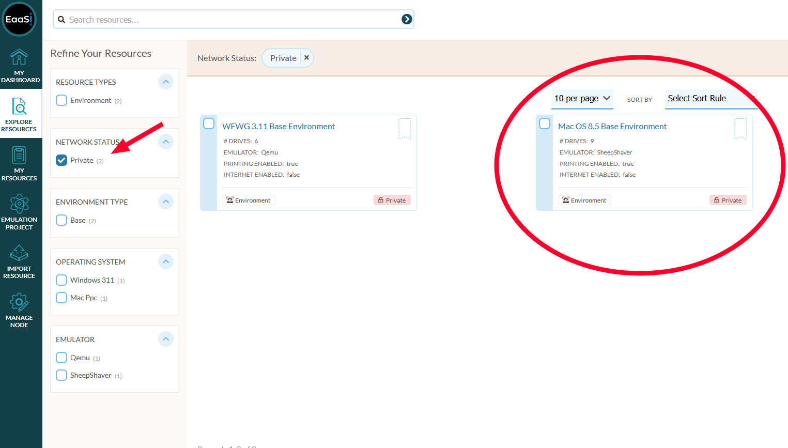
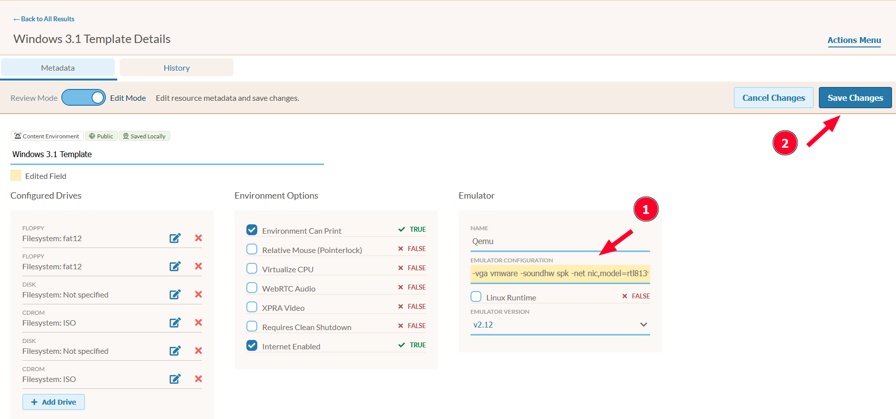

.. Template Environments

Template Environments
=======================

"Template Environments" refers to a special set of Environment resource provided to EAASI Research Alliance users in order to bootstrap configuration worklows. Template Environments are available to all user accounts in all Organizations.

.. note::
    "Template Environments" are not present in every EAASI installation be default - they are unique to the EAASI Research Alliance's U.S.-hosted v2021.10 deployment of EAASI. They are a work-around to the particular technical limitations of v2021.10 and will not be present in "Next-Gen" EAASI.

These Template Environments are not formally tagged on resource cards, and you  unfortunately can not directly facet on them on the Explore or My Resources pages - they are only identified (and searchable) by the word "Template" in the Environment name, and should all have the "Saved Locally" :ref:`network_status`. They should all be named according to a common legacy operating system release: for instance "Windows 98 Template," "Mac OS 8 Template," etc.

Each Template Environment is uneditable, cannot be deleted, and provides a recommended :term:`hardware configuration` (including the appropriate underlying :ref:`emulator<emulators>`) and a blank :term:`image` of an appropriate size on which to install the specified operating system. Paired together as an Environment, you *can* technically run these components in emulation - however, they contain no bootable software and are thus useless for interaction:

    An example of directly running a Template Environment

However these Templates can be used as the start of an Environment chain by pairing them with a piece of bootable operating system installation media, uploaded as a :term:`software` resource. The effect, and worfklow, is much the same as using a bootable CD-ROM or USB stick to install an OS on to a desktop with a wiped hard drive.

First, add the desired Template Environment to your Emulation Project.

Then, import and add a Software resource containing a bootable, installable OS to your Emulation Project.

Pair the two and select "Run" to launch an Emulation Access session - where you should boot off of the Software resource and be able to proceed with installing the desired operating system on to the (blank) Template Environment:

Once you have successfully completed installing an operating system on to a Template Environment, use the :ref:`Save Environment<save_environment>` instructions to save the installed OS as a **new** Environment resource. Because all the Template Environments are uneditable, the resulting new Environment will be private to the user account doing the configuration, leaving the Template Environment untouched and still available for configuring additional Environments [#f1]_ .

The image sizes for each Template Environment have been carefully selected to stay within the historical technical limits of the specified OS (many legacy systems, such as MS-DOS or Mac OS 7, either could not see or might actively start to malfunction when faced with a hard drive of modern size), while still providing a comfortable amount of virtual space for users to copy and install additional era-appropriate :term:`software` or :term:`content`. 

The recommended emulator configurations, likewise, have been confirmed by the EAASI team to provide a working, flexible guest system with commonly-desired hardware capabilities (including sound output, graphics output of at least 800x600 or 1024x768 resolution, network access, and CD-ROM input).

If the provided, recommended configuration does not wind up being appropriate or compatible with the desired OS, users can always tweak the hardware configuration by navigating to the Template Environment's Details page, entering "Edit Mode", changing the Emulator settings, and saving:

Note that this will not actually edit the Template Environment itself - instead, it will save a new, private copy of the Template Environment (with the same name, until or unless the user also edits the Resource Name field) unique to that user account, with the edited configuration. The user can then add this private copy to their Emulation Project and use it as the starting point for installing an OS instead.

.. note::
    There is no technical limitation saying you must use a Template Environment to install the exact OS and version specified in the Template name! For instance a "Mac OS 8 Template" could be appropriate for the entire OS 8 range (8.0, 8.1, 8.5, etc.), or a "Windows 98 Template" may also be appropriate to install Windows ME. These are recommendations but not requirements for appropriate emulator configurations. If you have questions about the specifications of particular Template Environments or need guidance for installing legacy systems, please post to the `Support <https://forum.eaasi.cloud/c/support/6>`_ section of the EAASI User Forum where the EAASI team and other users in the Research Alliance will be happy to assist you.

.. rubric:: Footnotes

    .. [#f1] Experienced users from EAASI's grant-funded phase may be familiar with this general flow of configuration, only accustomed to starting with :term:`base` Environments where a legacy operating system was *already installed*, allowing users to jump straight to the point of adding and installing additional :term:`software` resources as smaller dependencies. Due to concerns with ownership and distribution of copies of proprietary legacy operating systems, the EAASI team have essentially added Template Environments as an additional conceptual and technical layer to environment chains - rather than starting with a Base Environment, start with a Template Environment and install an operating system in order to arrive back at a Base Environment. The team hopes this work-around, while requiring redundant storage of operating systems across accounts and Organizations and additional time spent installing and configuring operating systems in emulation, allows EAASI Research Alliance users to still take advantage of shared expertise and the ability to cleanly trace branching chains of dependencies.