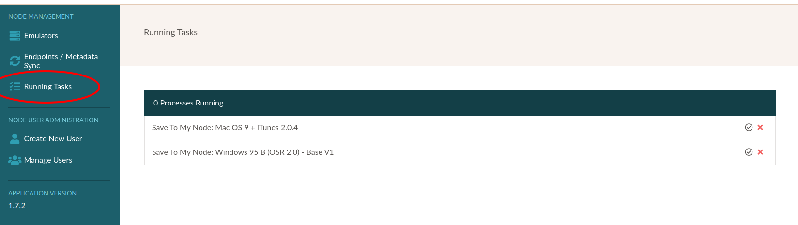
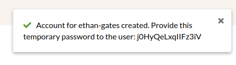

.. Administrative settings

.. _administration:

Manage Node
**************

.. warning::
  "Node" refers to an outdated and non-applicable model of using and administering EAASI servers from early in the platform's grant-funded cycle. This language will be replaced entirely in "Next-Gen EAASI," but due to complexities in the legacy code, could not be replaced in `v2021-10`.

  For the purposes of `v2021-10`, the word "Node" on this page should be considered functionally equivalent to "Organization" (e.g. "Manage Organization", "Organization User Administration", etc.)

The Manage Node page has two primary sections: :ref:`node_management` for troubleshooting, and :ref:`user_admin` for managing user accounts in the logged-in Organization. See each section below for more details.

.. _node_management:

Node Management
==================

Running Tasks
---------------

The Running Tasks tab allows Admins to monitor activity in the EAASI server, including any currently running imports. This high-level information is meant to help Admins better troubleshoot issues (i.e. confirm that uploads have completed with or without errors)

Troubleshooting
-----------------

In the event that EAASI users encounter bugs or unexpected behavior, Admin users can use this menu to download server and web API logs. These logs may provide guidance to the EAASI support team. Please attach these logs when :ref:`bugs` if possible.

.. _user_admin:

Node User Administration
=========================

.. warning::
  For more context on user account administration and recommendations from the EAASI team for using the Research Alliance's v2021.10 deployment, please review the :ref:`sharing-environments` page.

Manage Users
-------------

EAASI users must for now be added manually by an Organization :term:`Admin` before they can :ref:`log in <logging_in>` to EAASI. The Manage Users page lists all user accounts that are present in the Organization, including their username and their role/permission
level.

.. image:: ../images/node_users.png

Clicking on an account's Details page will allow an Admin the ability to also edit that account's email address,
their username and full name information, and their role/permission level:

.. image:: ../images/edit_user.png
  :align: center
  :scale: 75

Create New User
----------------

To add a new user account to a node, an Admin can click on the "Create New User" button to set the new account's email,
name, and user role.

**All** fields in the Create New User menu are required.

.. image:: ../images/create_new_user.png
  :align: center
  :scale: 75

Once added, **the user's temporary one-time password will be displayed to the Admin in a notification for approximately 15-20 seconds**. The Admin will need to immediately copy and save the password and provide it to the desired user, for example:

All new accounts will be prompted the first time they log in to change their password from the provided credentials to a new password of the user's choice. See :ref:`logging_in`.

Resetting User Passwords
--------------------------

If a user (of any level) *forgets* or otherwise loses their password, they will need to ask an Admin-level user in their Organization to reset their password. Admin users can accomplish this on the Manage Users page of their Organization settings (Manage Node -> Manage Users -> select Details of user in question):

.. image:: ../images/reset_password.png
  :align: center
  :width: 600

Once the Admin confirms they want to reset the user's password, **the user's new temporary password will be displayed to the Admin in a notification for approximately 15-20 seconds**. The Admin will need to immediately copy and save the password and provide it to the user, for example:

.. image:: ../images/password_notification.png
  :align: center

Once the Admin has provided the user with the temporary password, the user in question will be able to log in again. They will be prompted to immediately change/reset the temporary password back to a password of their choosing.

.. _permissions:

Permission Levels
--------------------

Lower-level ("Configuration") users may be restricted from performing certain actions described in this Handbook. To summarize:

**Admin**-level users can:
  - Add new user accounts to their Organization and change their permissions level (e.g. promote a Configuration user to an Admin)
  - Publish Environments resources to all user accounts in all Organizations in the EAASI server
  - Access user management features
  - All features and actions available to Configuration-level users

**Configuration**-level users can:
  - import new local Software and Content resources to their account
  - run and create new Environment resources using Saved Locally "Template Environments"
  - run and create new Environment resources using their private Software and Content resources
  - download server logs helpful for troubleshooting and filing bug reports
  - change their basic user account settings (email and password)