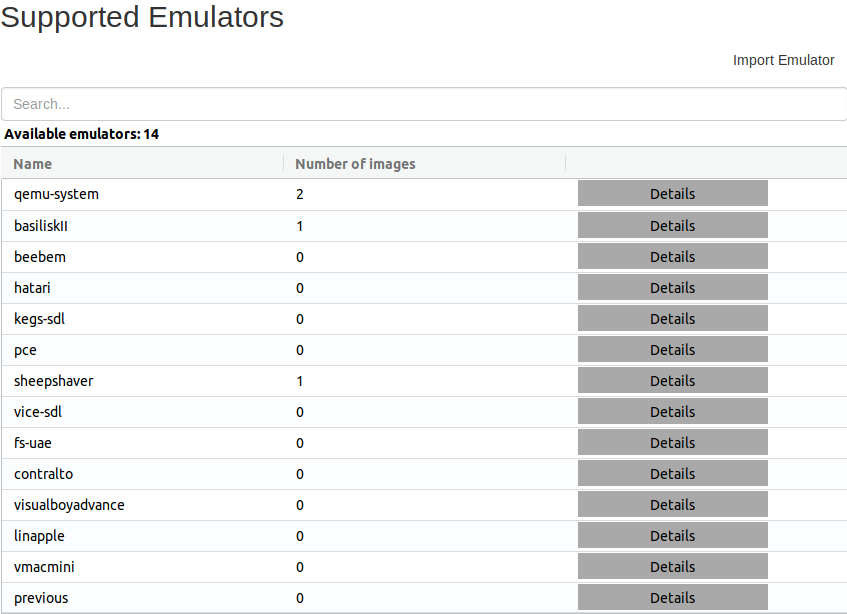
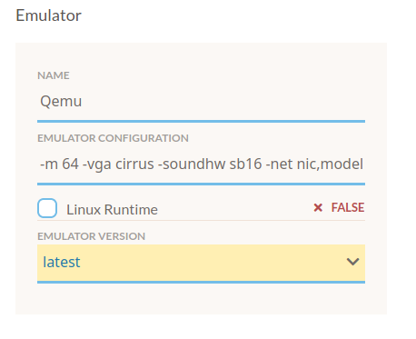
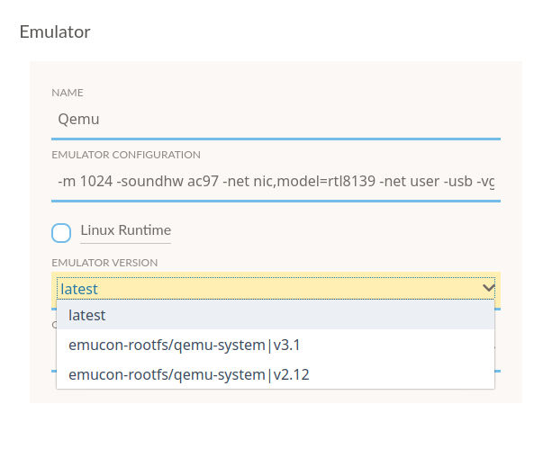
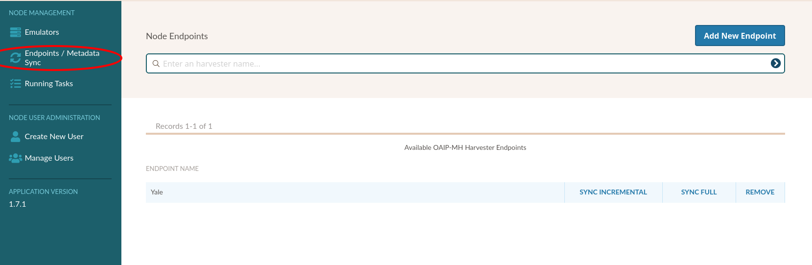
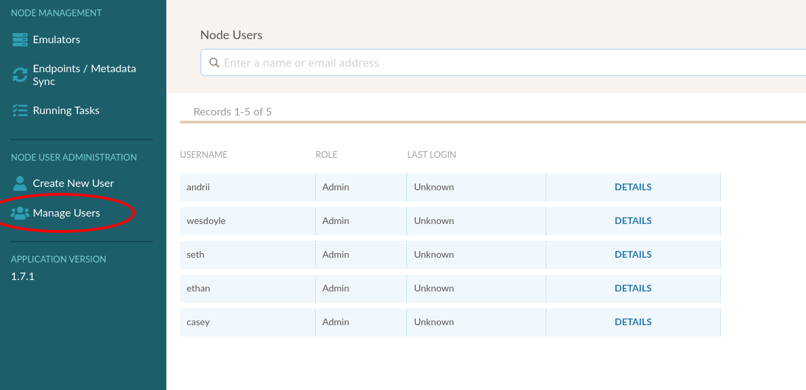
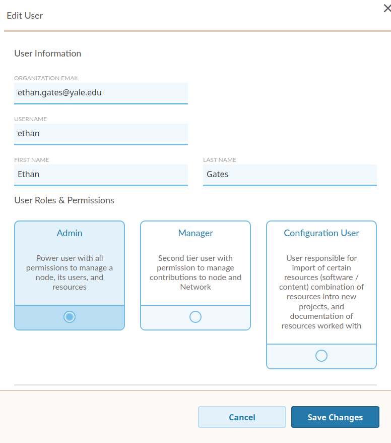
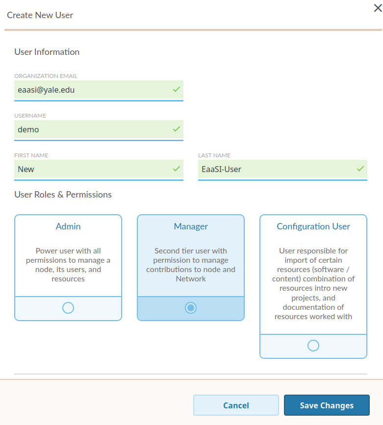

.. Administrative settings

.. _administration:

Manage Node
**************

.. warning::
  The Manage Node interface should *only* be visible to :term:`Admin` users. :term:`Managers <manager>`
  and :term:`Configuration Users <configuration user>` will not see this page in the EaaSI menu or be able to control
  any of the settings described.

The Manage Node page has two primary sections: :ref:`node_management` for controlling the :term:`node` itself (emulators, OAI-PMH, computing
resources) and :ref:`user_admin` for managing the users who can access the node. See each section below for more details.

This page also displays the node's EaaSI Application Version number, which is important information to include
when :ref:`bugs`.

.. _node_management:

Node Management
==================

Emulators
-----------

The EaaSI platform relies on a number of open-source emulators. Replicating environments, troubleshooting, 
and expanding a node's functionality all may involve some management of the emulators themselves.

:term:`Admin` users can review and manage emulators via the "Emulators" section of the Manage Node page.

The list on this page represents the whole range of emulators that have been containerized and made available to the
EaaSI network by the development team via the OpenSLX team's `GitLab repository <https://gitlab.com/emulation-as-a-service/emulators>`_.
This does **not** mean they are necessarily available for immediate use in the current node installation. The
presence/availability of the emulator in the node is determined by the "Number of Images".

For instance, in the above screenshot, the example node contains QEMU (two versions/images), BasiliskII and VICE (vide-sdl).

Details for each emulator - version number(s), Docker source info, etc. - can be reviewed by clicking the "Details"
button.

Again, in the above example, the node installation has two images/versions of QEMU available: 2.12 and 3.1. This can
be convenient for troubleshooting environments, as certain versions of an emulator may be more compatible with certain
legacy operating systems or hardware than others.

If an emulator has multiple images/versions in a node, the version that EaaSI uses to run an environment can be viewed
and edited on any given environment details page under "Emulator" settings:

.. note::
  The "Default" tag will determine which emulator image/version is used when creating new environments with a System 
  template that depends on that emulator.
  
New emulator images/versions can be added to the node in two ways: either through environment replication or manual adding of
Docker images.

Emulator images are automatically imported into a node if a node user attempts to replicate an environment from
a remote node in the network, and the host node does not have the emulator image the remote node used to originally
create and configure that environment.

*For example: a user at Node A sees a remote Mac OS 9.0.4 environment configured using SheepShaver available from Node B.
Node A does not currently have a SheepShaver image installed. But, when the user chooses to replicate, the appropriate
SheepShaver image will be imported as part of the environment replication process, with no extra input needed.
SheepShaver will now be available in Node A for future environment creation and configuration as well.*

The replication method requires little to no direct management from an EaaSI Admin. But Admins can also manually add
emulator images as well by clicking the "Import Emulator" button on the Emulators page:

  .. image:: ../images/import_emulator_button.png

This will bring up the Import Emulator pop-up menu:

  .. image:: ../images/import_emulator_menu.png

Instructions for filling out the Name and Tag fields diverge slightly depending whether the user is attempting to
import a new QEMU image, or any other emulator container:

**QEMU**: EaaS QEMU images are pushed to DockerHub. For the "Name" field, fill in "eaas/qemu-eaas", then use the list
of available Tags on DockerHub to specify the desired QEMU container: `<https://hub.docker.com/r/eaas/qemu-eaas/tags/>`_.

**All others**: All other emulator images are hosted directly on GitLab. To obtain the reference information for a
Docker image, first choose the appropriate emulator from the list of available projects on the EaaS GitLab:
`<https://gitlab.com/emulation-as-a-service/emulators>`_

Once inside the relevant emulator project (e.g. `<https://gitlab.com/emulation-as-a-service/emulators/vice-eaas>`_),
click "Registry" on the left-hand side GitLab menu. From this screen, you can find the link to the containerized
emulator (**use the full registy.gitlab.com address as the "Name" of the emulator in the Import Emulator menu**) and
specific tagged versions, if desired.

.. image:: ../images/container_registry_link.png

.. note::
  If no Tag is specified, the EaaSI import function will default to the "latest" image as specified in each
  emulator's Dockerfile.

The optional "Emulator Alias" field will populate the "User version" information in the emulator's Details page and helps to
differentiate when there are multiple images for any one emulator in a node.

When Name, Tag, and Emulator alias fields have all been filled out as desired, click the "Import Emulator" button.
After a minute or two, the new emulator image should be visible in the Emulators menu and available for creating and
configuring environments.

.. _OAI-PMH:

Endpoints/Metadata Sync
------------------------

Users can fetch metadata from other nodes on the network (that is, synchronize published environments)
using the "Endpoints/Metadata Sync" settings.

To add endpoints (other nodes) to this page, click the "Add New Endpoint" button.

.. image:: ../images/add_endpoint.png

Details for adding EaaSI Network nodes (i.e. the appropriate Host Location URLs for each node) will be provided to each node's
Admins for configuration. You should "Name" the endpoint something quick and descriptive to remember which node it represents 
(e.g. "Yale", "EaaSI Open Source Sandbox", etc.)

To fetch the available metadata/environments from other nodes, simply click the "Synchronize" button next to the
selected node endpoint. The *Remote* tab on the :ref:`environments overview <environments_overview>` page should update
accordingly.

Running Tasks
---------------

The Running Tasks tab allows Admins to monitor activity on the node, including any currently running environment sessions,
replication requests, uploads or imports, etc. This high-level information is meant to help Admins
better troubleshoot the node (i.e. confirm that uploads have completed, that environments have been properly shut down,
etc)

.. _user_admin:

Node User Administration
=========================

Manage Users
-------------

EaaSI users must for now be added manually by a node :term:`Admin` before they can :ref:`log in <logging_in>` to a node.
The Manage Users page lists all individuals that are present on the node, including their given username and their role/permission
level.

Clicking on a user's Details page will allow an Admin the ability to also edit that user's email address (used for authenticating login),
their username and full name information, and their role/permission level:

Create New User
----------------

To add a new user to a node, an Admin can click on the "Create New User" button to set the new user's email,
name, and user role.

**All** fields in the Create New User menu are required.

Once added, new users should be able to successfully follow the procedures described in :ref:`logging_in` to join
the node.
