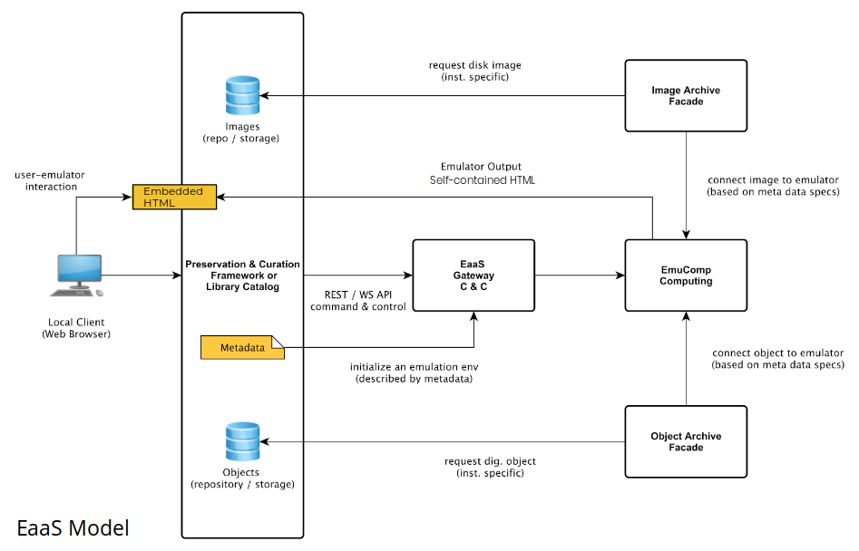

.. Technical architecture

System Architecture
*******************

Node Components
===============
The EaaS stack is composed of a number of software modules working together. These modules can be deployed together or configured across multiple physical/virtual machines, depending on resources available. EaaSI installations contain additional components to allow for sharing :term:`resources` and metadata across the EaaSI network, but core functionality is accomplished with the following components.

Front-end
----------

The front-end provides an interface to use the EaaS API through RESTful HTTP requests. EaaSI will ultimately offer a number of potential front-end access services that vary by use case; for the course of the EaaSI beta, the front-end will be provided in the form of a demo administration interface. (See :ref:`navigation`)

Gateway
--------

The EaaS Gateway acts as the API end-point and manages all emulation-related resources (it tracks emulation sessions, calculates necessary compute resources, and finds all disk images/software/metadata as requested from the front-end).

Emulation Component (EmuComp)
------------------------------

The Emulation Component module actually allocates local CPU resources to serve emulation sessions. Its hardware must be optimized to allow for potentially running multiple emulation sessions.

Image Archive (Connector)
-------------------------

The Image Archive connector/facade provides access to the underlying disk images that form :term:`environments` (and their metadata). This module can act as a simple archive for locally-stored images, or (ideally) connect to a third-party storage system, depending on where each EaaSI node intends to store its resources.

Object Archive (Connector)
--------------------------

Likewise, the Object Archive module provides access to :term:`Objects` and :term:`Software` (floppy, CD-ROM, and hard disk images, file sets, etc.); this module can also act as a simple archive for locally-stored data or (ideally) connect to a third-party storage system, depending on the node setup.

OAI-PMH Synchronization
=======================

Environment Derivation
======================

Emulators
=========
EaaS relies on several open source projects to actually perform emulation and virtualization. Using the Import Container feature, different emulation software (and different versions of the included emulators) can be imported into the system, but available to a default EaaSI installation are:

- `QEMU <https://www.qemu.org/>`_
x86 PC emulation/virtualization, PowerPC 9.x-10.x Mac OS emulation

- `Linapple-pie <https://github.com/dabonetn/linapple-pie/>`_
Apple II emulation

- `Mini vMac <https://www.gryphel.com/c/minivmac/`_
68k series Mac emulation

- `Basilisk II <https://basilisk.cebix.net/>`_
68k series Mac emulation

- `SheepShaver <https://sheepshaver.cebix.net/>`_
PowerPC Mac OS 8.x-9.0 emulation

- `VICE (Versatile Commodore Emulator) <http://vice-emu.sourceforge.net/>`_
Commodore series emulation

- `ContrAlto <https://github.com/livingcomputermuseum/ContrAlto>`_
Xerox Alto emulation

- `FS-UAE <https://fs-uae.net/>`_
Amiga series emulation
