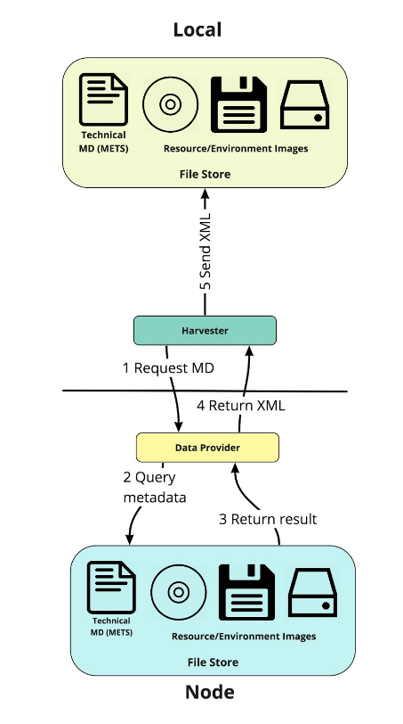
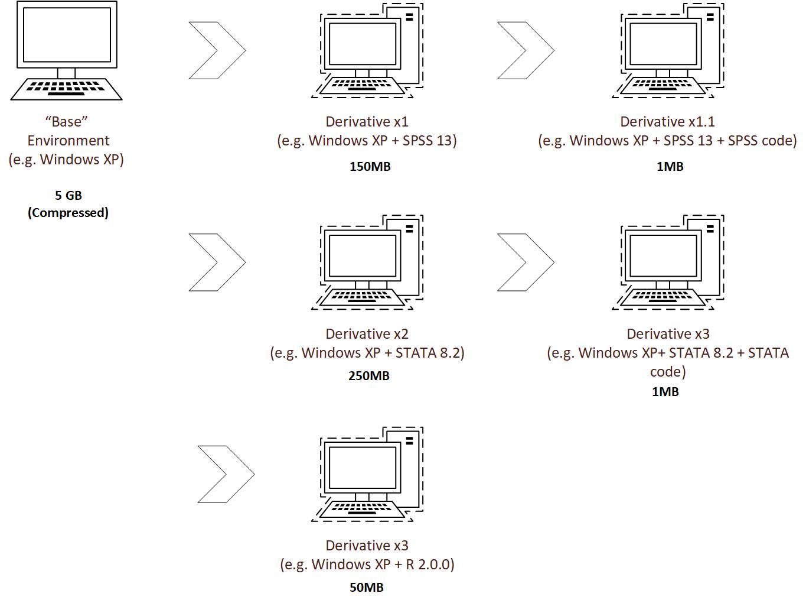

.. Technical architecture

System Architecture
*******************

Node Components
===============
The EaaS stack is composed of a number of software modules working together. These modules can be deployed together or
configured across multiple physical/virtual machines, depending on resources available. EaaSI installations contain
additional components to allow for sharing :term:`resources` and metadata across the EaaSI network, but core
functionality is accomplished with the following components.

Front-end
----------

The front-end provides an interface to use the EaaS API through RESTful HTTP requests. EaaSI will ultimately offer a
number of potential front-end access services that vary by use case; for the course of the EaaSI beta, the front-end
will be provided in the form of a demo administration interface. (See :ref:`navigation`)

Gateway
--------

The EaaS Gateway acts as the API end-point and manages all emulation-related resources (it tracks emulation sessions,
calculates necessary compute resources, and finds all disk images/software/metadata as requested from the front-end).

Emulation Component (EmuComp)
------------------------------

The Emulation Component module actually allocates local CPU resources to serve emulation sessions. Its hardware must be
optimized to allow for potentially running multiple emulation sessions.

Image Archive (Connector)
-------------------------

The Image Archive connector/facade provides access to the underlying disk images that form :term:`environments` (and
their metadata). This module can act as a simple archive for locally-stored images, or (ideally) connect to a
third-party storage system, depending on where each EaaSI node intends to store its resources.

Object Archive (Connector)
--------------------------

Likewise, the Object Archive module provides access to :term:`Objects` and :term:`Software` (floppy, CD-ROM, and hard
disk images, file sets, etc.); this module can also act as a simple archive for locally-stored data or (ideally)
connect to a third-party storage system, depending on the node setup.

.. image:: images/EaaS_Model.png

OAI-PMH Synchronization
=======================

The EaaSI network makes use of the `Open Archives Initiative Protocol for Metadata Harvesting (OAI-PMH) <https://www.openarchives.org/pmh/>`_
to request, share and synchronize metadata between nodes.

Each EaaSI installation contains an OAI-PMH harvester and a data provider. The harvester requests metadata (in EaaSI's
case, Base and Software Environment records) from the data providers at other nodes; the data providers query the
node's local records and return this metadata back to the original harvester.

Using the provided metadata, the harvester can also then find and replicate necessary files (disk images) from the
other nodes on :ref:`request <replication>`.

.. _derivation:

Environment Derivation
======================

EaaS makes use of a snapshot-base storage system to avoid redundant copying and storage of full disk images. Revisions
and changes to any Base Environment are isolated and stored in files separate from the base image - the saved
derivative environments are then recreated programmatically from the original base and full chain of changes at the
point that the user requests to run or replicate the environment.

.. _emulators:

Emulators
=========
EaaS relies on several open source projects to actually perform emulation and virtualization.
These emulators have been containerized into Docker images by the EaaS development team to allow for easily swapping in
new emulators (or different versions of an emulator) to an EaaSI installation.

Default EaaSI deployments will come only with QEMU (v3.1) installed, but emulation capability can be quickly expanded
by replicating environments from other nodes and/or using the Emulator menu in the demo interface. Please see
:ref:`managing_emulators` for more details.

The full list of compatible and pre-Dockerized emulators prepared by the EaaS team is located and will be updated on
their `public GitLab repository <https://gitlab.com/emulation-as-a-service/emulators>`_, but immediately available for
the EaaSI network are:

- `Basilisk II <https://basilisk.cebix.net/>`_
    68k series Mac emulation

- `BeebEm <http://www.mkw.me.uk/beebem/>`_
    BBC Micro and Master 128 emulation

- `ContrAlto <https://github.com/livingcomputermuseum/ContrAlto>`_
    Xerox Alto emulation

- `FS-UAE <https://fs-uae.net/>`_
    Amiga series emulation

- `Hatari <https://hatari.tuxfamily.org/>`_
    Atari ST/STE/TT/Falcon series emulation

- `KEGS <http://kegs.sourceforge.net/>`_
    Apple IIgs emulation

- `Linapple-pie <https://github.com/dabonetn/linapple-pie/>`_
    Apple II emulation

- `Mini vMac <https://www.gryphel.com/c/minivmac/>`_
    68k series Mac emulation

- `PCE <http://www.hampa.ch/pce/about.html>`_
    Various microcomputer emulators, including Atari ST, IBM PC5150, and classic Macintosh models

- `QEMU <https://www.qemu.org/>`_
    x86 PC emulation/virtualization, PowerPC 9.1-10.x Mac OS emulation

- `SheepShaver <https://sheepshaver.cebix.net/>`_
    PowerPC Mac OS 8.x-9.0 emulation

- `VICE (Versatile Commodore Emulator) <http://vice-emu.sourceforge.net/>`_
    Commodore series emulation
