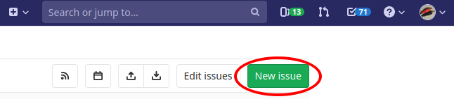

.. Filing bug reports for EaaSI

.. _bugs:

Bug How-Tos
------------

Since submitting bug reports may require you to use tools you have not used previously, we have
created this document to help you learn GitLab issues, the bug system used by the EaaSI team to track
bug reports and communicate between our developers.

Signing up for a `GitLab account <https://gitlab.com/users/sign_in>`_ will allow for the EaaSI team
to quickly follow up with you directly about your problem, or ask for more information as necessary.
If you can not sign up for a GitLab account, you *can* also file a bug report by emailing
[tktktk], but we highly encourage using GitLab directly for the best and quickest support.

1. Get out a piece of paper or open a text file and write down everything you can remember about 
what you were doing when your problem happened. Also write down the exact wording of any error messages you 
received. (Or even take a screenshot if possible!)

2. Check to see if your bug has been reported already by another user - go to the current `Issue list <https://gitlab.com/eaasi/eaasi-dev/issues>`_
and search to see if something looks like your same problem. If it has been reported already, you
can still help by adding your own information and experience as a comment in that thread! 

3. Try to reproduce your problem - return to EaaSI, try to do the same thing you attempted to do before,
and see if you can do it again. If you can, attempt to reproduce it in other ways - can the same action
be completed using a different button the menu? 

4. If you haven't logged in to GitLab yet, make sure you do so now. On the eaasi-dev Issue list, select
"New Issue".

5. Choose a template to pre-populate the "Description" field with important information and questions
that will help guide you in writing your bug report.

[image of templates]

Give your bug a good "Title" summarizing your problem.

6. In the "Description", you can follow the pre-populated prompts to tell the EaaSI team about your problem
and give as much information about your system as possible (your host node, your EaaSI version, your 
browser version, etc). The more information you give us, the faster our developers can narrow down the source
of your issue!

[image of pre-populated Bug template]
