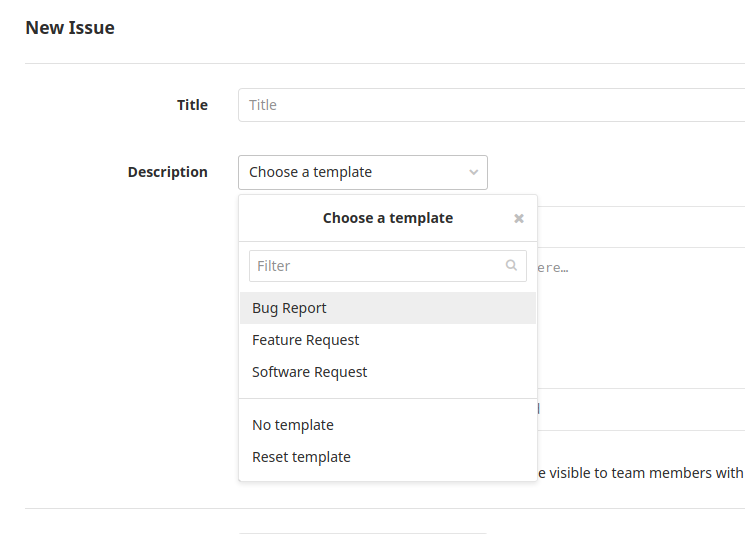
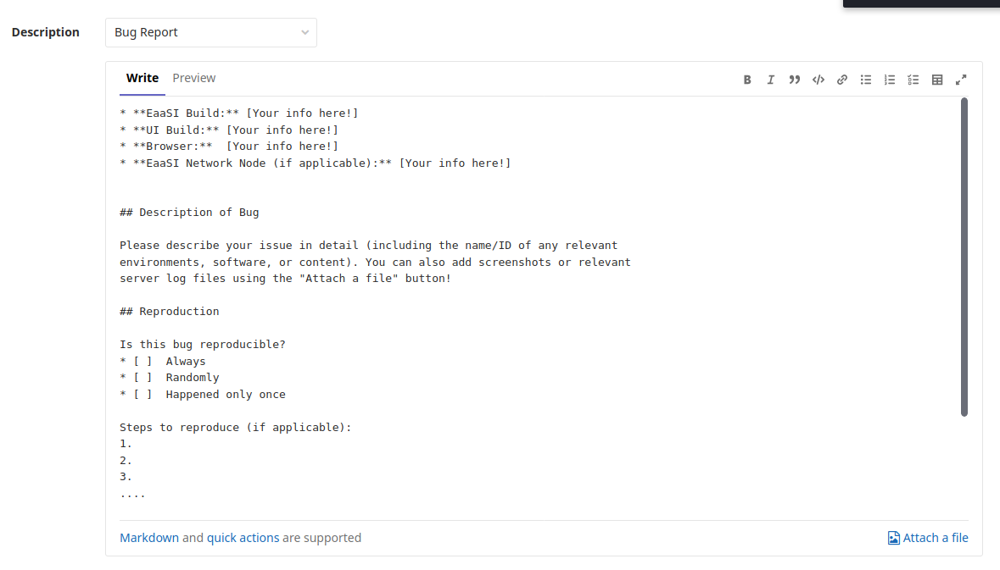

.. Filing bug reports for EaaSI

.. _bugs:

GitLab How-Tos
------------

Since submitting bug reports or `requests <Feature and Software Requests_>`_ may require you to use tools you have not used previously, we have
created this document to help you learn GitLab Issues, the bug system used by the EaaSI team to track
bug reports and communicate between our developers.

Signing up for a `GitLab account <https://gitlab.com/users/sign_in>`_ will allow for the EaaSI team
to quickly follow up with you directly about your problem, or ask for more information as necessary.

**1. Document your bug**. 
Get out a piece of paper or open a text file and write down everything you can remember about what 
you were doing when your problem happened. Also write down the exact wording of any error messages you 
received. (Or even take a screenshot if possible!)

**2. Check the EaaSI Issue tracker**.
Go to the current `Issue list <https://gitlab.com/eaasi/eaasi-dev/issues>`_
and search to see if something looks like your same problem. If it has been reported already, you
can still help by adding your own information and experience as a comment in that thread! 

**3. Try to reproduce your problem**. Return to EaaSI, try to do the same thing you attempted to do before,
and see if you can do it again. If you can, attempt to reproduce it in other ways - can the same action
be completed using a different button the menu? 

**4. Log in to GitLab**. 
(If you haven't already). On the `eaasi-dev Issue list <https://gitlab.com/eaasi/eaasi-dev/issues>`_, 
select "New Issue".

.. image:: images/gitlab_new_issue.png
  :scale: 75

**5. Choose the "Bug Report" template**. This will pre-populate the Description field with questions and
guidelines to help you write your bug report:

**6. Give your bug a brief and descriptive "Title"** summarizing your problem!

**7. Fill out the Description**. You can follow the pre-populated prompts to tell the EaaSI team about your problem
and give as much information about your system as possible (your host node, your EaaSI version, your 
browser version, etc). The more information you give us, the faster our developers can narrow down the source
of your issue!

  
The Bug Report template in our GitLab will also auto-assign a "bug report" label to your issue, which helps
bring it to the quick attention of EaaSI staff.

**7. Please wait patiently!** EaaSI staff will address your bug report and make sure it gets in front of
the right people at our development teams as soon as possible. We may follow up with a request for more
details. You can set your `GitLab account notifications <https://docs.gitlab.com/ee/user/profile/notifications.html>`_ 
to receive emails related to your bug report, so you don't miss a thing if we ask for more information (or
when your bug gets fixed!)

Feature and Software Requests
==============================

There are also provided templates for requesting enhancements to the EaaSI platform, or for EaaSI staff to
try to add new software to the Network.

The Feature Request template asks for details about your proposed feature or enhancement, including, if possible,
concrete examples or use cases (what does your proposed feature offer that can't currently be accomplished in
the platform?). We ask for details of your current EaaSI version to assess whether your
request is already part of future revisions or the development roadmap and respond accordingly. If it's not, the
EaaSI staff and community will consider if your idea is in-scope, and let you know if we'll include your
enhancement in future updates!

.. note::
  EaaSI Network nodes will generally receive priority for future features and updates over requests from the
  broader digital preservation/Emulation-as-a-Service community. You might also consider posting to the
  `EaaSI Tech Talk list <https://groups.google.com/forum/#!forum/eaasi-tech-talk>`_ to gauge or gather interest
  and support from within the Network!
  
The Software Request template is intended to help EaaSI users find out more information about necessary software
for accessing/preserving digital material. If you're looking for a particular application, a particular version,
or just need help figuring out how to interact with/view a funky file, send a Software Request our way! EaaSI staff
will check the software collection at Yale University Library to see if we can provide the relevant software (provided
you're writing from a EaaSI Network node host), or at least help you find some more information about the software
you need.
