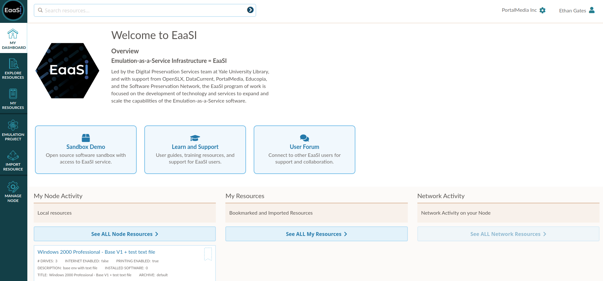

.. Dashboard

.. _dashboard:

Dashboard
==========

The EaaSI Dashboard provides a central hub for viewing :term:`resources <resource>` and activity within
your node, as well as links for additional support and materials from the EaaSI project.

|
**Sandbox Demo**: Will take the user to the `EaaSI Open Source Sandbox <https://www.softwarepreservationnetwork.org/eaasi-sandbox/>`_, a demonstration service for 
showing the in-browser emulation capabilities of EaaS to those outside the EaaSI Network.
  
**Learn and Support**: Links to the EaaSI User Handbook that you are reading right now!

**User Forum**: Links to the "EaaSI Tech Talk" Google Group, a forum for connecting with other
EaaSI users for support and collaboration. This forum is not open to the general public but new users
can be added by EaaSI staff on request. (See :ref:`community`)
  
Activity
---------

The EaaSI Dashboard displays three activity feeds to conveniently access the latest environments and other
resources available in your EaaSI :term:`node`.

**My Node Activity** displays the latest resources created or uploaded in your node, regardless of the
user who created them. (You can click on "See ALL Node Resources" to navigate to the :ref:`explore` page)

**My Resources** displays the latest resources created, uploaded, or bookmarked by the currently logged-in
user. (You can click on "See ALL My Resources" to navigate to the :ref:`my_resources` page)

**Network Activity** displays the latest resources published within the EaaSI Network (that is, all
resources that have been published by *other* nodes connected by an :term:`Admin` user to the current node).

Blog Feed
-----------

The bottom of the Dashboard page displays a refreshing feed of the most recent posts from the `Software
Preservation Network <https://www.softwarepreservationnetwork.org/spn-news/>`_ blog, so EaaSI users can
keep up with the latest and greatest news in software preservation and emulation! 
