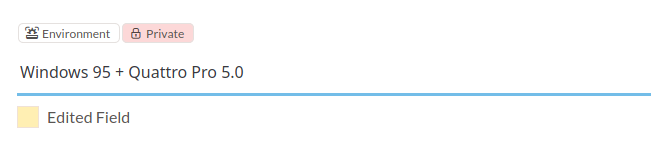
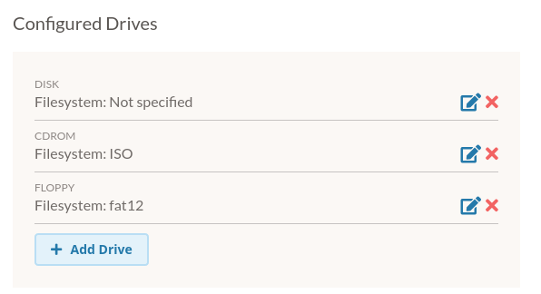
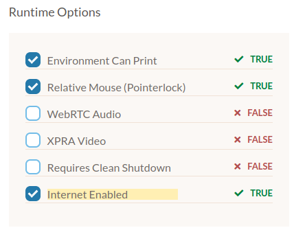
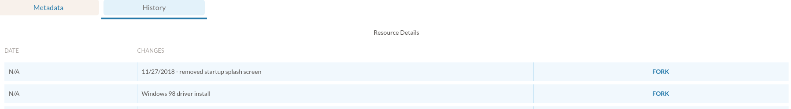
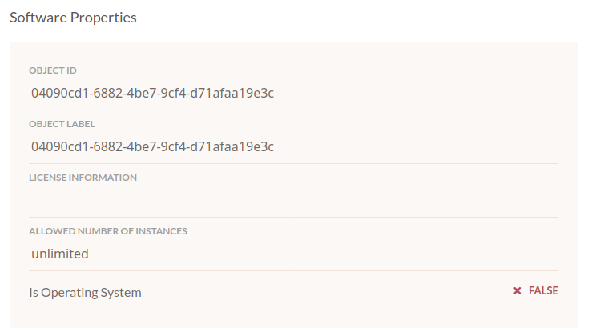

.. Resource Details pages

.. _details:

Resource Detail Pages
======================

:term:`Resource` Detail pages provide some additional descriptive information for EaaSI resources. Depending on permissions and the resource's Network status, users may be also be able to edit teh resource's configuration settings for Emulation Access sessions.

Environment Details
---------------------

The Details page for :term:`Environment` resources is divided into two tabs: Metadata and History.

Metadata
*********

In "Review Mode", users can view current descriptive metadata and configured emulator settings. Click on "Edit Mode" to edit and save changes to compatible fields in Private Environments.
  
.. warning::
  Resources marked "Public" and "Saved Locally" **are not editable**. Once published to the EaaSI Network, neither their descriptive metadata nor emulator configuration settings can be altered. Editing **any** fields on a Public/Saved Locally Environment will create a new, derivative, Private Environment. Take care to change Resource Names or other fields to indicate new Environments created from changing settings on the Details page.

.. note::
  All resources are assigned a unique identifier (UUID) by the EaaS back-end on creation. UUIDs are not viewable in the EaaSI interface or editable.
  
**Resource Name**: This is an arbitrary, free text field for users to identify the resource.

**Configured Drives**: Storage drives must be added and configured properly for Environments in order to allow mounting Software and Content resources in emulation. Drive configuration requires a Media Type (CD-ROM/ISO, Floppy, or Disk) corresponding to the three available :ref:`Media Types <media_types>` for Software and Content resources). Depending on the underlying emulator, additional storage interface and bus/address numbers must be specified to function properly. (editable)

By default, PC-based EaaSI Environments should have at least: a Disk drive (for the Environment's system drive/operating system), a CDROM drive (for mounting ISO and Files type resources), and a Floppy drive (for mounting Floppy type resources). Adding additional Configured Drives, particularly with Macintosh or other non-PC hardware, may allow for Software and Content resources with multiple CD-ROM or Floppy type objects to be properly mounted.

.. warning::
  There can be severe limitations to the Configured Drive feature depending on the underlying emulator and the Environment's operating system. Please raise specific examples/concerns in the `Support Center <https://forum.eaasi.cloud/c/support-center/6>`_ in the EaaSI Community Forum for help and guidance if needed.
  

**Emulator**: This section indicates the underlying emulator and :term:`Hardware Configuration` used to run this Environment in emulation. Advanced users can use this section to switch the emulator version used to run the Environment (e.g. QEMU 2.12 or QEMU 3.1) and, if necessary, tweak the emulated machine's hardware. Consult each emulator's own documentation to correctly pass Configuration settings to the emulator.

.. image:: ../images/emulator_details.png

**Runtime Options**: Enables (or disables) various options for running the Environment in the Emulation Access Interface.

"Environment can Print" enables the "Download Print Jobs" feature. If an emulated operating system is configured with a PostScript-enabled virtual printer, print jobs sent to that printer within the emulation session will be intercepted by the EaaSI client and offered to the user to download as a PDF. This is currently the only method of extracting data/files from within EaaSI Environments.

"Relative Mouse (Pointerlock)" enables a running Environment to capture the user's mouse input.

"WebRTC Audio" enables an improved method for streaming audio from the emulation session to the user's browser. 

"Requires clean shutdown" forces the user to perform a full ACPI shutdown of the Environment's operating system in emulation before allowing the user to use the Save Environment feature. (editable)

"Internet Enabled" controls whether or not the Environment can theoretically access the live internet while running (if the Environment is configured correctly).

.. note::
  WebRTC Audio is now out of beta and considered a recommended configuration setting for most Environments. However, accessing Environments over/through a VPN may break WebRTC audio.
  
.. note::
  "Requires clean shutdown" is recommended for most Environments from approximately 1998 and later (e.g. Windows 98 and up) to make sure emulation sessions save cleanly as a new Environment or revision without operating system errors. It should **not** be enabled for Environments and operating systems prior to this. See `Advanced Configuration and Power Interface <https://en.wikipedia.org/wiki/Advanced_Configuration_and_Power_Interface>`_.
  
.. warning::
  "XPRA Video" is an alpha feature for improving video delivery and lag (essentially an equivalent to the improved WebRTC audio delivery). It is not yet stable and is not yet functional in EaaSI.

.. warning::
  For "Environment can  print" and "Enable Internet access" features to work correctly, the Environment's operating system must have been properly configured with a functional PostScript printer drive (for "Environment can print") or an installed TCP/IP networking stack ("Enable Internet access"). Please consult the `Software Help <https://forum.eaasi.cloud/c/software-help/10>`_ section of the EaaSI Community Forum if needing assistance in this area for the Environment or legacy operating system of your choice.
  

  
  
History
*********

The History tab displays prior revisions of the Environment, if any. Revisions are displayed and sorted according to the "Description" field for that revision.

.. note::
  The EaaSI team recommends using the "Description" field in a similar manner to git commit messages, providing a brief but descriptive message to other users regarding the configuration or metadata change to create that revision.
  
The user can choose to "Fork" any previous revision. Forking will create a new, Private Environment resource based on that revision. This essentially allows node users to revert Environment revisions.

Software Details
--------------------

In "Review Mode", users can view current properties of Software resources and some details of the object, including attached files and their Media Type. In "Edit Mode", **only** "Software Properties" are editable.

**Software Properties**: These are editable settings that control to some degree how and when users can interact with the Software resource in emulation. "License Information" is a free-text field and a recommended place to stash license key or registration information that a user may need to correctly run or install the software. "This is an Operating System" communicates whether the Software resource contains a bootable operating system or operatiny system installer.

.. note::
  "Allowed Number of Instances" is set by default to "unlimited", allowing an unlimited number of concurrent emulation sessions. Future updates will allow editing of this field to limit simultaneous sessions using that resource.
  
.. note::
  "Is Operating System" is currently a descriptive distinction but will be important information to communicate to emulators in planned EaaSI workflows. The EaaSI team recommends setting this accurately and choosing a relevant OS preset for the future.
  

Content Details
-------------------

.. warning::
  Content metadata is **not** editable after import.
  
The EaaSI system currently gathers very little metadata or description about Content resources, except for its name/label. Therefore there are no Details pages for Content resources.
