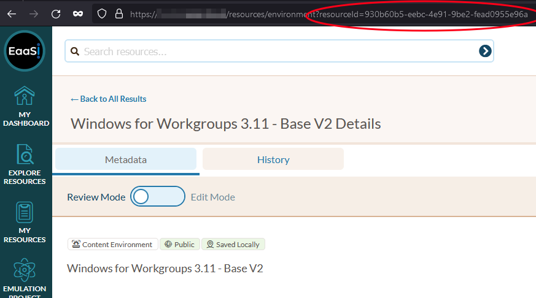

.. Embedding Published Environments

.. _embedding:

Embedding Published Environments
*********************************

EaaSI users can embed published Environments from their node into other web pages using the `Emulation-as-a-Service JavaScript client library <https://gitlab.com/emulation-as-a-service/eaas-client>`_ developed the OpenSLX team.

.. note::

    For the eaas-client code to work, the target Environment **must** be first published via OAI-PMH. (In other words, have a Network Status of both "Public" and "Saved Locally" in the host/source node). Please consult :ref:`publishing` for guidance and ramifications of choosing to publish an Environment from your EaaSI node.

Using Custom EaaS JavaScript Elements in HTML
-----------------------------------------------

To embed a published Environment into arbitrary HTML, first the eaas-client JavaScript module must be imported:

.. code-block:: html

    

.. note::
    The necessary ``webcomponent.js`` can also be sourced from ``https://purl.archive.org/eaas/eaas.js`` for a stable link using the Internet Archive's PURL (Persistent URL) service.

You can then include an ``<eaas-environment>`` element on your web page to select and style the Environment you would link to embed, e.g.:

.. code-block:: html

    <eaas-environment id="example-env" 
        eaas-service="https://<your.eaasi.domain>/emil/"
        environment-id="xxxxxxxx-xxxx-xxxx-xxxx-xxxxxxxxxxxx" 
        autoplay 
        style="border: black solid 10px;"> 
        <strong>Please wait</strong> while the environment is being started ...
    </eaas-environment>

Where:

- ``id`` is an arbitrary name/string to use for identifying the element in styling/CSS
- ``eaas-service`` identifies the location and necessary API endpoint for getching the Environment; replace "<your.eaasi.domain>" with the source node
- ``environment-id`` is the UUID identifying an Environment resource; replace with your desired Environment's UUID
- ``autoplay`` is an optional Boolean attribute that will start to load and run the Environment as soon as the visitor's browser loads the page (remove this attribute to disable autoplay)
- ``style=`` can be optionally used to add styling to the element
- ``<strong>Please wait</strong> while the environment is being started ...`` is optional, arbitrary text that will be shown to the user while the Environment loads and will be replaced by the running Environment. This can be edited to include any arbitrary text, images, other HTML as desired.

Please note that the UUID for a given Environment can be found either using the :ref:`eaasi-api` or by looking at the URL bar when navigating to any given Environment's Details page:

Importing Library for Direct Use in JavaScript
------------------------------------------------

With the `eaas-client <https://gitlab.com/emulation-as-a-service/eaas-client>`_ repository cloned into your project, use:

.. code-block:: javascript

    import { Client } from "./eaas-client.js";