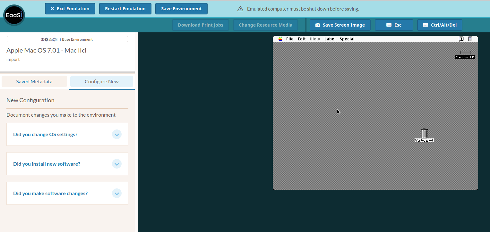
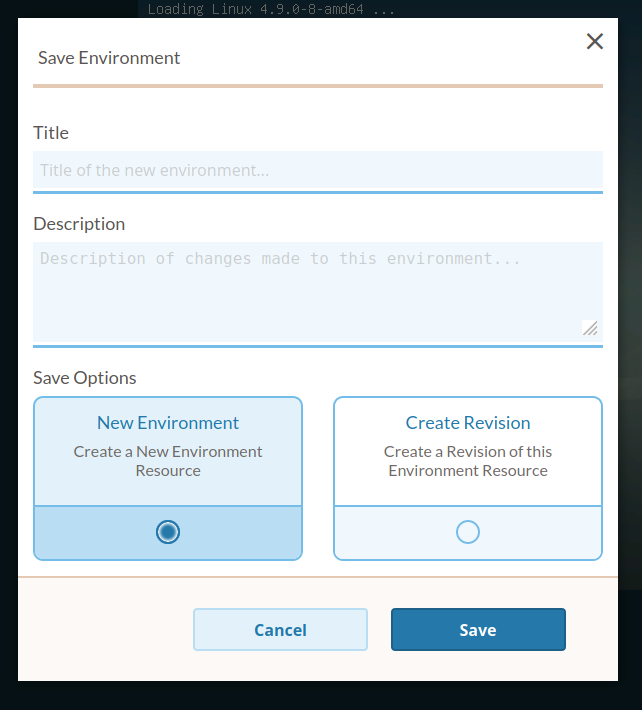

.. Emulation Access interface

.. _emulation_access:

Emulation Access Interface
=============================

The Emulation Access screen allows the user to interact with a running emulation Environment. The user will be led to this screen when:

  1. They select the "Run in Emulator" or "Add Software" actions for any given Environment resource
  2. They complete the Import Image workflow
  3. They complete an Emulator Project workflow
  

The features offered on this page may vary depending on how the Environment has been configured.

  - *Download Print Jobs*: Only available if "Environment can Print" has been enabled for the running Environment, and the Environment contains an installed and configured PostScript driver. If so, print jobs to PostScript in the running Environment will be intercepted by the EaaSI interface and this button will become selectable. The printed document will be offered to the EaaSI user as a downloadable PDF.
  
  - *Change Resource Media*: If the Environment contains a mounted Software or Content resource with more than one disk, the user may click on this button to alternate mounting them in the Environment. (In other words, the user may use this menu to mimic the behavior of ejecting and inserting multiple CD-ROMs, floppy disks, or other removable media into a physical machine)
  
  - *Save Screen Image*: Takes a screenshot of the Environment screen. The user's browser will offer the screenshot for download.
  
  - *Esc*: Sends an "Esc" keyboard input to the Environment. "Esc" key presses on the user's keyboard usually do not/will not pass to an EaaSI environment. Clicking this button allows the user to press the "Esc" key in the Environment if/when emulated software requires.
  
  - *Ctrl/Alt/Del*: Likewise, pressing this button will send a "Ctrl + Alt + Delete" keyboard command to the emulated Environment, which may be useful for troubleshooting or rebooting an emulated operating system. Pressing this keyboard combination on the user's keyboard will likely be intercepted by the host system, and is not recommended if an Environment is displaying issues.
  
The three buttons at the top of the screen allow the EaaSI user to stop or leave the Emulation Access interface in various ways:

  - *Save Environment* will open a new modal screen. The EaaSI user can save any changes or edits they made to the Environment during the currently-running Emulation Access session as a new Environment. See :ref:`below <save_environment>`.
  
  - *Restart Emulation* will perform a hard restart of the Emulation Access session. Any changes or edits made by the user to the Environment during the currently-running session will be discarded.
  
  - *Exit Emulation* will stop the currently-running Emulation Access session and return the user to whatever menu was used to launch the session. Any changes or edits made by the user to the Environment during the currently-running session will be discarded.
  
.. note::
  If the Environment was configured with the "Relative Mouse (Pointerlock)" option, clicking on the Environment's screen will capture the user's mouse. Press the "Esc" key on your host keyboard to free your mouse and interact with your browser and host system again.

.. note::
  The metadata options ("Saved Metadata" and "Configure New") on the left side of the Emulation Access interface are placeholders and until noted otherwise, non-functional. Advanced options for describing Environments and Software *while* they are running in emulation is under development.
  
  
.. _save_environment:

Saving Environments
---------------------

There are two possible paths for EaaSI users to save their Emulation Access session as an Environment in the Save Environment modal.

**New Environment**
saves the current (or just-concluded) Emulation Access session as a new Environment resource. The user must create a Title for this new Environment, and on successful save, the Environment should be available in the Explore Resources page as a Private Environment within the user's node.

If the Emulation Access session began by choosing to Run a previously-existing Environment, that original Environment will also remain available and unchanged. The new Environment resource is a :term:`derivative` of the original Environment. A user can return to it and branch off on a completely different path of configuration and Environment creation as necessary.

**Create a Revision** edits over the currently running Environment resource. The user can edit the Environment's description to indicate the changes or new configuration made to the Environment during the session, but can not re-name the resource, because the edit will overwrite the Environment in the EaaSI interface.

.. note::
  EaaSI Environments are version-controlled, so any revision can be reversed and no overwrite is permanent. On any given Environment's Details page, navigate to the "History" tab to view the descriptions from previous revisions. Selecting "fork" for any given revision will restore that prior state of the Environment as an available resource.

.. warning::
  Create a Revision will **only** overwrite a Private Environment. If a user chooses Create a Revision when running an Environment marked "Saved Locally" (that is, an Environment that has been published to the Network), it will have the *same effect* as creating a New Environment. A new, derivative Private Environment resource will be created in the user's node, with the same name as the published Environment. The published/Saved Locally Environment will persist in the interface as well.

  
