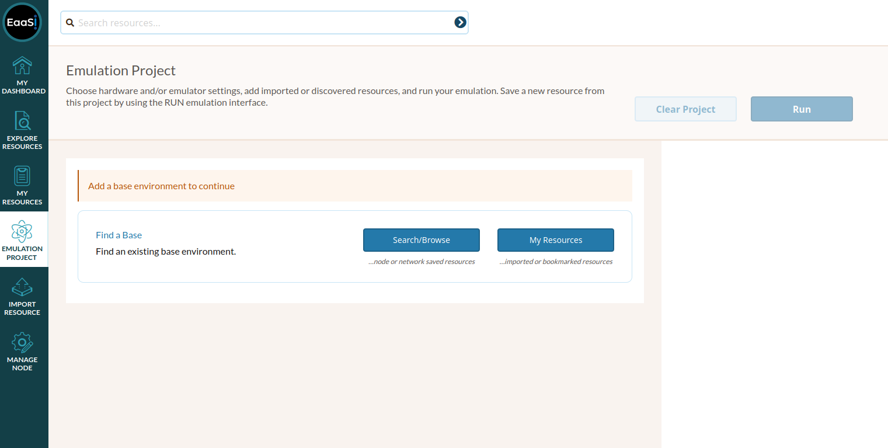
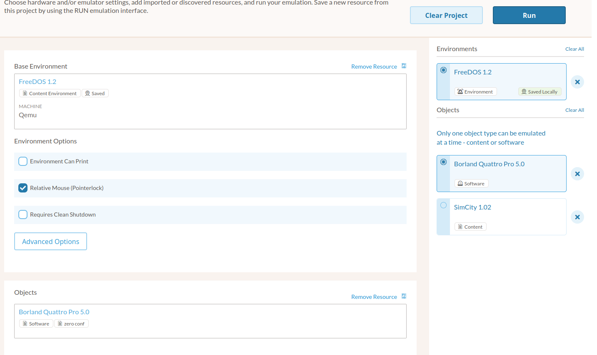

.. Emulation Project

.. _emulation-project:

Emulation Project
===================

The Emulation Project menu allows EaaSI users the opportunity to build new Environments using existing Environment, Software and Content resources in their node.

.. note::
  For the EaaSI v2020.03 release and newer, "Emulation Project" essentially replaces the "Create Environment" menu and workflow from the :ref:`demo_client`. Certain Environment creation workflows may be more limited in the EaaSI Client's Emulation Project than in the Demo Client. Workflows and features will be re-designed to fit the EaaSI Client and implemented on a rolling basis.
  
To create a new (derivative) Environment resource, you **must** start by selecting an existing "base environment" (an available resource from the network that has been Saved Locally to your node).

The shortcut buttons on the Emulation Project page will guide you back to either the Explore Resources overview or the My Resources page to select and add an Environment to the Emulation Project using the :ref:`Actions <actions>` menu.

Once an Environment resource has been added to the Emulation Project, you can begin creating your new Environment resource by either:

1. Editing the selected Environment's options.
2. Returning to the Explore/My Resources pages and adding additional Content or Software resource(s) to the Project.

.. note::
  Though you can add multiple Environments, multiple Content, and/or multiple Software resources to the Emulation Project page, in order to select "Run" and begin an Emulation Access session, you can only actively select **ONE** Environment resource and at most **ONE** Content or Software resource.

In the example below, an existing "FreeDOS 1.2" Environment, a "Borland Quattro Pro 5.0" Software resource, and a "SimCity 1.02" Content resource have all been added to the Emulation Project. The "Borland Quattro Pro 5.0" is the **active** object and will be the one presented in the Emulation Access session once the user clicks "Run":

Once the user has crafted their desired resources and options, they may select "Run" to begin an :ref:`emulation_access` session. From this point, the user can install and configure the operating system software, Change Resource Media, save the new configuration as its own Environment resource, etc. 

The options and resources selected on the Emulation Project page will persist until intentionally cleared by the user, regardless of whether the user saves or discards their changes in an Emulation Access session started from this page. This is intended to make it easier for the user to return and tweak the Emulation Project settings without re-assembling all the selected resources after an Emulation Access session.
