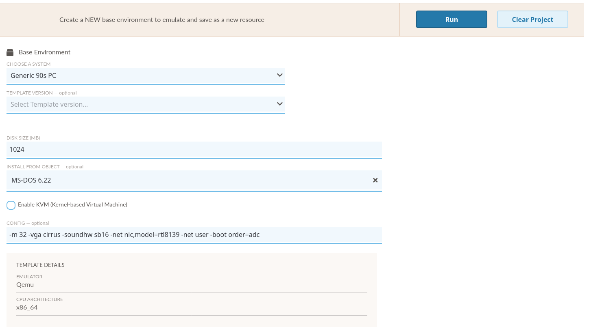

.. Emulation Project

.. _emulation-project:

Emulation Project
===================

The Emulation Project menu allows EaaSI users the opportunity to create new Environments from "scratch" using existing Software and emulators in their node.

.. note::
  For the EaaSI v2020.03 release, "Emulation Project" essentially replaces the "Create Environment" menu and workflow from the :ref:`legacy_ui`. Future updates will expand the feature-set of the Emulation Project for a more flexible "mix-and-match" type approach to creating new Environments.
  
To create a new Base Environment, two conditions must be met:

1. The node must have available system hardware templates. Templates are made available either by:
  - saving Remote environments from other nodes in the Network to your node (the emulator and template used to create that Environment will then automatically become available in the local node)
  - importing emulator images (see :ref:`Managing Emulators <managing_emulators>`)
2. An appropriate, bootable Software resource (e.g. an operating system installation disk) - that is, any Software resource that has been marked "IS AN OPERATING SYSTEM"

On the Emulation Project menu, the user must first select an option from the Template menu (to select an emulator and default configuration).

Next, specify a disk size (in MB) for the Environment's system drive. The EaaSI platform will automatically create a blank disk image/virtual hard drive on which to install the operating system, of the specified size.

.. note::
  The blank disk iamge will be created using QEMU's "qcow2" file format.
  
Select a bootable operating system disk using the "Install from Object" dropdown menu (the dropdown menu should display all Software resources in the node that have been marked "IS AN OPERATING SYSTEM").

If desired, the user can edit the Config field to tweak the settings passed to the underlying emulator. The Config field is filled in automatically by the selected Template, but can be freely edited. Please consult the relevant :ref:`emulator's <emulators>` documentation to change Config settings appropriately (or contact the EaaSI Tech Talk list or the Software Preservation Analyst for assistance).

An example Emulation Project below, using the "Generic 90s PC" template provided by the "eaas/qemu-eaas:2-12" emulator image, a bootable MS-DOS 6.22 Software resource (Floppy-type set), and a 1 GB virtual hard drive:

.. warning::
  "Enable KVM" allows for the EaaSI platform to virtualize, rather than emulate, compatible x86 operating system Environments. This will greatly accelerate and improve Environment use if compatible, but may result in errors if incompatible. It is recommended for recent (~2005-present) Linux systems or Windows XP and newer. Please consult KVM's `documentation <https://www.linux-kvm.org/page/Main_Page>`_ to investigate whether your desired "guest" OS is compatible.
  
  KVM support must also be properly configured by your EaaSI sysadmin during deployment for "Enable KVM" to be effective. Please consult the :ref:`enable-kvm` page and contact your EaaSI sysadmin if uncertain whether your EaaSI node supports "Enable KVM".
  
Clicking "Run" will start an emulation session in the Emulation Access interface with the selected settings. From this point, the user can install and configure the operating system software, Change Resource Media, and Save the Environment to create a new Private Environment. See :ref:`emulation_access`.
