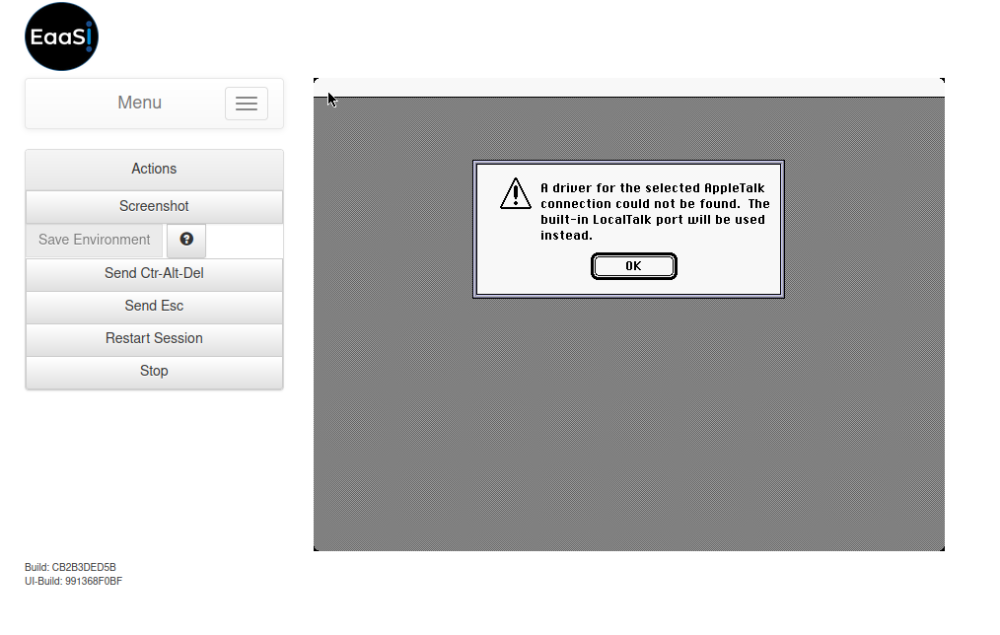

.. Features limited because of underlying emulators

.. _emulator_limitations:

Emulator Limitations
======================

While the EAASI platform provides a centralized, single interface for interacting with a number of different underlying :ref:`emulators`, variations between these different applications make it difficult if not impossible to have all EAASI features work in the same way for all Environments.

This page details some of these limitations, along with recommended work-arounds, to help manage user expectations.

.. _print-jobs-qemu-limitation:

"Download Print Jobs" Only Works in QEMU-based Environments
-------------------------------------------------------------

**Relevant emulators**: BasiliskII, SheepShaver, VICE, any and all other emulators besides QEMU

**Affected Environments**: Classic Mac OS systems, Commodore 64, various other non-PC systems (anything **not** emulated by QEMU)

**Problem**: Emulation-as-a-Service's `strategy <https://gitlab.com/emulation-as-a-service/eaas-server/-/blob/master/src/eaas/components/impl/src/main/java/de/bwl/bwfla/emucomp/components/emulators/PostScriptPrinter.java>`_ for creating a virtual PostScript printing device to intercept print jobs from within a running emulation and convert them to PDF for an EaaS user to download via their browser relies on QEMU's character device emulation. This approach is not generic/replicable to other emulators.

**Recommended work-around**: Unfortunately there is no other method for directly exporting files or content from non-QEMU emulators available in EAASI at this time. You can use the "Save Screen Image" feature to take a screenshot of the content running in emulation in PNG format to share emulated content externally.

Multi-file Content and Software resources and "Change Media" in Apple Environments
-----------------------------------------------------------------------------------

**Relevant emulators**: Basilisk II, SheepShaver

**Affected Environments**: approximately Apple Mac OS 7.x through OS 9.0.4 (late M68K and PowerPC Macs)

**Problem**: Basilisk and SheepShaver do not support live-swapping mounted disk images during a running emulation session. All desired disk images for a session must be selected and mounted before or between running the emulation. Thus, the "Change Media" feature **will not function** as expected when running Basilisk or SheepShaver-based Environments in EAASI - users can not "eject" and "insert" disk images in multi-file Floppy or ISO type Content and Software resources, the way they would with physical hardware (or with emulators that support live-swapping, such as QEMU and VICE.)

**Recommended work-around**: EAASI users can edit the number of disk images that can be mounted at any one time into a Basilisk or SheepShaver-based Environment by adjusting the Environment's Configured Drives on its Details page. Adding additional Floppy or CDROM drives to match or exceed the number of disk images in a multi-Floppy or ISO-type resource should allow the entire resource to be mounted into the Environment at the same time when run.

Because of hardware limitations (Basilisk and SheepShaver emulate a particular SCSI bus), this method will only work for up to a maximum of 8 drives (including, if relevant, the main/system disk contining the operating system).

Alternatively, break a multi-file Content or Software resource into multiple or individual resources during import. (e.g. treat each individual Floppy or ISO-type disk image as its own separate resource, then mount and save in a series of Environment revisions until the complete desired set is available for interaction)

Floppy Objects (Content or Software) of Mixed Size in QEMU
------------------------------------------------------------

**Relevant emulators**: QEMU

**Affected Environments**: MS-DOS, Windows, and most Linux environments (x86 PCs)

**Problem**: QEMU can switch between Floppy-type objects during a running emulation session, but they must all be of the same size. For instance, if a user uploads a Floppy-type Content object mixing disk images from 5.25" and 3.5" floppies - respectively 1.2 MB and 1.44 MB - the user will **not** be able to swap between them using the Change Media feature in a running QEMU-based Environment. Whichever file was ranked/prioritized first in the Software or Content import will determine the capacity of the emulated floppy drive when that resource is mounted.

**Recommended work-around**: If looking to import a mixed-size floppy set into EAASI as a Content or Software resource, separate disk images of the same size into separate resources. Copy and save one of the resources into a QEMU-based Environment, then mount the second resource interact with the full set.

Alternatively, if it is possible or acceptable: manipulate the size of a disk image prior to import into EAASI (e.g. padding a smaller disk image to match the size of a larger one) using a disk image manipulation program such as `WinImage <https://winimage.com/>`_, `qemu-img <https://linux.die.net/man/1/qemu-img>`_ (built-in QEMU utility), or similar.

AppleTalk Error in Mac OS 7.0.x
-------------------------------

**Relevant emulators**: BasiliskII

**Affected Environments**: Mac OS (System Software) 7.0.1 and derivatives

**Problem**: Trying to run a genuine copy of Apple's System Software 7.0.1 operating system in BasiliskII results in the following AppleTalk error on boot:

This error appears regardless of host system (the EAASI team has confirmed it running BasiliskII on both Linux and macOS hosts), regardless of BasiliskII hardware settings selected, and regardless of operating system settings selected within System Software 7.0.1 (e.g. even when AppleTalk is explicitly disabled in the OS).

**Recommended work-around**: If System Software 7.0.1 is explicitly required or desired, just clicking "OK" on the error message allows the user to continue to emulate the Environment with no apparent ill affects.

If this pop-up error is too inconvenient or confusing, and the Software or Content does not explicitly require 7.0.1, the EAASI team recommends using a different Classic Macintosh Environment running on BasiliskII instead (e.g. Mac OS 7.5). This error appears unique and specific to the 7.0.x operating system.

Running Macromedia Director Crashes Mac Emulators
--------------------------------------------------

**Relevant emulators**: BasiliskII, SheepShaver

**Affected Environments**: Possibly any with Macromedia Director installed (specific versions uncertain)

**Problem**: Users in the AusEAASI network have reported problems with emulator crashes when trying to run Macromedia Director in SheepShaver-based Environments. The issue has been traced to an upstream error likely present in both the SheepShaver and BasiliskII codebase.

**Recommended work-around**: Disable the emulator's "JIT" (just-in-time) compiler setting by navigating to the relevant Environment's Details page and then editing the Emulator Configuration line to add "jit false". (You must insert a line break between the end of the previous emulator setting, which is probably the ROM specification, and the "jit false" string)