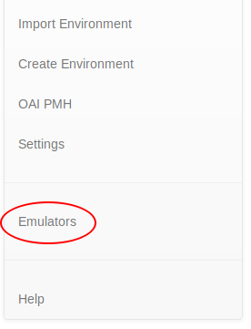
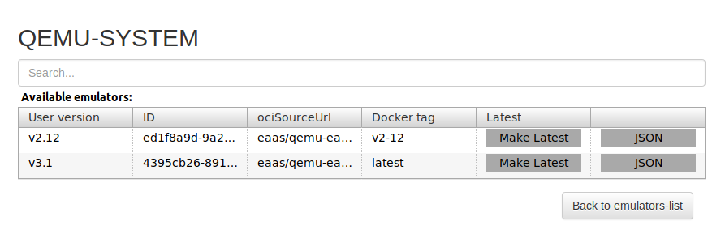
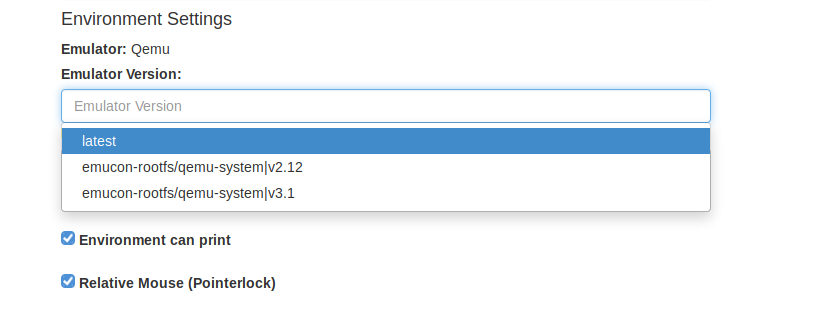
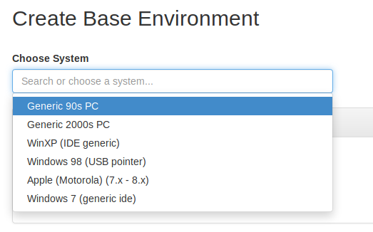
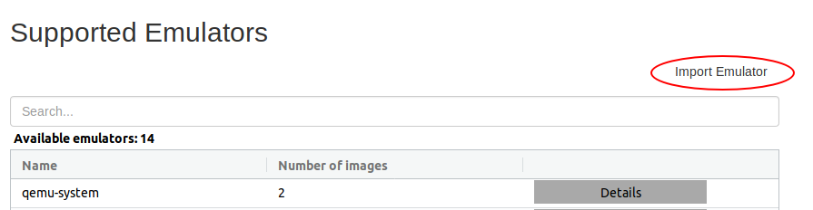
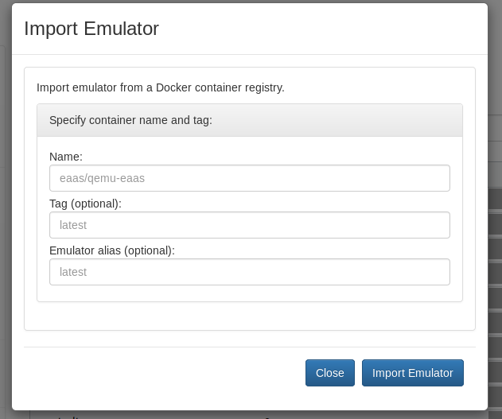
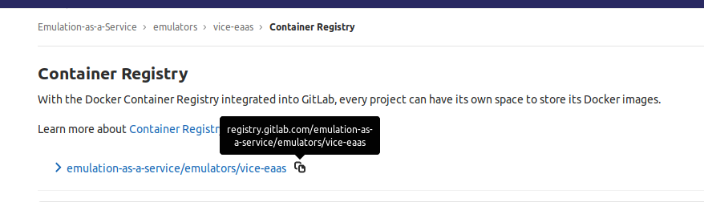

.. Managing Emulators

.. _managing_emulators:

Managing Emulators
*******************

The EaaSI platform relies on a number of open-source emulator projects to perform the emulation
aspect of software and environment management. Replicating environments, troubleshooting, and expanding a node's
functionality all may involve some management of the emulators themselves.

"Emulators" in the EaaSI Interface
==================================

Available emulators can be reviewed and managed via the "Emulators" tab in the navigation menu.

.. image:: images/emulators_menu.png

"Available emulators" refers to emulation applications that have been containerized and made easily available to the
EaaSI network by the development team via the OpenSLX team's `GitLab repo <https://gitlab.com/emulation-as-a-service/emulators>`_.
This does **not** mean they are necessarily available for immediate use in the current node installation. The
presence/availability of the emulator in the node is determined by the "Number of images".

For instance, in the above screenshot, the example node contains QEMU (two versions/images), BasiliskII and SheepShaver.

Details for each emulator - version number(s), Docker source info, etc. - can be reviewed by clicking its corresponding "Details"
button.

Again, in the above example, the node installation has two images/versions of QEMU available: 2.12 and 3.1. This can
be convenient for troubleshooting environments, as certain versions of an emulator may be more compatible with certain
legacy operating systems or hardware than others.

If an emulator has multiple images/versions in a node, the version that EaaSI uses to run an environment can be viewed
and edited on any given environment details page under "Environment Settings":

.. note::
  The "Latest" tag should be read as "default". You can tag a specific image/version to be the default version offered
  when creating and running environments using that emulator by clicking the "Make Latest" button in the emulator detail
  page.

  The "latest" (most recent available) version of an emulator is generally the EaaSI team's *recommended* default, to
  allow for the most up-to-date feature and security updates from these outside projects!

Emulator Templates
==================

Emulator images contain the template files used to assist with :term:`Hardware Configuration`. These templates provide
common system configurations for recommended emulators, and are visible in the UI when either creating or importing a
new environment:

In the above image, for instance, the configurations for "Generic 90s PC" and "Generic 2000s PC" are defined in
templates contained in an imported QEMU image; the "Apple (Motorola)(7.x-8.x)" was provided with a BasiliskII container.

To start a new environment from scratch rather than replicating and deriving from a remote node, these templates *must*
be present, to populate these menus in the UI. The target emulator must thus be imported first (see below).

.. _emulator_containers:

Adding New Emulator Containers
==============================

New emulator containers can be added to the node in two ways: either through environment replication or manual adding of
Docker images.

Emulator images are automatically imported into a node if a node user attempts to replicate an environment from
a remote node in the network, and the host node does not have the emulator image the remote node used to originally
create and configure that environment.

For example: a user at Node A sees a remote Mac OS 9.0.4 environment configured using SheepShaver available from Node B.
Node A does not currently have a SheepShaver image installed. But, when the user chooses to replicate, the appropriate
SheepShaver image will be imported as part of the environment replication process, with no extra input needed.
SheepShaver will now be available in Node A for future environment creation and configuration as well.

The above method requires little to no direct management from the EaaSI user. Node admins can also manually add
emulator images as well by clicking the "Import Emulator" button on the Emulators page:

This will bring up the Import Emulator pop-up menu:

Instructions for filling out the Name and Tag fields diverge slightly depending whether the user is attempting to
import a new QEMU image, or any other emulator container:

**QEMU**: EaaS QEMU images are pushed to DockerHub. For the "Name" field, fill in "eaas/qemu-eaas", then use the list
of available tags on DockerHub to specify the desired QEMU container: `<https://hub.docker.com/r/eaas/qemu-eaas/tags/>`_.

**All others**: All other emulator images are hosted directly on GitLab. To obtain the reference information for a
Docker image, first choose the appropriate emulator from the list of available projects on the EaaS GitLab:
`<https://gitlab.com/emulation-as-a-service/emulators>`_

Once inside the relevant emulator project (e.g. `<https://gitlab.com/emulation-as-a-service/emulators/vice-eaas>`_),
click "Registry" on the left-hand side GitLab menu. From this screen, you can find the link to the containerized
emulator (**use the full registy.gitlab.com address as the "Name" of the emulator in the Import Emulator menu**) and
specific tagged versions, if desired.

.. note::
  If no tag is specified, the EaaSI import function will default to the "latest" image as specified in each
  emulator's Dockerfile.

The optional "alias" field will populate the "User version" information in the emulator details page and helps to
differentiate when there are multiple images for any one emulator in a node.

When Name, Tag, and Emulator alias fields have all been filled out as desired, click the "Import Emulator" button.
After a minute or two, the new emulator image should be visible in the Emulators menu and available for creating and
configuring environments.
