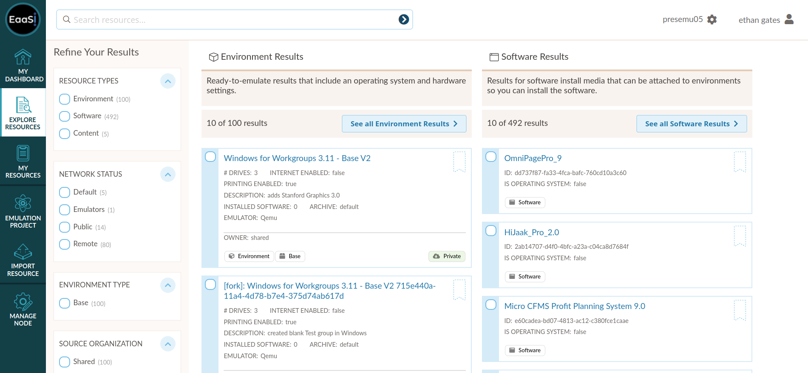
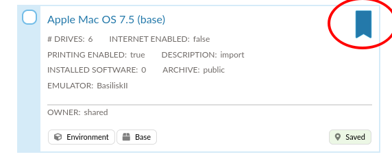
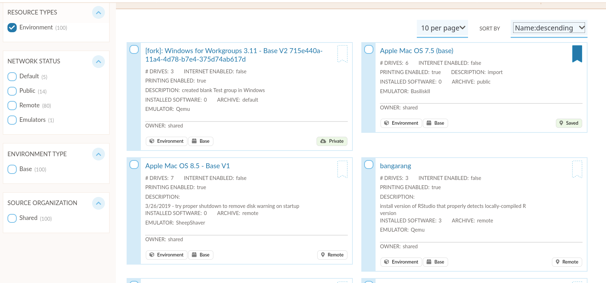
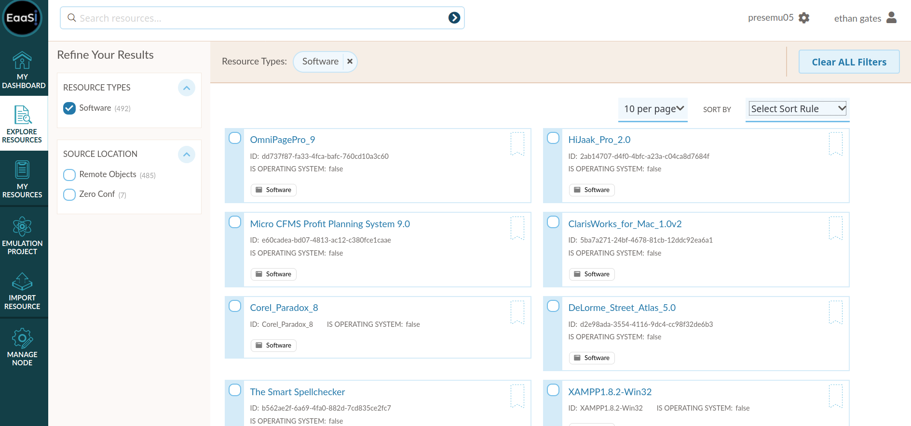
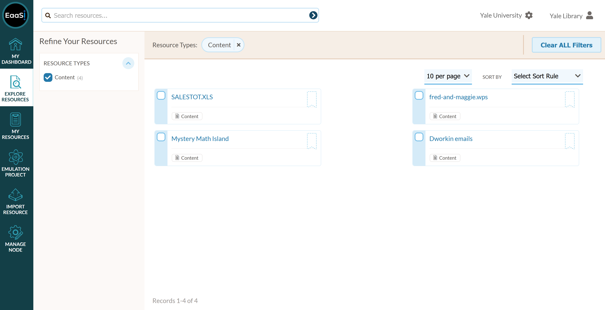
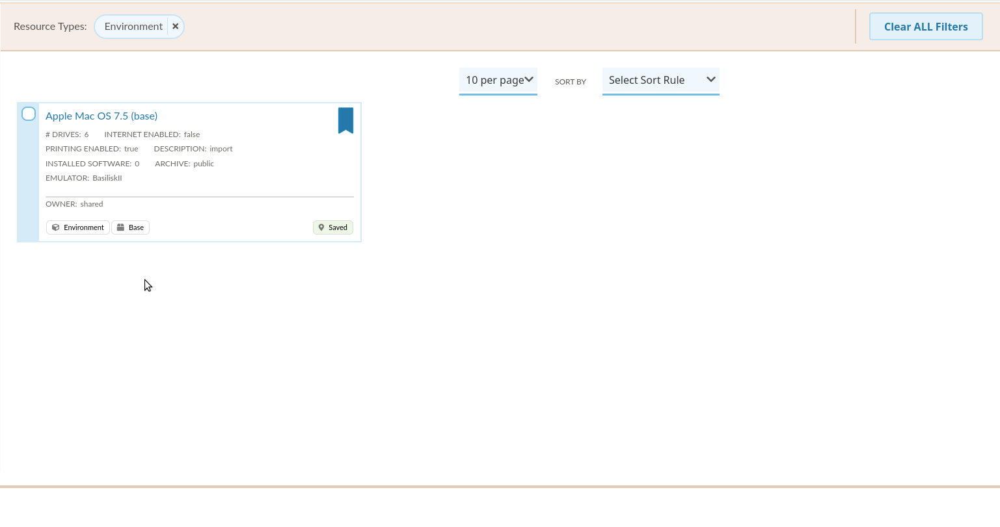

.. Exploring Resources

.. _explore:

Explore Resources
====================

The "Explore Resources" page is the EAASI platform's main portal for discovering resources available to the current user account.

Each resource card has visual tags to quickly display relevant information like the Resource Type (Environment, Software, Content or Image).

The Explore Resources page will display the first 10 resources within each resource category - Environments (which includes both Base and Content Environments), Software and Content. If there are more than 10 resources available in any given category, users can use the "Refine Your Results" sidebar to more narrowly browse, or use the search bar at the top of the screen to find a particular resource.

.. note::
  The "Search resources" bar currently only performs a free-text search based on resource names. Advanced search based on particular metadata fields (Description, Operating System, etc.) is under development.
  
Any resource on the Explore Resources page can be bookmarked by the logged-in user by clicking the bookmark icon at the top right corner of the resource card:

A bookmarked resource will then be visible on the :ref:`my_resources` page for quick reference/use later.

Environment Results
----------------------

Environment resources can be refined by Network Status, i.e. whether that Environment is:

* **Saved Locally** (Published and visible to ALL user accounts, regardless of their Organization)

* **Private** (only available to the currently-logged-in user account)

By default, any new Environments, (including any derivatives or revisions of Environments that are Saved Locally) are "Private".

Software Results
------------------

Software resource results can only be minimally sorted and refined until further development of the EAASI metadata application profile.
  
  
Content Results
-----------------

Content results can only be minimally sorted and refined until further development of the EAASI metadata application profile.

.. _actions:

Actions Menu
-------------

Clicking on the top left corner of any resource card will activate a slide menu containing contextual "Actions" for that resource:

* **"View Details"** will take the user to that resource's Details page (same as clicking on the resource name/title)
* **"Run in Emulator"** opens an Emulation Access session using that Environment
* **"Bookmark This Resource"** adds the resource to bookmarks on the :ref:`my_resources` page (same action as clicking the bookmark icon)
* **"Add to Emulation Project"** adds the resource to the user's current :ref:`emulation-project`
* **"Add Software"** allows the user to select a Software resource from a dropdown menu, then opens that Environment in the Emulation Access interface with the Software resource attached
* **"Publish to Network"** (Private Environment resources only) makes an Environment available for users all other user accounts - the Environment tag will change from "Private" to "Saved Locally"
* **"Delete"** (Private Environment, Software and Content resources only) removes the selected resource
