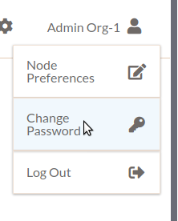
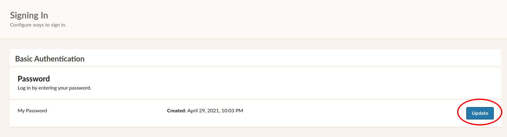
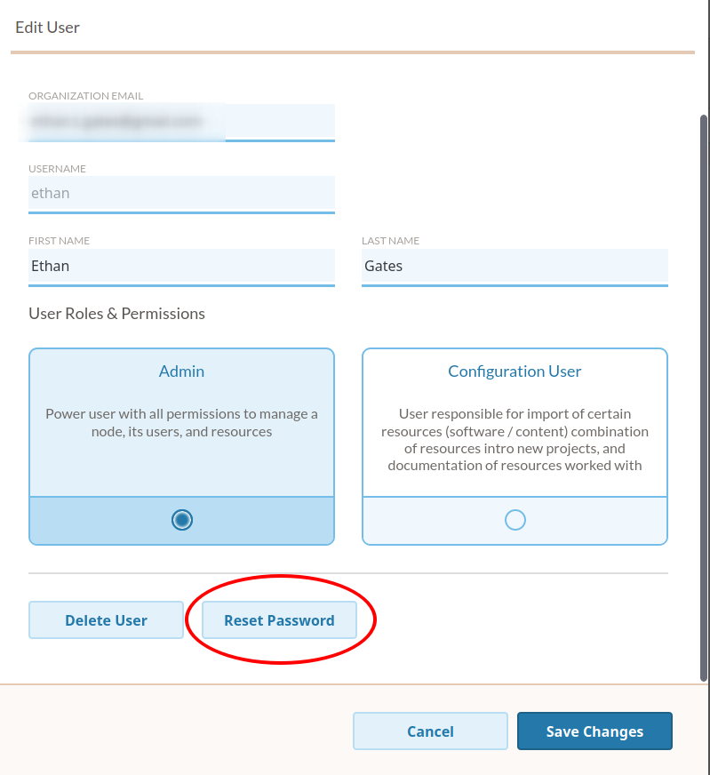
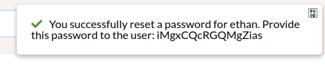

.. Hosted Service User Management

.. _hosted-service:

EaaSI Hosted Service User Management
=====================================

.. note::
  The following notes are unique to participants in EaaSI's 2021 partnership with the Software Preservation Network to pilot offering the EaaSI platform as a hosted service. As of May 2021, those deploying an EaaSI node on locally-controlled infrastructure can ignore this page.
  
Organizations provided with a hosted node by the EaaSI program of work will be provided login credentials for an initial user by the EaaSI support team. This initial user will have Admin-level privileges in the hosted node, so once they have logged in and set up their account, they have the ability to add further users to the hosted node using the EaaSI client's built-in :ref:`user_admin` features.

All new users (including the initial Admin user) will be prompted the first time they log in to change their password from the dummy/provided credentials to a new password of the user's choice. EaaSI's hosted service uses the Google Cloud platform, so user credentials are stored and managed securely but *do* pass over the public internet. The EaaSI team strongly recommends the usual password recommendations for cybersecurity and online services, including:

  * using a password manager to generate and store a unique password for your EaaSI hosted service node
  * do not reuse passwords from other accounts associated with your EaaSI email/username
  * longer passwords are better
  

Changing Your Password
========================

Hosted service users can change their password at any time by clicking on the Change Password button in the user menu at the top right of the EaaSI menu:

  
Clicking on "Change Password" will take the user to EaaSI's `Keycloak <https://www.keycloak.org/>`_ account services menu. Clicking on the "Update" password button under the "My Password" options on this page will allow the user to set and confirm a new password:

  
Hosted service users also have the option to set up a third-party Two-Factor Authentication application on this page for extra security, if desired.

.. note::
  Using the EaaSI Keycloak Account Management for individual users to change passwords and adjust 2FA settings is intended to be a temporary measure while Keycloak user management features are fully integrated into the EaaSI client's own Node User Management page. Hosted service users will be notified when this feature is updated. The EaaSI team does not recommend hosted service users to adjust any other information or settings on the Keycloak Account Management page, **only** manual passwords changes and optional 2FA setup.
  
If a user (of any level) *forgets* or otherwise loses their password, they will need to ask an Admin-level user in their node to reset their password. Admin users can accomplish this on the Manage Users page of their node settings (Manage Node -> Manage Users -> select Details of user in question):

  
Once the Admin confirms they want to reset the user's password, **the user's new temporary password will be displayed to the Admin in a notification for approximately 15-20 seconds**. The Admin will need to immediately copy and save the password and provide it to the user, for example:

Once the Admin has provided the user with the temporary password, the user in question will be able to log in again. They will be prompted to immediately change/reset the temporary password back to a password of their choosing.

.. note::
  Again, this password reset workflow is intended as a temporary solution until EaaSI's email service is properly configured with the EaaSI client's Keycloak user management functionality. Hosted service users will be notified when they can manually reset their own forgotten password over email, as with other online services.
