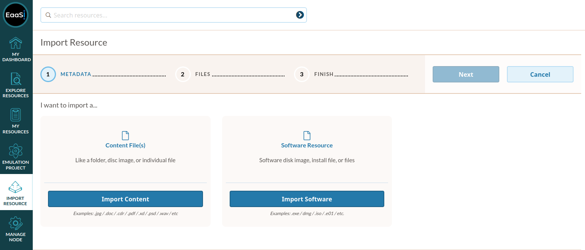
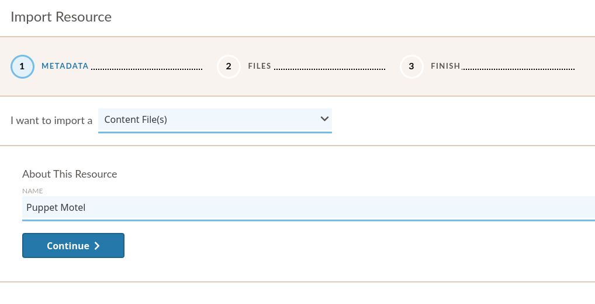
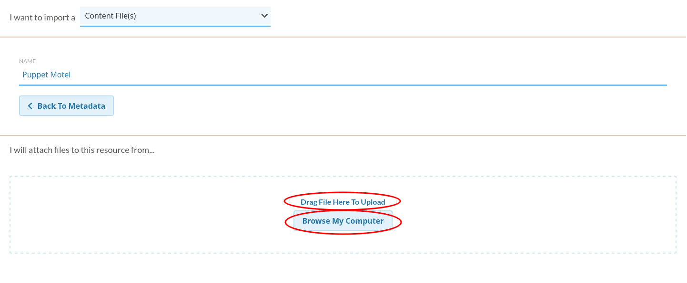
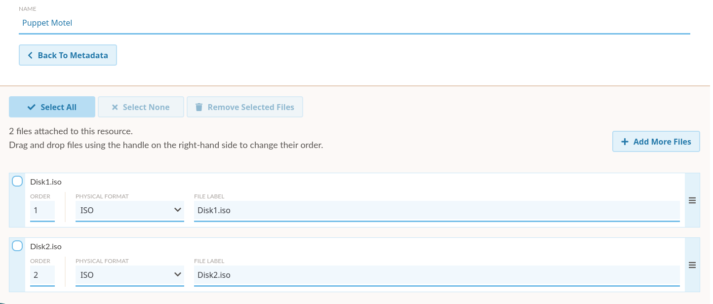
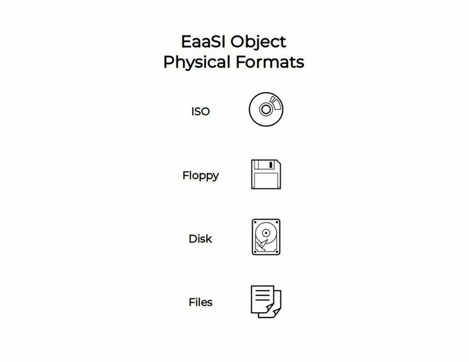
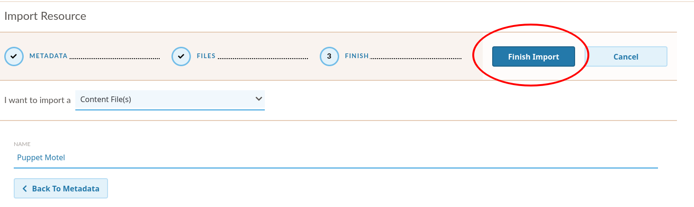

.. Import Resource

.. _add_resources:

.. note::
  Resources imported by nodes previous to an EaaSI update *should* persist without additional
  migration steps. However, unexpected behavior may occur due to metadata changes in the EaaS framework between platform versions. The EaaSI team still always recommends healthy backup practices! Do please file a bug report or contact the EaaSI team if encountering missing resources or issues during update or migration.

Import Resources
*******************

To import a new Content or Software Resource, navigate to the "Import Resource" page using the sidebar navigation menu.

From there, please follow the corresponding instructions and guidelines below depending on whether you wish to import :term:`Content` or :term:`Software`.

.. _import_content:

Importing Content
===================

To begin, select the "Import Content" button on the Import Resource page.

First, you will need to name your Content resource. This should be something short and descriptive; spaces, periods, hyphens
and underscores are OK, but please avoid using other special characters. Then proceed by clicking "Continue".

You have three options for attaching and uploading files to be included in an import:

#. **Browse My Computer**: Will pull up a file browser for you to manually select the file(s) from your computer that make up your desired Content.
#. **Drag Files**: You may drag-and-drop the file(s) from your desktop to make up your desired Content.

Once at least one file is selected, the UI will allow you to "Add More Files" to create a multi-file resource:

You may add as many files as desired.

.. _media_types:

There are four Physical Formats available to describe the file(s) being uploaded. The Physical Format will be used by EaaS to
communicate to emulators where/how to mount an object into an environment (i.e. relevant file system and/or virtual
drive).

- **ISO** - Mounts the object in an environment's virtual optical/CD-ROM drive. Should accept any file extension.

- **Floppy** - Mounts the object in an environment's virtual floppy drive. Should accept any file extension.

- **Disk** - Attempts to mount the object as a hard drive (success may thus be highly variable depending on an environment's configured hardware, the operating system's compatibility with the image's file system, etc.). Should accept most if not all hard disk image formats (IMG, DMG, DD/raw, QCOW, VDI, VMDK, E01/EWF, etc.)

- **Files** - This option will accept any set of files (i.e. intended for files that are not packaged in a disk image). To allow the arbitrary file set to be mounted in the broadest possible range of operating systems, imported file sets are currently packaged by EaaSI into an ISO file on the back-end; Files objects should thus mount in an environment's virtual CD-ROM/optical drive.

For "ISO", "Floppy", and "Disk" type resources, the files that make up the Content **must** be of the same Physical Format to mount and switch between files/disks
properly in emulation. Mixed-format resources are currently not supported.

.. warning::
  For example, An operating system installer might contain a boot floppy and then multiple CD-ROMs. The floppy image
  and the CD-ROM images must be considered and imported as different resources, but the CD-ROM images should likely be
  imported together as a single resource.
  
You can change the Physical Format of many/all files associated with the resource at once by using the Select All button. When multiple files are selected in the import menu, changing the Physical Format of one file will change the Physical Format of *all* files selected accordingly.

Once all desired files have been selected, click "Finish Import" at the top of the page:

Please **do not** navigate away from the import page until the upload is completed (i.e. the EaaSI logo stops spinning)

On successful import, the new Content resource will be available in the :ref:`explore` menu. Resources imported as Content can never be published in the EaaSI Client, either as stand-alone resources or as a component of a Content Environment (they will always be "private" to the node where they are imported).

.. _import_software:

Importing Software
======================

The steps for importing Software resources are the same as those for :ref:`import_content` described above. At this time we recommend including as much immediately descriptive version detail as possible, in brief, into the Software resource's Name: e.g. "FileMaker Pro 4.0 for Windows"

The only difference is that at the end of the import process, the object will be labelled and used functionally as a Software resource in EaaSI Client menus. That means that the contents of a Software resource could *potentially* be published if they are: 1) first saved or installed into an Environment, then 2) that Environment is published by an Admin user.

Importing Emulators
====================

Please see :ref:`managing_emulators` for more detailed instructions on managing and importing new emulators into an EaaSI node.
