.. Import Resource

.. _add_resources:

Import Resources
*******************

To import a new Content or Software Resource, navigate to the "Import Resource" page using the sidebar navigation menu.

.. image:: ../images/import_resource_overview.png

From there, please follow the corresponding instructions and guidelines below depending on whether you wish to import :term:`Content` or :term:`Software`.

.. _import_content:

Importing Content
===================

To begin, select the "Import Content" button on the Import Resource page.

First, you will need to name your Content resource. This should be something short and descriptive; spaces, periods, hyphens
and underscores are OK, but please avoid using other special characters. Then proceed by clicking "Continue".

.. image:: ../images/about_this_content.png

You have three options for attaching and uploading files to be included in an import:

.. image:: ../images/attach_files.png

#. **Browse My Computer**: Will pull up a file browser for you to manually select the file(s) from your computer that make up your desired Content.
#. **Drag Files**: You may drag-and-drop the file(s) from your desktop to make up your desired Content.

Once at least one file is selected, the UI will allow you to "Add More Files" to create a multi-file resource:

.. image:: ../images/add_more_files.png

You may add as many files as desired.

.. _media_types:

There are four Physical Formats available to describe the file(s) being uploaded. The Physical Format will be used by EaaS to
communicate to emulators where/how to mount an object into an environment (i.e. relevant file system and/or virtual
drive).

.. image:: ../images/visual_designs4.jpg
  :align: center

- **ISO** - Mounts the object in an environment's virtual optical/CD-ROM drive. Should accept any file extension.

- **Floppy** - Mounts the object in an environment's virtual floppy drive. Should accept any file extension.

- **Disk** - Attempts to mount the object as a hard drive (success may thus be highly variable depending on an environment's configured hardware, the operating system's compatibility with the image's file system, etc.). Should accept most if not all hard disk image formats (IMG, DMG, DD/raw, QCOW, VDI, VMDK, E01/EWF, etc.)

- **Files** - This option will accept any arbitrary, flat set of files. To allow the arbitrary file set to be mounted in the broadest possible range of operating systems, imported file sets are currently packaged by EAASI into an ISO file on the back-end; Files objects should thus mount in an environment's virtual CD-ROM/optical drive.

.. warning:: 
  The "Files" type object group does not accept selecting directories, so can not handle/preserve nested file structures. See :ref:`import_file_sets` for work-around guidance.

For "ISO", "Floppy", and "Disk" type resources, the files that make up the Content **must** be of the same Physical Format to mount and switch between files/disks
properly in emulation. Mixed-format resources are currently not supported.

.. warning::
  For example, An operating system installer might contain a boot floppy and then multiple CD-ROMs. The floppy image
  and the CD-ROM images must be considered and imported as different resources, but the CD-ROM images should likely be
  imported together as a single resource.

You can change the Physical Format of many/all files associated with the resource at once by using the Select All button. When multiple files are selected in the import menu, changing the Physical Format of one file will change the Physical Format of *all* files selected accordingly.

Once all desired files have been selected, click "Finish Import" at the top of the page:

.. image:: ../images/finish_import.png

Please **do not** navigate away from the import page until the upload is completed (i.e. the EAASI logo stops spinning)

On successful import, the new Content resource will be available in the :ref:`explore` menu.

.. _import_software:

Importing Software
======================

The steps for importing Software resources are the same as those for :ref:`import_content` described above. At this time the EAASI team recommends including as much immediately descriptive version detail as possible, in brief, into the Software resource's Name: e.g. "FileMaker Pro 4.0 for Windows"

The only difference from importing Content is that at the end of the import process, the object will be labelled and used functionally as a Software resource.

.. _import_image:

Importing Computer Images
===========================

"Computer Images" (or just "Images") are a special kind of EAASI resource that can be used to essentially import an Environment from outside of EAASI.

This workflow is only recommended for two particular scenarios:

  - Converting a virtual machine from another emulation or virtualization platform into an EAASI Environment
  - Extracting, disk imaging, and converting a unique system drive from a particular physical computer into an EAASI Environment

As of the 2021.10 release, it is not possible to accomplish this entirely via the EAASI UI. However, Admin-level users can import and convert Computer Images to Environments using a work-around that requires temporarily accessing their EAASI installation via the Demo UI rather than the EAASI UI.

.. warning::
  Both EAASI and Demo UIs are now included by default with EAASI deployments, but side-by-side use can produce unpredictable results. The Demo UI provides an avenue for the EAASI team to troubleshoot EAASI UI functionality and/or accomplish very specific tasks not yet fully integrated into the EAASI UI, as with converting Computer Images to Environments. In such cases these specific tasks are well-tested by the EAASI team before documented or recommended to users. Please use the EAASI UI to access your EAASI installation unless specifically directed otherwise in the Handbook or by a member of the EAASI team.

To begin, select "Import Computer Image" on the Import Resource page.

First you will need to name your Computer Image resource. This should be something short and descriptive; spaces, periods, hyphens and underscores are OK, but please avoid using other special characters. Then proceed by clicking “Continue”.

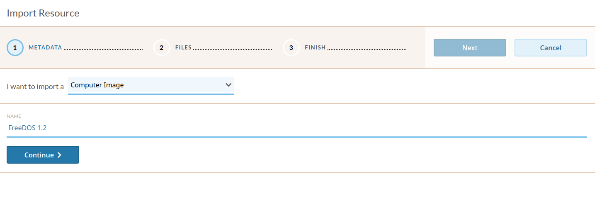

Unlike Software and Content resources, Computer Image resources can **not** be imported directly from a user's local file storage via their web browser. The Computer Image file (e.g. a hard drive or virtual machine disk image) **must** be directly accessible/downloadable by the EAASI UI at an HTTP-addressable storage endpoint. This could include common consumer cloud storage services like Google Drive, Dropbox, Box, etc., though acquiring these services often obscure their direct download links and acquiring the correct URL can be difficult if not impossible. S3-compatible storage services may be a better option, given their easy ability to generate direct download links and the ability to fine-tune permissions such that these links are not accessible to the public.

Once a Computer Image can be located at an appropriate URL, copy the URL into the "File URL" field on the "Files" page of the Computer Image import workflow. The EAASI UI will validate that the user's input is a valid/well-formed URL (but not whether a file can be successfully downloaded from that URL):

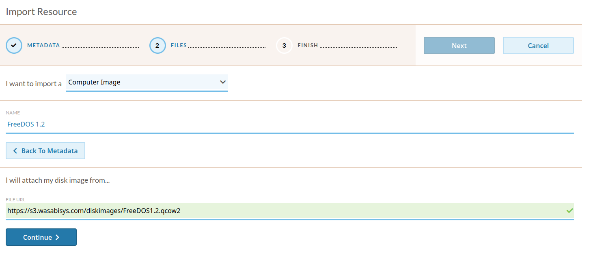

On the the final, "Finish" page, the user can review the file selected for import one more time before starting the import process. There is no other action that can be accomplished on this page at this time. Click the blue "Finish Import" button to begin.

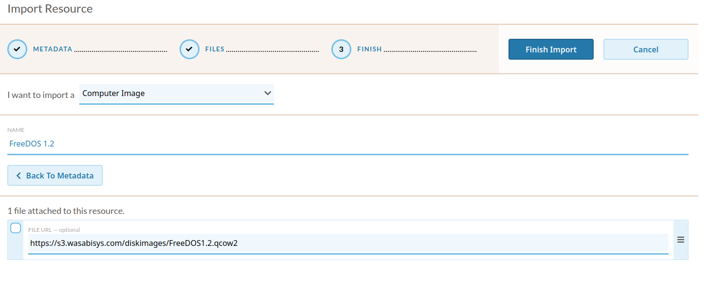

When the import task has successfully finished, the importer Computer Image will display as an "Image Resource" associated with the node and user who imported it in the Explore and My Resources menus. At this point, there is no other action that can be completed with Image resources in the EAASI UI.

Navigate to ``https://<your_eaasi_url>/admin`` to access your EAASI installation via the Demo UI instead of the EAASI UI (the Demo UI should automatically pick up on your user credentials, but log in again if necessary), and click on "Environments" in the navigation menu:

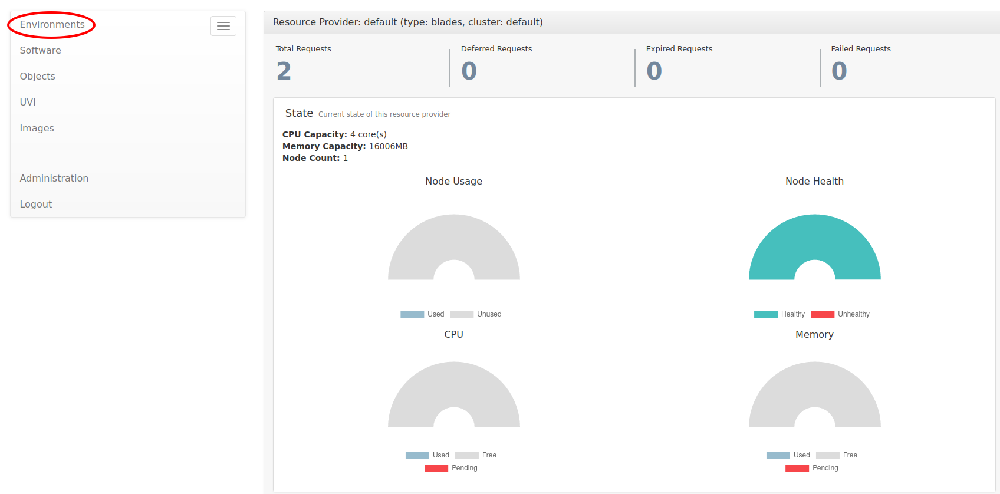

Click on the "+ Create Environment" button at the top right of the Environments screen:

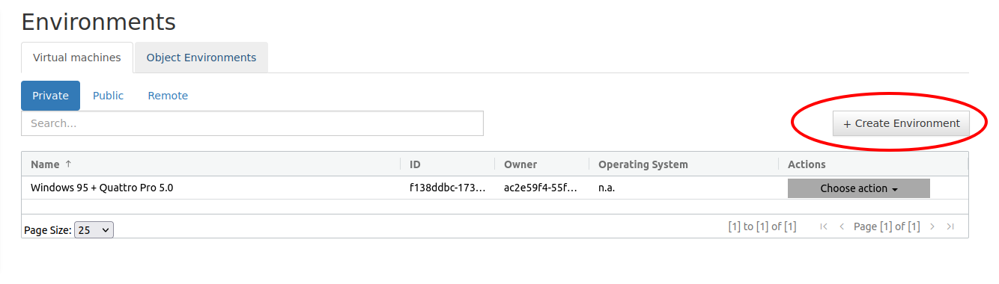

Select the general "family" of operating systems that is installed on your Computer Image:

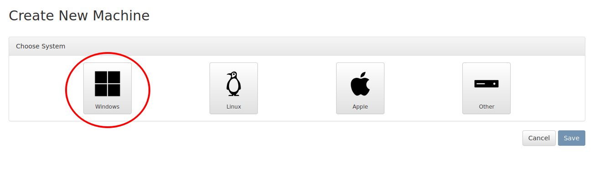

Name the Environment you want to create with your Computer Image, and then use the "Select operating system/System" dropdown menu to select the closest equivalent of your specific operating system. These options are templates that will auto-populate your Environment with an appropriate :term:`hardware configuration`. (To have templates in this menu, you must have imported Emulator images first; see :ref:`Managing Emulators <managing_emulators>` and :ref:`emulator compatility <emulators>` for process and recommendations)

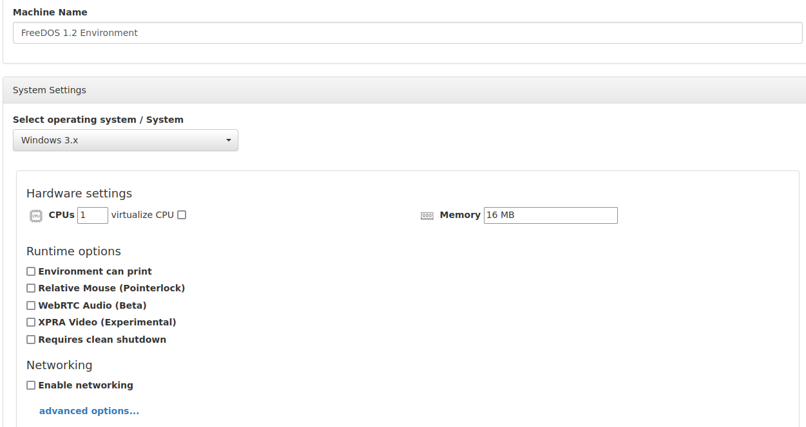

You can edit "Runtime Options" here, or change them later in the EAASI UI as desired.

Under the "Drive Settings", locate the "disk empty drive" with the "boot drive" flag, and click on the appropriate gear button for that drive:

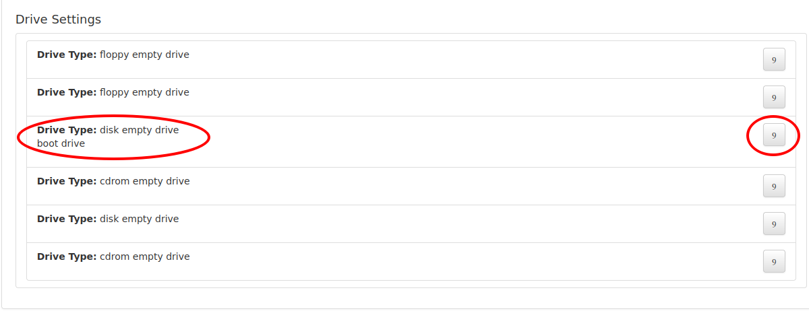

On the pop-up window, click on the "Select from disk image library" radio button. In the dropdown menu that appears, you should be able to locate your imported Computer Image and select it:

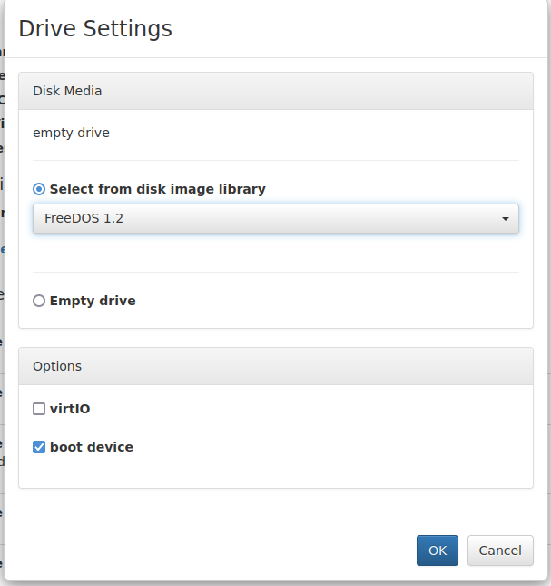

Once returned to the Create New Machine overview, click the "Save" button at the bottom right of the page to complete the process of creating a new Environment:

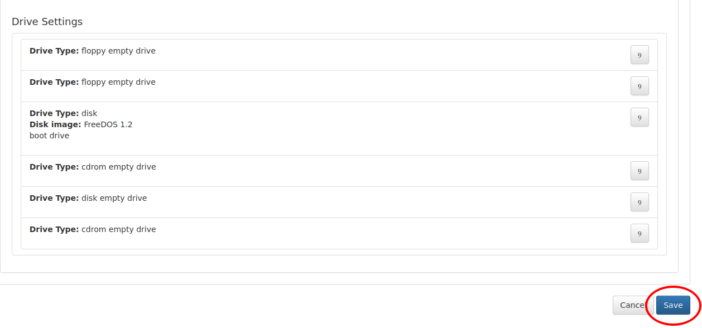

At this point, the user will be returned to the Environments overview in the Demo UI. You should see the newly created Environment, and at this point, returning to the EAASI UI (by navigating to ``https://<your_eaasi_url>``), it should also be available as a "Private" Environment:

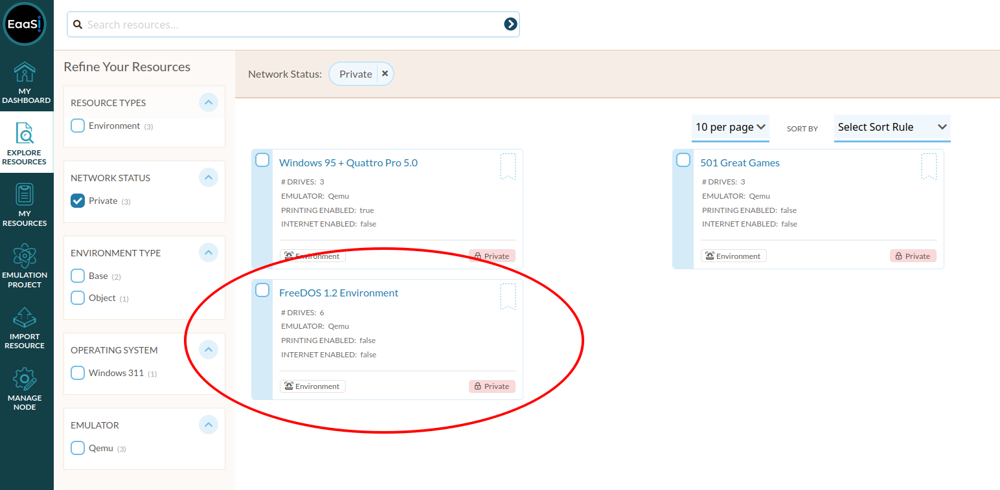

.. note::
  It is possible there will be a slight delay before the new Environment appears in the EAASI UI. Please wait a few minutes and refresh the Explore Resources page if the new Environment does not immediately appear.

The process of importing and converting a Computer Image to an Environment is now complete, and the Environment can be run, configured, and published as with any other EAASI Environment.
