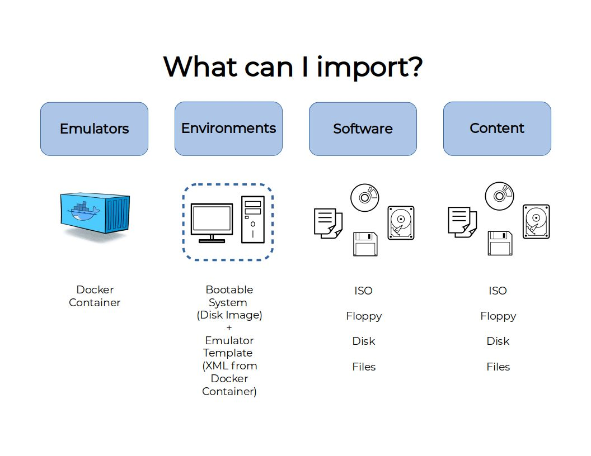
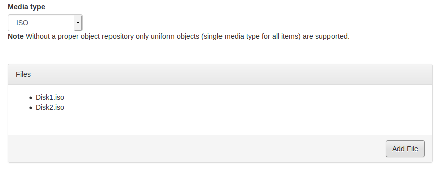
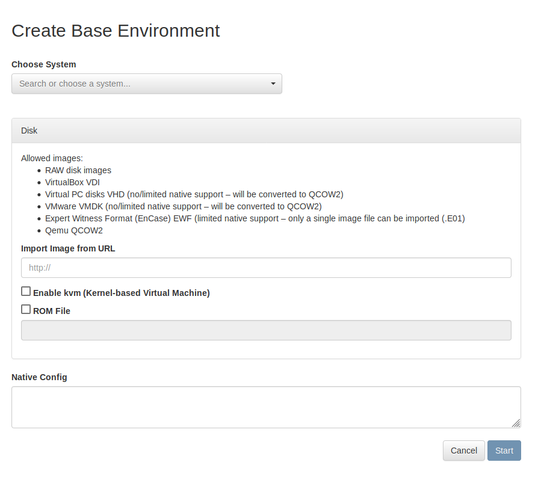
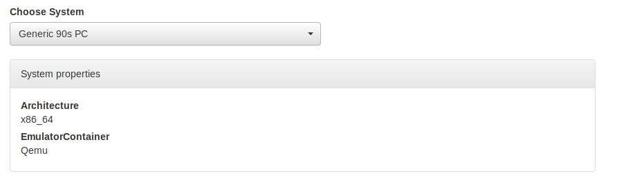
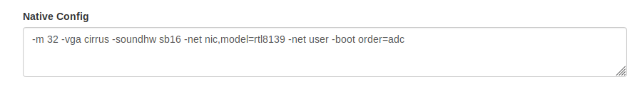

.. Import Resource

.. _add_resources:

Import Resources
*******************

.. warning::
  tktktktk something about migrating resources from the 2019 beta versions if necessary

To import a new Content, Software, or Environment Resource, navigate to the "Import Resource" page using the sidebar
navigation menu.

.. image:: ../images/import_resource_overview.png

From there, please follow the corresponding instructions and guidelines below depending on whether you wish to import :term:`Content`,
:term:`Software`, or a stand-alone :term:`Environment`.

.. _import_content:

Importing Content
===================

To begin, select the "Import Content" button on the Import Resource page.

First, you will need to name your Content resource. This should be something short and descriptive; spaces, periods, hyphens
and underscores are OK, but please avoid using other special characters.

.. image:: ../images/about_this_content.png

.. _media_types:

There are four Media Types available to describe the file(s) being uploaded. The Media Type will be used by EaaS to
communicate to emulators where/how to mount an object into an environment (i.e. relevant file system and/or virtual
drive).

.. image:: ../images/visual_designs4.jpg

- *ISO* - Mounts the object in an environment's virtual optical/CD-ROM drive. Should accept any file extension.

- *Floppy* - Mounts the object in an environment's virtual floppy drive. Should accept any file extension.

- *Disk* - Attempts to mount the object as a hard drive (success may thus be highly variable depending on an environment's configured hardware, the operating system's compatibility with the image's file system, etc.). Should accept most if not all hard disk image formats (IMG, DMG, DD/raw, QCOW, VDI, VMDK, E01/EWF, etc.)

- *Files* - This option will accept any set of non-disk-image files. To allow for maximum compatibility, imported file sets are currently packaged by EaaSI into an ISO file and file set objects will thus mount in an environment's virtual optical/CD-ROM drive.

Click the "Add Files" button to pull up a file browser and select the file(s) that make up your desired Object. You can
add as many individual files to an import as desired to create multi-file Objects. The files that make up an Object
should be of a consistent Media Type to allow for successful mounting into an emulator.

.. note::
  For example, An operating system installer might contain a boot floppy and then multiple CD-ROMs. The floppy image
  and the CD-ROM images must be considered and imported as different Objects, but the CD-ROM images should likely be
  imported together as a single Object.

Once all desired files have been selected, click "Import" at the bottom of the page. A pop-up window should display the
progress and success of the Object import.

On successful import, the new Object will be available in the :ref:`Objects overview <objects_overview>`. If the
imported Object is considered a Software Object (rather than a Digital Object/collection item) see
:ref:`adding_software`.

.. _import_software:

Importing Software
======================

.. _import_base:

Importing an Environment
===========================

.. note::
  To import a new Base Environment into EaaSI using the demo interface, the base disk image file must first be directly
  accessible at an HTTP web address. This could include cloud storage services (Google Drive, Dropbox, Box, etc.)

  If this is not possible, environments must be directly uploaded into the EaaSI container's file system and synced
  into the system. Contact the EaaSI team for instructions.

To import a new Base Environment, navigate to the "Import/Create Environment" page using the sidebar menu.

Choose the most appropriate system for the environment from the available dropdown menu. These options are provided
:term:`Hardware Configurations <Hardware Configuration>` that will determine the emulator program and settings EaaSI
uses for this environment (the displayed "System Properties" will change accordingly).

Under the "Disk" section, copy the HTTP link to the base image file (accepted disk image types are raw/dd, VDI, E01/EWF
and QCOW2; VHD and VDMK are also accepted but will be converted to QCOW2). If importing from a cloud storage service,
this *must* be a direct link; consult your service's sharing settings.

.. note::
  If importing an EWF image, this must be contained in a single E01 file. Multi-file forensic images are not supported.

If the Base Environment is running a KVM-compatible operating system (e.g. Windows XP), you can enable virtualization
here.

If a specific ROM file is needed to run the environment (e.g. for Apple/Mac operating systems), contact the EaaSI team
for instructions.

The "Native Config" field will specify the actual flags/options passed to the underlying emulator according to the
selected Hardware Configuration template. You can edit the Hardware Configuration here accordingly (consult each
:ref:`emulator's <emulators>`) documentation for available options.

Click "Start" to begin the import process. The base image will first be cached into EaaSI's temporary storage. Once the
base image has been cached, an emulation session will load to allow the user to preview the new environment before
saving. The length of the import process will depend on the size of the base image, data rate and bandwidth of the
local network, etc.

When the user is satisfied with the new environment's operation, shut down the emulated operating system and select
"Save Environment" from the Action Menu. When the new base has been named, described and saved, it will be available in
the *Private* sub-section of the Base Environments overview.

Importing Emulators
====================

Please see :ref:`managing_emulators` for more detailed instructions on managing and importing new emulators into an EaaSI
node.
