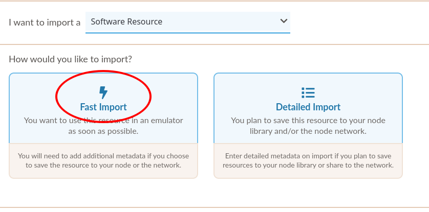
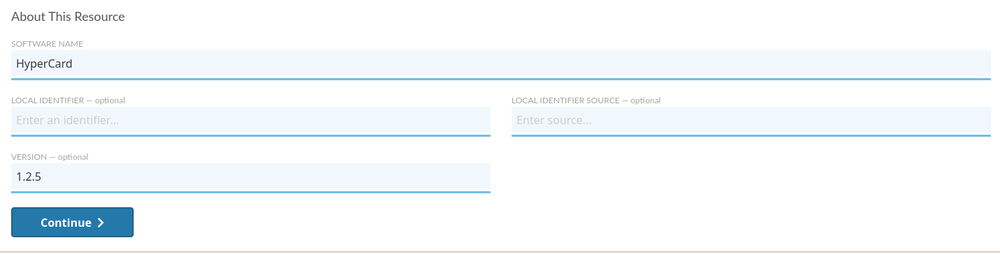

.. Import Resource

.. _add_resources:

.. note::
  Resources imported by nodes previous to an EaaSI update *should* persist without additional
  migration steps. The EaaSI team still always recommends healthy backup practices! Do please file a bug report or contact the EaaSI team if encountering missing resources.

Import Resources
*******************

.. image:: ../images/visual_designs5.jpg

To import a new Content, Software, or Image Resource, navigate to the "Import Resource" page using the sidebar
navigation menu.

.. image:: ../images/import_resource_overview.png

From there, please follow the corresponding instructions and guidelines below depending on whether you wish to import :term:`Content`,
:term:`Software`, or a stand-alone :term:`Image`.

.. _import_content:

Importing Content
===================

To begin, select the "Import Content" button on the Import Resource page.

First, you will need to name your Content resource. This should be something short and descriptive; spaces, periods, hyphens
and underscores are OK, but please avoid using other special characters. Then proceed by clicking "Continue".

.. image:: ../images/about_this_content.png

You have three options for attaching and uploading files to be included in an import:

.. image:: ../images/attach_files.png

1. **URL**: Provide a direct download URL from publicly available cloud/web storage (HTTP addresses only)
2. **My Computer**: Will pull up a file browser for you to manually select the file(s) from your computer that make up your desired Content.
3. **Drag Files**: You may drag-and-drop the file(s) from your desktop to make up your desired Content.

Once at least one file is selected, the UI will allow you to "Add More Files" to create a multi-file resource:

.. image:: ../images/add_more_files.png

You may add as many files as desired.

.. _media_types:

There are four Physical Formats available to describe the file(s) being uploaded. The Physical Format will be used by EaaS to
communicate to emulators where/how to mount an object into an environment (i.e. relevant file system and/or virtual
drive).

.. image:: ../images/visual_designs4.jpg

- *ISO* - Mounts the object in an environment's virtual optical/CD-ROM drive. Should accept any file extension.

- *Floppy* - Mounts the object in an environment's virtual floppy drive. Should accept any file extension.

- *Disk* - Attempts to mount the object as a hard drive (success may thus be highly variable depending on an environment's configured hardware, the operating system's compatibility with the image's file system, etc.). Should accept most if not all hard disk image formats (IMG, DMG, DD/raw, QCOW, VDI, VMDK, E01/EWF, etc.)

- *Files* - This option will accept any set of files (i.e. intended for files that are not packaged in a disk image). To allow the arbitrary file set to be mounted in the broadest possible range of operating systems, imported file sets are currently packaged by EaaSI into an ISO file on the back-end; Files objects should thus mount in an environment's virtual CD-ROM/optical drive.

For "ISO", "Floppy", and "Disk" type resources, the files that make up the Content **must** be of the same Physical Format to mount and switch between files/disks
properly in emulation. Mixed-format resources are currently not supported.

.. warning::
  For example, An operating system installer might contain a boot floppy and then multiple CD-ROMs. The floppy image
  and the CD-ROM images must be considered and imported as different resources, but the CD-ROM images should likely be
  imported together as a single resource.

Once all desired files have been selected, click "Finish Import" at the top of the page:

.. image:: ../images/finish_import.png

Please **do not** navigate away fromm the import page until the upload is completed (i.e. the EaaSI logo stops spinning)

On successful import, the new Content resource will be available in the :ref:`explore` menu.

.. _import_software:

Importing Software
======================

The steps for importing Software resources are extremely similar to those for :ref:`import_content` above, with a few added options
for additional metadata.

To start import of a Software resource, select "Import Software" on the Import Resources page, then select "Fast Import".

.. warning::
  "Detailed Import" is a proposed future feature that takes advantage of the full EaaSI metadata model for describing software.
  It is non-functional in the 2020.03-beta release, but can give nodes an idea of the type of information they may want to start
  capturing about their software collections. The EaaSI team is considering enforcing detailed description of Software resources
  that are published to the Network in order to reduce redundant/duplicate resources.
  
From there, you must at a minimum assign a name to the Software Resource:

All notes above regarding Physical Formats and selecting files to create a Content resource apply to Software as well.

(Again, mixed-format Software types are currently not compatible with EaaSI)

When you have selected Finish Import.

.. _import_image:

Importing an Image
===========================

The workflow for importing an :term:`Image` resource is intended to serve one of two specific use cases:

1. The user wishes to import an already-existing virtual machine or server image from an alternative emulation or virtualization application (VirtualBox, VMWare, KVM, etc) into EaaSI. For example: the `BitCurator Environment VM <https://confluence.educopia.org/display/BC/Installation+via+Virtual+Machine>`_.

2. The user has created a disk image of a specific/unique individual computer and wishes to import and run it in EaaSI for assessment, processing, and/or access. For example: `Salman Rushdie's desktop <https://www.newyorker.com/tech/annals-of-technology/digital-life-salman-rushdie>`_, emulated in its (redacted) entirety for users at the Emory University Manuscript, Archives and Rare Book Library.

In both cases, an Image is a complete, bootable object that can be run in emulation without additional configuration or installation of Software.

.. warning::
  This is not the procedure EaaSI recommends for creating new Environments in general. EaaSI recommends either creating Environments from scratch within the EaaSI platform using :term:`operating system` installation media, replicating existing Environments published in the Network, creating :term:`derivates <derivative>` from Environments already in your node, etc.
  
  Importing Images is only recommended/encouraged in one of the use cases described above.

To import a new Image resource, select "Import Image" on the "Import Resources" menu.

Choose the most appropriate system for the environment from the available dropdown menu. These options are provided
:term:`Hardware Configurations <Hardware Configuration>` that will determine the emulator program and settings EaaSI
uses for this environment (the displayed "System Properties" will change accordingly).

Under the "Disk" section, copy the HTTP link to the base image file (accepted disk image types are raw/dd, VDI, E01/EWF
and QCOW2; VHD and VDMK are also accepted but will be converted to QCOW2). If importing from a cloud storage service,
this *must* be a direct link; consult your service's sharing settings.

.. warning::
  If importing an EWF image, this must be contained in a single E01 file. Multi-file forensic images are not supported.

If the Base Environment is running a KVM-compatible operating system (e.g. Windows XP), you can enable virtualization
here.

.. warning::
  "Enable KVM" allows for the EaaSI platform to virtualize, rather than emulate, compatible x86 operating system Environments. This will greatly accelerate and improve Environment use if compatible, but may result in errors if incompatible. It is recommended for recent (~2005-present) Linux systems or Windows XP and newer. Please consult KVM's `documentation <https://www.linux-kvm.org/page/Main_Page>`_ to investigate whether your desired "guest" OS is compatible.
  
  KVM support must also be properly configured by your EaaSI sysadmin during deployment for "Enable KVM" to be effective. Please consult the :ref:`enable-kvm` page and contact your EaaSI sysadmin if uncertain whether your EaaSI node supports "Enable KVM".

If a specific ROM file is needed to run the environment (e.g. for Apple/Mac operating systems), please consult :ref:`mac_envs`.

The "Native Config" field will specify the actual flags/options passed to the underlying emulator according to the
selected Hardware Configuration template. You can edit the Hardware Configuration here accordingly (consult each
:ref:`emulator's <emulators>`) documentation for available options.

Click "Start" to begin the import process. The base image will first be cached into EaaSI's temporary storage. Once the
base image has been cached, an emulation session will load to allow the user to preview the new environment before
saving. The length of the import process will depend on the size of the base image, data rate and bandwidth of the
local network, etc.

When the user is satisfied with the new environment's operation, shut down the emulated operating system and select
"Save Environment" from the Action Menu. When the new base has been named, described and saved, it will be available in
the *Private* sub-section of the Base Environments overview.

Importing Emulators
====================

Please see :ref:`managing_emulators` for more detailed instructions on managing and importing new emulators into an EaaSI
node.
