.. Navigating the interface

.. _navigation:

Navigating and Using the EaaSI Interface
******************************

These guidelines and screenshots refer to the EaaSI demo administration interface, as provided for the beta release starting in March 2019. Front-end development will continue throughout the course of the EaaSI project and instructions may be periodically updated and versioned accordingly.

Logging In
==========

To log in to the EaaSI beta interface, navigate to the URL and provide the login credentials provided by your node's system administrators.

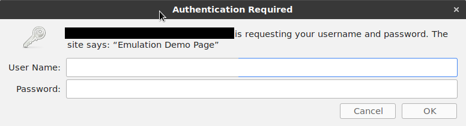

Landing Page
============

The demo Admin UI landing page features live statistics regarding the health of the local EaaSI node and the network as a whole (i.e. CPU and memory usage). These may assist Admin users and systems administrators with troubleshooting.

.. image:: images/dashboard.png

The EaaSI navigation sidebar allows users to investigate and interact with EaaSI's three primary types of :term:`resources` : Environments_, Software_ and Objects_.

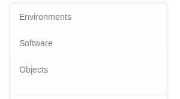

The sidebar can also be used to access various pages for :ref:`importing resources <add_resources>`, :ref:`adding emulators <managing_emulators>`, and :ref:`adminstrative settings <administration>`.

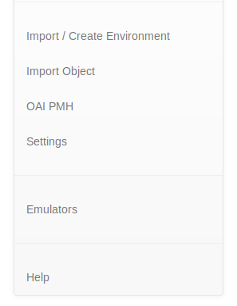

.. _environments_overview:

Environments
============

Overview page
-------------

Environments are sorted into tabs and sub-sections depending on:

  1. Derivative status (i.e. if it is a Base, Software or Object Environment)
  2. Published status (its visibility to other users in the network)

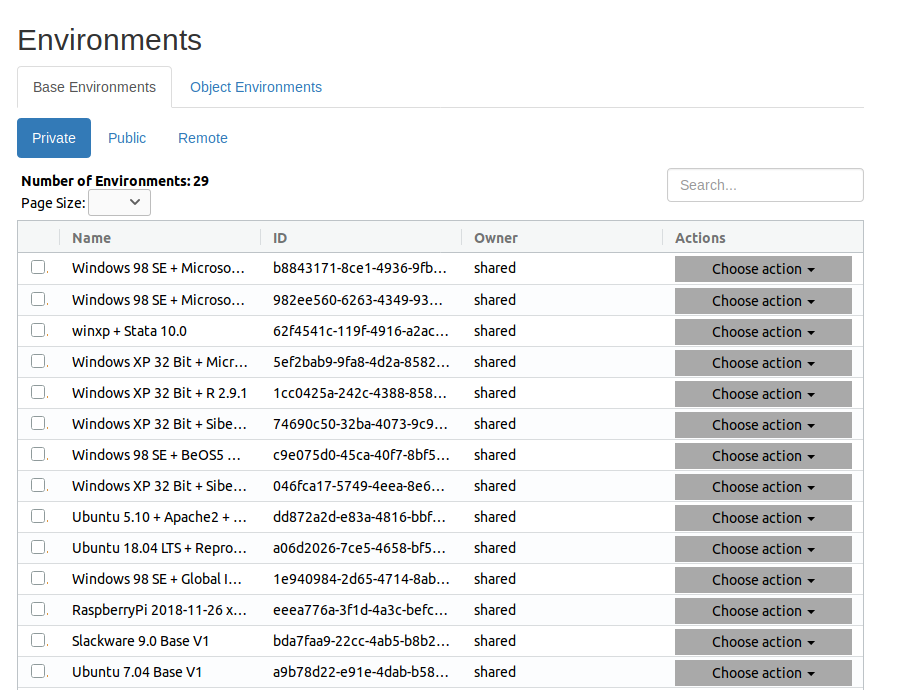

The "Base Environments" tab contains both :term:`Base` and :term:`Software Environments <Software Environment>`. Base Environments have typically been marked as a "Base" in their name. The notation "V#" has been used internally by EaaSI staff to mark "version" number for base environments - e.g. "V1" for the first attempt at importing a base image, "V2" for the second attempt at importing a base image of the same system, etc.

Software Environments can typically be identified by a name that connotes its original base environment and the name of the Software added (e.g. "Windows 98 SE + Microsoft Office 97").

The "Base Environments" tab is further broken down into three sub-sections: *Private*, *Public* and *Remote*.

  - *Private* environments are visible only to the currently logged-in node user (see `Logging In`_). They are stored locally at the node.
  - *Public* environments are visible and available for replication to all users on the network. They are stored locally at the source node. (Users at other nodes will see your *Public* environments in their *Remote* sub-section)
  - *Remote* environments are all :ref:`published <publishing>` environments from other nodes on the network. These environments are not stored locally but are available for replication to local storage (at which point they will move to the *Public* sub-section)

The "Object Environments" tab contains only derivative :term:`Object Environments <Object Environment>`. The environments displayed here should **always** be unique to the node; no node should be able to see or interact with other nodes' Object Environments.

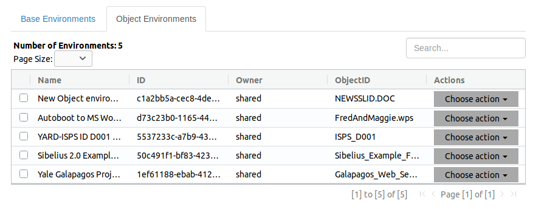

For each tab and sub-section, the environments display table shows:

  - *Name*: a descriptive human-readable name for the environment
  - *ID*: a unique UUID assigned to the environment to allow for sharing and consistency across the network
  - *Owner*: will indicate ownership status of the environment within one node when multi-user login functionality is added to the platform; for now, all environments should list "shared"
  - *Actions*: dropdown menu allowing for user and administrative actions related to that environment

Running environments
---------------------
To run a selected environment in emulation, choose the "Run Environment" option from the Actions dropdown menu.

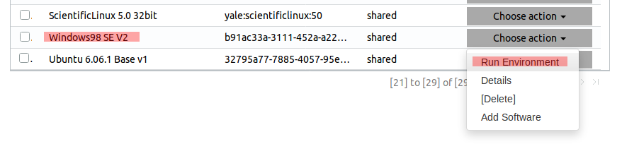

Your emulation session should load immediately.

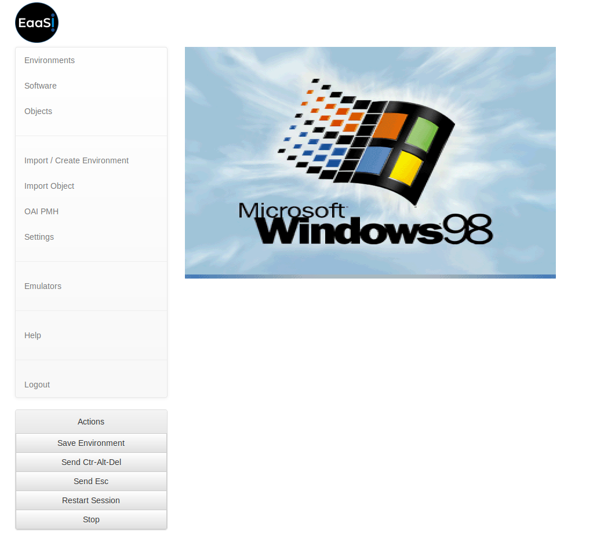

Clicking on the emulation window will capture your mouse and keyboard input to the emulated system. If Pointerlock is enabled, press "Esc" at any point during the session to free your mouse to interact with your host system.

During the session, the EaaSI Action Menu will appear below the navigation sidebar:

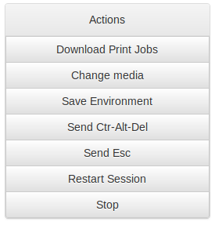

- *Download Print Jobs*: This button will appear contextually depending on whether "Environment can print" has been selected in the environment record (see `Viewing and editing environment records`_). If enabled, PostScript print jobs from the emulated system should be converted and available here as downloadable PDFs.
- *Change Media*: This button will appear contextually depending on whether a multi-disk-image Software or Digital Object has been loaded into the environment. The user can switch between images within the emulation session, mimicking the behavior of inserting and ejecting floppy disks or CD-ROMs in physical drives.
- *Save Environment*: Saves the current emulation session state as a new revision or derivative environment; changes are :ref:`isolated <derivation>` from the base image that began the session. The guest operating system must be shut down before the environment changes can be saved (see `Creating new environments`_)
- *Send Ctrl-Alt-Del*: Shortcut for sending the `"Ctrl+Alt+Delete" <https://en.wikipedia.org/wiki/Control-Alt-Delete>`_ keyboard input to the emulated operating system
- *Send Esc*: Sends the "Esc" keyboard input to the emulated operating system
- *Restart Session*: Reloads the emulation session; any changes made to the environment during the current session will be discarded
- *Stop*: Shuts down the emulation program and quits emulation session altogether; any changes made to the environment during the session will be discarded

An emulation session can be ended in several ways: using the "Stop" button from the Action Menu, shutting down the emulated operating system, or simply navigating away from the page in your browser. In all scenarios, the changes to the environment are not saved and running the environment again will return the emulation session to its original state.

Viewing and editing environment records
-----------------------

To view and edit a selected environment's metadata, choose the "Details" option from the Actions dropdown menu in the environment overview.

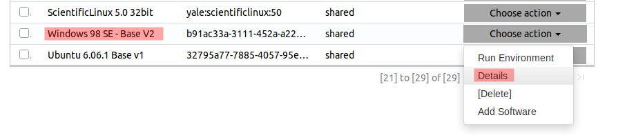

An environment record will initially only display a few descriptive fields. Click the 'Advanced Options' button to reveal the full environment record:

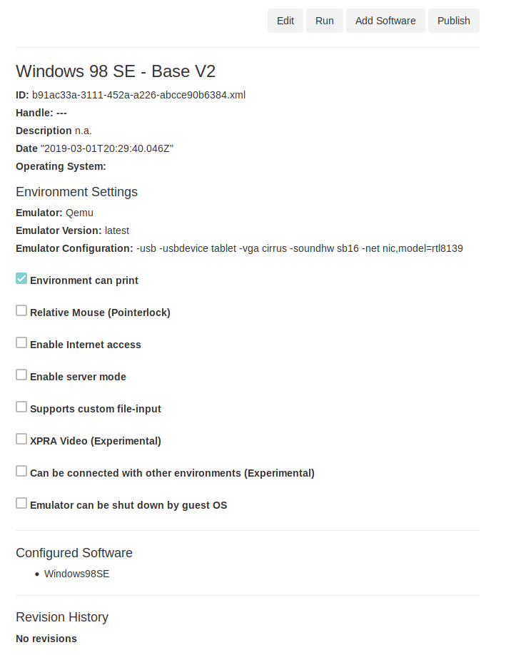

- *Environment Settings* determine the :term:`Hardware Configuration`; users can see which emulator (and version, if an emulator has multiple imported :ref:`containers <emulator_containers>`) have been selected the run the environment, as well as specific configuration options/arguments passed to the emulation application.

  .. note:: Only "Environment can print", "Relative Mouse (Pointerlock)", and "Enable Internet access" are fully supported emulation features as of the beta. All other check-box options should be considered experimental.

- *Configured Software* lists any Software Objects that were loaded and saved into this environment.
- *Revision History* describes the history of the environment in EaaSI, including any revisions made to this environment *and* the environment(s) it was derived from, if applicable.

To edit settings and descriptive metadata, click the "Edit" button at the top right corner of the page to open the record in editable mode.

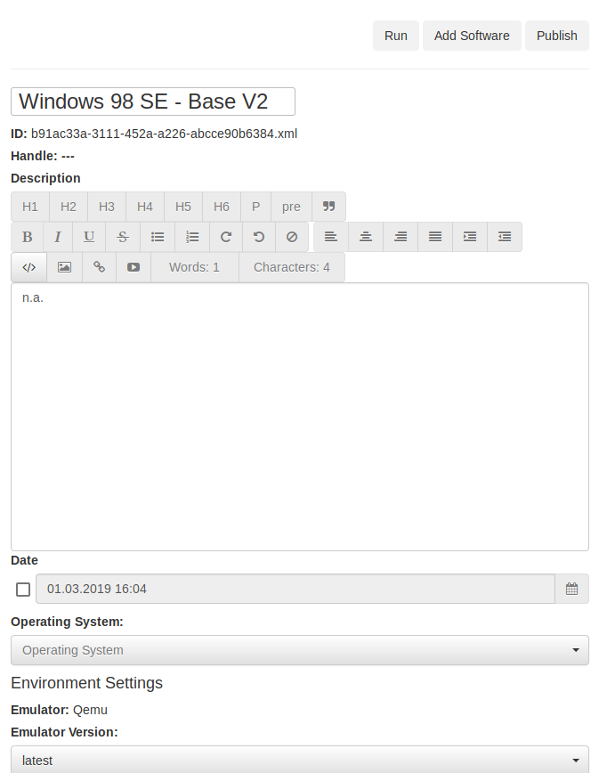

.. note:: Enabling "Relative Mouse (Pointerlock)" is highly recommended for most if not all environments. It usually allows more accurate mouse movement and input to the emulated system.

- *Environment can print* allows the EaaSI platform to pass any `PostScript <https://en.wikipedia.org/wiki/PostScript>`_ print jobs from the emulated environment to the host system and convert the print job to a PDF for the user to download from their browser. (Requires PostScript drivers to be installed and configured in the emulated operating system)
- *Relative Mouse (Pointerlock)* allows the EaaSI interface to capture the mouse for use of the emulated operating system only, if the user clicks on the emulation window. (Press "Esc" at any time to free the mouse for use in your host system/browser again)
- *Enable Internet access* allows, if the emulated hardware has been configured correctly, for the emulated system to access the live internet via the host system's network. (Requires an emulated network adapter, and compatible hardware and TCP/IP drivers)

After making any changes to an environment record, be sure to click "Save" at the bottom of the page to save your edits.

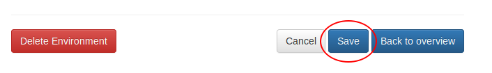

An environment can also be run at any given time from its record page by selecting the "Run" button at the top of the page.

Creating new environments
--------------------------

Adding new environments to the overview will depend on the type of environment being created. See:

  - :ref:`import_base`
  - `Creating a Software Environment`_
  - `Creating an Object Environment`_

Deleting environments
----------------------

.. warning::
  Only *Private* Base/Software Environments and Object Environments can be deleted. Any *Public* or *Remote* environments can not be deleted through the interface, as doing so will disrupt functionality across the entire network. See :ref:`publishing`.

.. warning::
  Deleting even a local, private environment will likewise break any local, private derivative environments that have been created from that environment. Use caution whenever exercising this feature.

Private environments can be deleted by node admin users in two locations in the EaaSI interface: either through the Environments overview page, or on any given environment's details page.

To delete a private Base or Software Environment from the Environments overview page, select the "Delete" option from the Actions dropdown list for the selected environment.

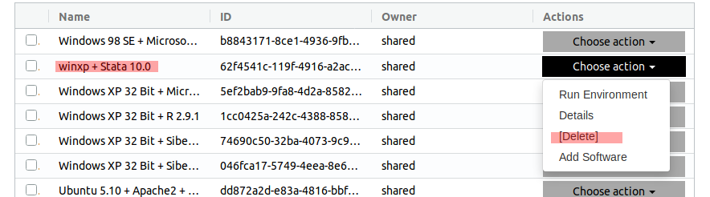

To delete a private Base, Software or Object Environment from its details page, first select "Details" from the Actions dropdown list for the selected environment, then click on the red "Delete Environment" button at the bottom of the relevant details page.

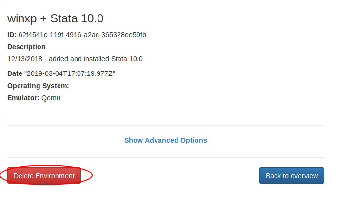

Software
========

Overview page
-------------

The Software overview page allows for browsing and adding Software Objects within the node.

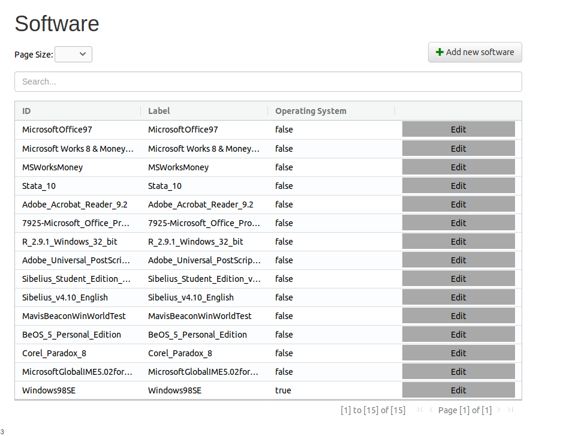

- *ID* and *Label* fields are currently the same descriptive value. Updates will come with further front-end development.
- *Operating System* indicates whether the Software Object has been marked as containing a bootable OS (e.g. is an operating system installation disc)

Viewing/editing records
-----------------------

Click the "Edit" button next to a selected Software Object to view its metadata and details.

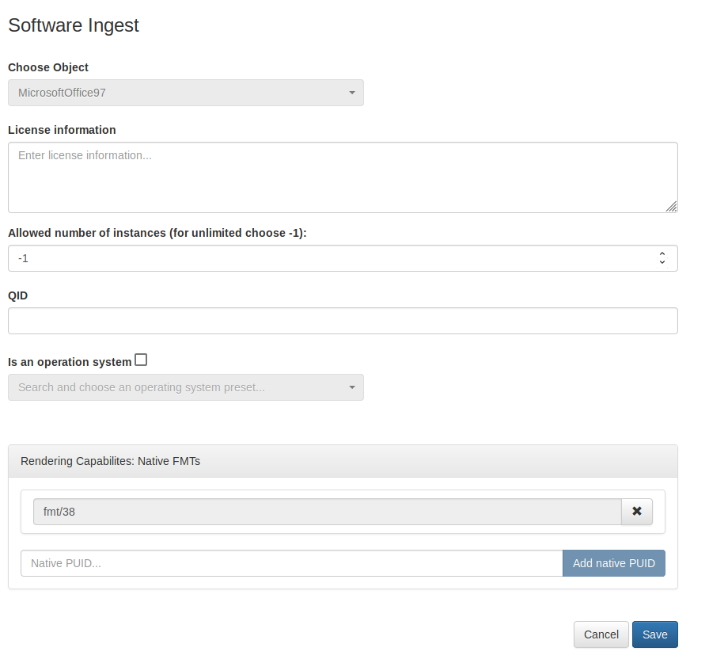

Software metadata input is currently minimal. Free text fields allow for input of license information and `WikiData QIDs <https://www.wikidata.org/>`_ if desired or convenient for reference.

You can also manually add PRONOM file format PUIDs to describe the Software's rendering capabilities, if known/desired.

.. _adding_software:

Adding Software
----------------

To add to the Software archive, software/installation media must first be imported as an Object to the EaaSI platform using the :ref:`import_object` process. The Object can then be labeled as Software.

To label an Object as Software, click the "Add New Software" button at the top right of the Software overview page.

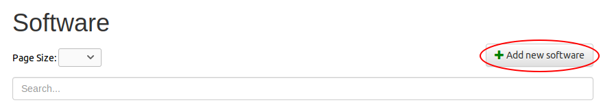

This will take you to the Software Ingest page. The "Choose Object" dropdown menu should offer you all available Objects.

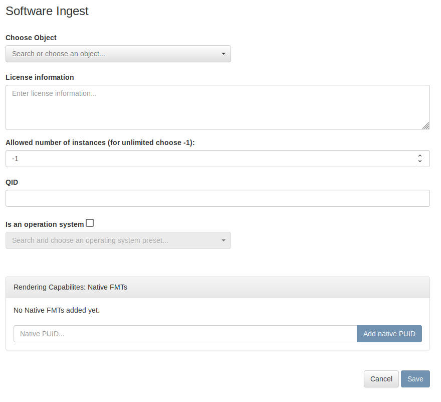

Search for and select your desired Software Object, then fill in the various Software details as available/desired. Once an Object has been selected you may click the "Save" button at the bottom of the screen to move the Software Object from the Objects overview to the Software overview.

The new Software Object should now be available in any "Add Software" options for environments.

Creating a Software Environment
-------------------------------

There are two paths to start creating a new Software Environment: from the Environments overview page, or any given environment Details page.

To start from the overview page, use the "Actions" column dropdown menu to select "Add Software" for the selected environment.

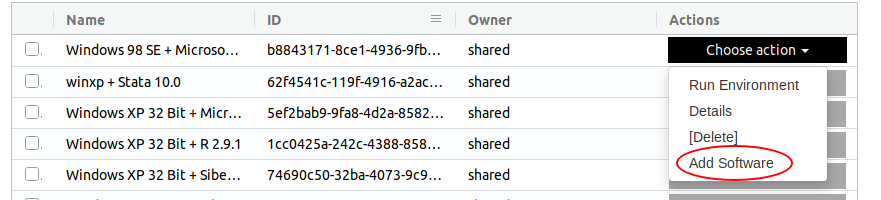

To start from an environment record, navigate to the selected environment's Details page and then click the "Add software" button in the top right corner of the page:

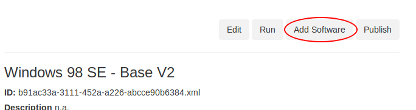

.. note:: You can add new Software to any type of environment - Base, Software, or Object - to create a new derivative environment. However, this may particularly cause unexpected behavior with Object Environments, as currently adding a Software Object to an already-saved Object Environment may essentially eject/overwrite the saved Digital Object from the environment's virtual drive(s).

  Development is ongoing to support adding Software to Object Environments while also keeping the original Digital Object mounted in the environment as well.

Either way, the user should be presented with the "Add Software" pop-up window and a dropdown menu with all available Software packages.

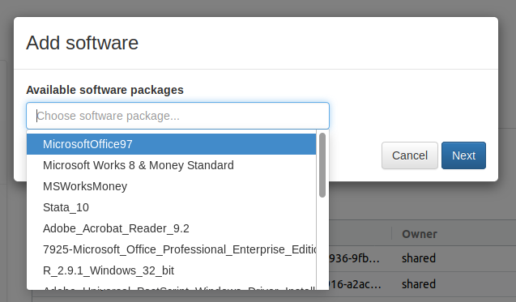

Once the user selects their desired Software package and clicks "Next", an emulation session will load with that Software mounted into the selected environment.

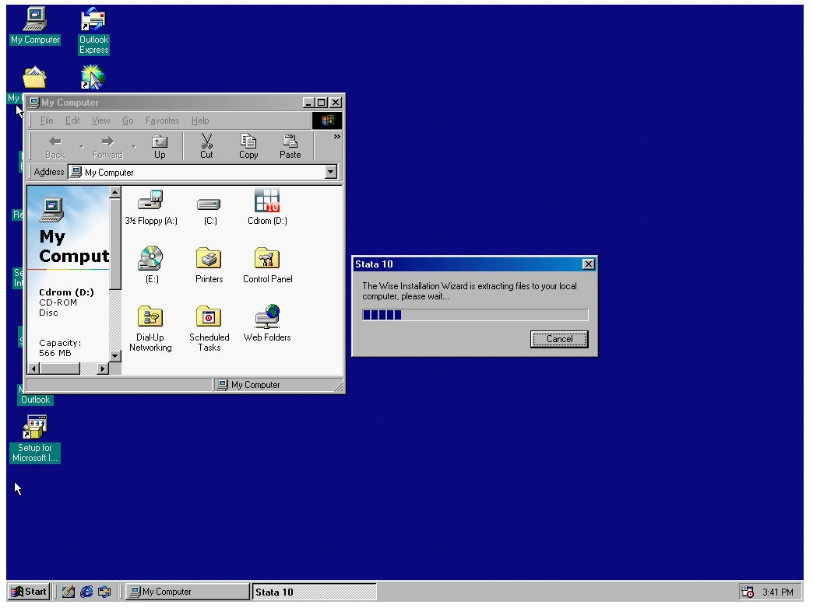

When the user has installed the software and/or configured the environment to their satisfaction (using the "Change Media" function if necessary), shut down the emulated operating system to end the emulation session (but **do not** yet navigate away from this page)

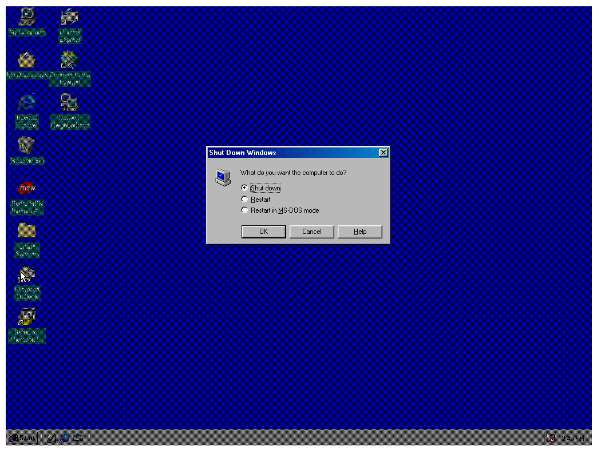

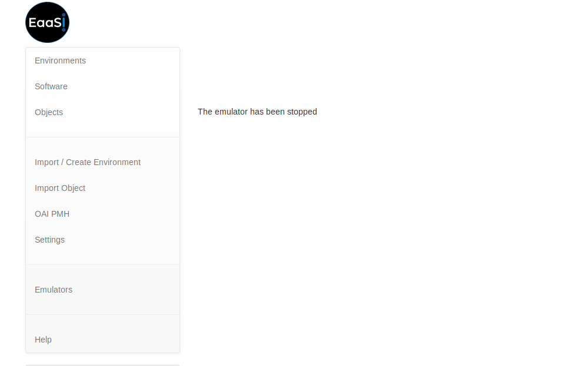

Click on "Save Environment" in the Action Menu (a reminder will display to shut down the emulated operating system, even if the user has already done so)

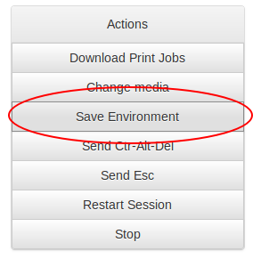

Use the WSYWIG free-text editor to describe the changes made to the environment (EaaSI staff recommend devising a standardized change log template/structure at the local node for internal consistency).

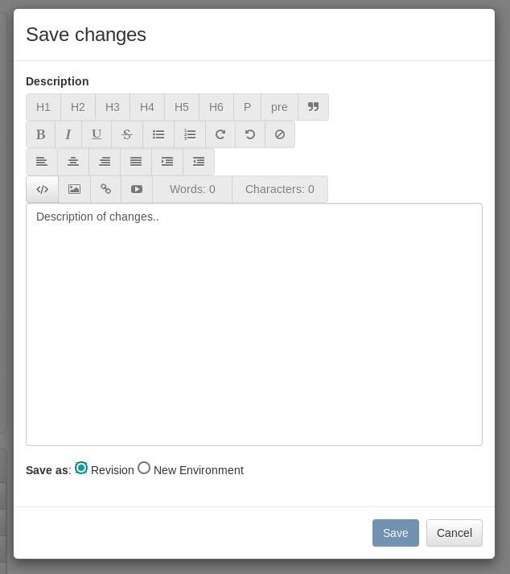

.. note::
  The user **must** input some text here or the interface will not allow the user to save changes.

If the user selects the *Revision* radio button, the changes will stay associated with the original Base or Software Environment - no new environment will be created. This should only be selected if the user truly wants **all** future derived environments to have these changes (generally EaaSI staff recommends creating new environments, with the exception of perhaps adding driver or system software packages to help an emulated operating system perform minimum, expected functionality)

If the user selects the *New Environment* button, the changes will be saved and "forked" into a new Software Environment. The original Base or Software Environment will still be accessible in its unchanged state (without the installed Software package). The user must name the new Software Environment.

Once a new Software Environment has been saved, it should immediately be available in the *Private* sub-section of the Base Environments overview, for interaction, editing, further derivation, etc.

.. note::
   If the user derived the new Software Environment from a Base or Software Environment in the *Public* image archive, the new derived environment will still be found in the *Private* archive and be accessible only at the local node. The decision can/must be made again to publish the derivative if desired.

.. _objects_overview:

Objects
=======

Overview page
-------------

The Objects overview page allows for searching and browsing all uploaded Digital Objects within the node.

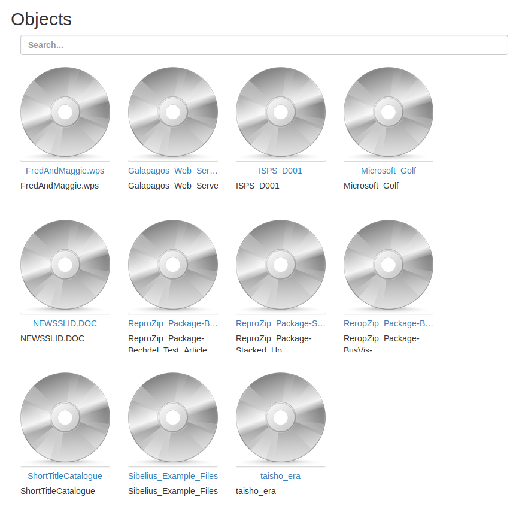

The displayed Object ID and description are currently the same value (object name/ID). Updates will come with further front-end development.

Viewing/editing page
--------------------

Click on an Object title to view its metadata and details.

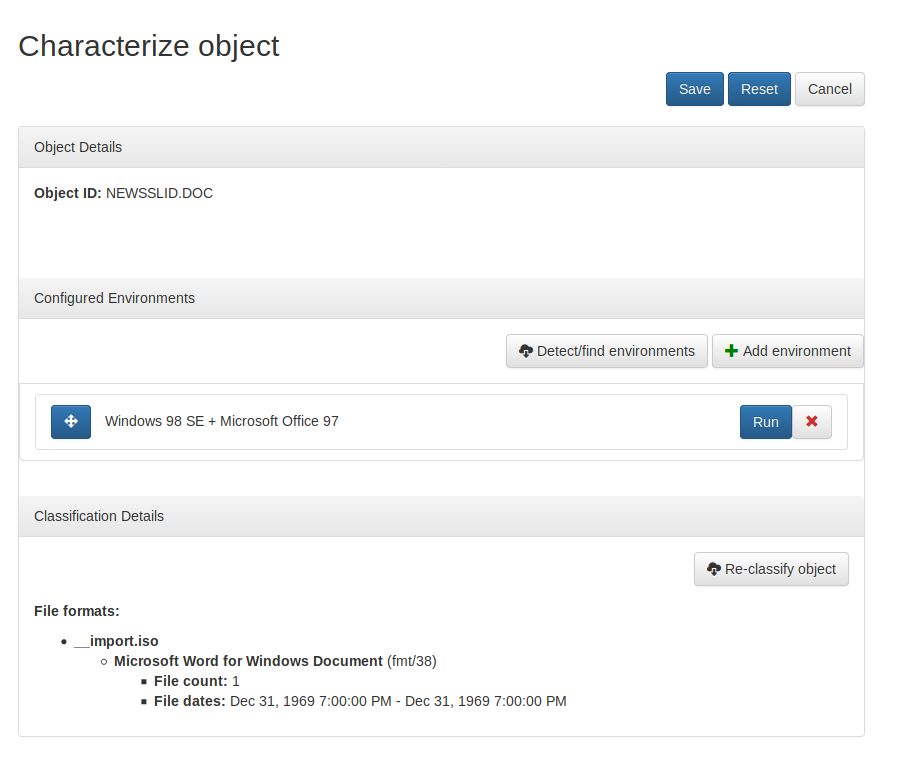

The "Object Details" section currently displays the Object ID as assigned during :ref:`import <import_object>`.

"Configured Environments" displays environments (Base, Software, or Object) that are either automatically recommended by the EaaS system or have already been manually assigned by the user to this object.

"Classification Details" displays `Siegfried <https://www.itforarchivists.com/siegfried>`_ file format identification information for all files contained in the Object (currently works best with file set :ref:`media types <media_types>`). Siegfried classification is run at the time of Object :ref:`import <import_object>`; at any point the user can re-run classification by clicking the "Re-classify object" button (to take advantage of updates to the PRONOM registry, e.g.)

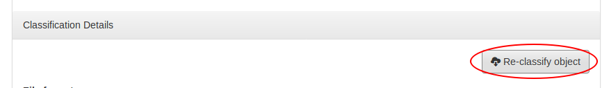

This classification information is used to help generate the automatically-recommended suggestions in the "Configured Environments" section above.

Creating an Object Environment
------------------------------

To create a derivative :term:`object environment` for easy emulated access to an Object, use the Objects overview and navigate to the details page of the desired Object.

Select an appropriate Base or Software environment in which to try running the Object from the list of recommended options. The user can also always manually select an environment, out of **all** available environments (including *Remote* environments, which can be an excellent method of testing whether a node wishes to replicate an environment from another node) by clicking the "Add environment" button and searching/selecting from the provided dropdown menu.

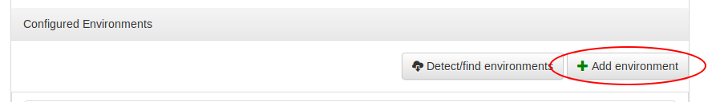

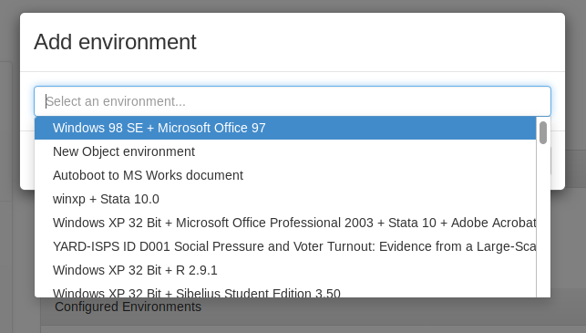

.. note:: You can add new Objects to any type of environment - Base, Software, or Object - to create a new derivative environment. However, this may particularly cause unexpected behavior with Object Environments, as currently adding an Object to an already-saved Object Environment may essentially eject/overwrite the original saved Digital Object from the environment's virtual drive(s).

  Development is ongoing to support adding new Objects to Object Environments while also keeping the original Digital Object mounted in the environment as well.

When the desired environment is available, click "Run" to load an emulation session with the Object mounted in the selected environment. (Objects should mount in the emulated environment according to their :ref:`media type <media_types>`, selected during object import)

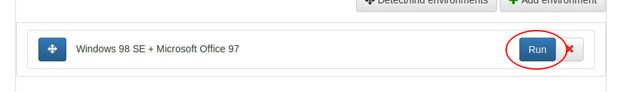

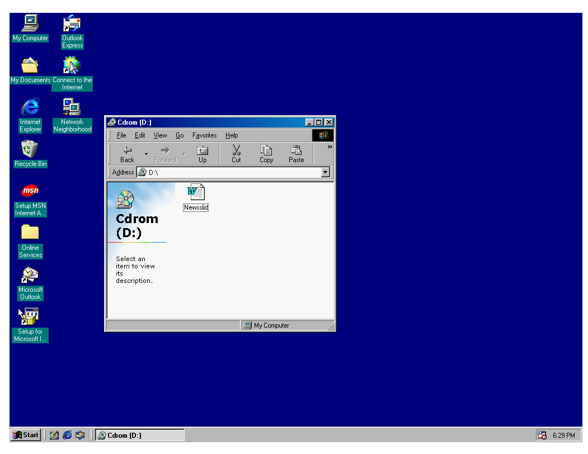

When the user has tested, installed, and/or configured the new environment to their satisfaction (using the "Change Media" function if necessary), shut down the emulated operating system to end the emulation session (but **do not** yet navigate away from this page)

Click on "Save Environment" in the Action Menu (a reminder will display to shut down the emulated operating system, even if the user has already done so)

Use the WSYWIG free-text editor to name the new Object Environment and describe the changes made to the environment (EaaSI staff recommend devising a standardized change log template/structure at the local node for internal consistency).

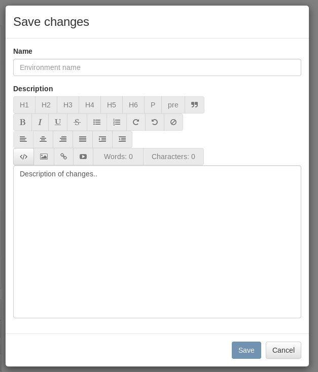

.. note::
  The user **must** input some text here or the interface will not allow the user to save changes.

Once a new Object Environment has been saved, it should immediately be available to local node users in the "Object Environments" tab of the Environments overview page for interaction and further editing/configuration, if desired.
