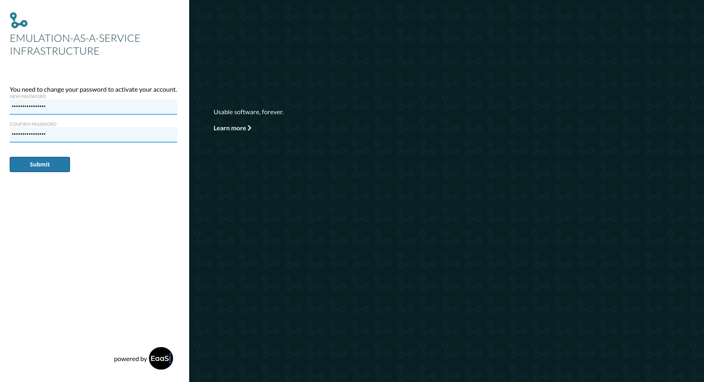
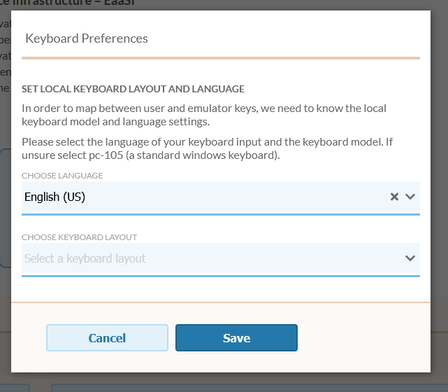

.. Logging In

.. _logging_in:

Logging In
===========

Before logging in for the first time, a new EAASI user must be added by an :term:`Admin`.
The Admin must set a user/display name, email and permission level for the user; see :ref:`user_admin`).

.. image:: ../images/landing_page.png
  :align: center

When a new user is created, the Admin who created them will be given a one-time password. This one-time password
should be provided to the user. (Again, see :ref:`user_admin`)

On their first login attempt, new users should provide the one-time password; once successful, the user
will be prompted to create their own, permanent password:

The EAASI team recommends:
  * using a password manager to generate and store a unique password for each EAASI user account
  * do not reuse passwords from other accounts associated with your EAASI email or username
  * longer passwords are better

If you forget your password, it must be reset by an Admin-level user in your Organization.

Logging Out
-------------

Users should remain logged in to the EAASI interface until clearing their browser cache or manually logging
out.

Users may log out at any time by clicking on their user name in the top right corner of the interface, then
clicking "Log Out".

.. image:: ../images/log_out.png
  :align: center

Changing Your Password
------------------------

Users can change their password at any time by clicking on the Change Password button in the user menu at the top right of the EAASI menu:

.. image:: ../images/change_password.png
  :align: center

Clicking on "Change Password" will take the user to EAASI's `Keycloak <https://www.keycloak.org/>`_ account services menu. Clicking on the "Update" password button under the "My Password" options on this page will allow the user to set and confirm a new password:

.. image:: ../images/update_password.png

Users also have the option to set up a third-party Two-Factor Authentication application for the account for extra security, if desired.

Keyboard Preferences
----------------------

Each individual user may set the layout and language of the keyboard of the keyboard they are currently using when logged into the EAASI UI. This is necessary to help map user input (keyboard presses) to a running Environment. These settings default to a generic 105-key PC keyboard layout and English (US).

To change these settings, users can click on the user icon at the top right of the EAASI menu, select "Keyboard Preferences", then use the dropdown menus in the Keyboard Preferences modal to select the most appropriate option matching their hardware.

