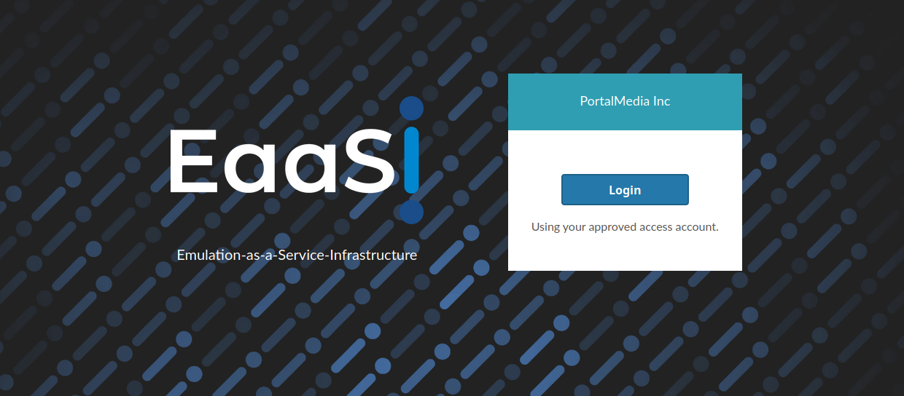
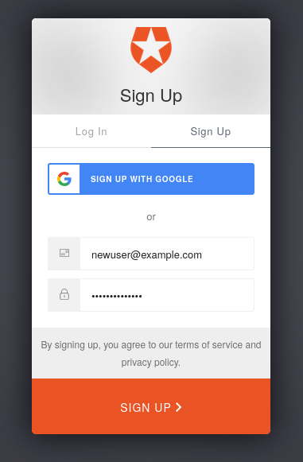
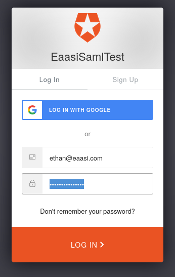
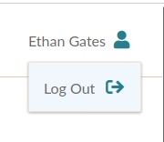

.. Logging In

.. _logging_in:

Logging In
===========

Currently users must log in to the EaaSI interface using a basic OAuth service. Streamlined integration
between EaaSI's authentication and Single Sign-On/local authentication services at Network
instutitions is in development.

Before logging in for the first time, a new EaaSI user must be added to the :term:`node` by an :term:`Admin`
or :term:`Manager` (the Admin must set a user/display name, email and permission level for the user). Once added, the new user may "Sign Up"
on the OAuth page to confirm their account and set a password for authentication.

New users have the option of using their Google/Gmail account to log in, rather than setting a unique
password, if desired.

After signing up, users may log in to their EaaSI node using the "Log In" tab of the OAuth page to proceed
to the EaaSI :ref:`dashboard`.

Logging Out
------------

Users will remain logged in to the EaaSI interface until clearing their browser cache or manually logging
out.

Users may log out at any time by clicking on their user name in the top right corner of the interface, then
clicking "Log Out".

