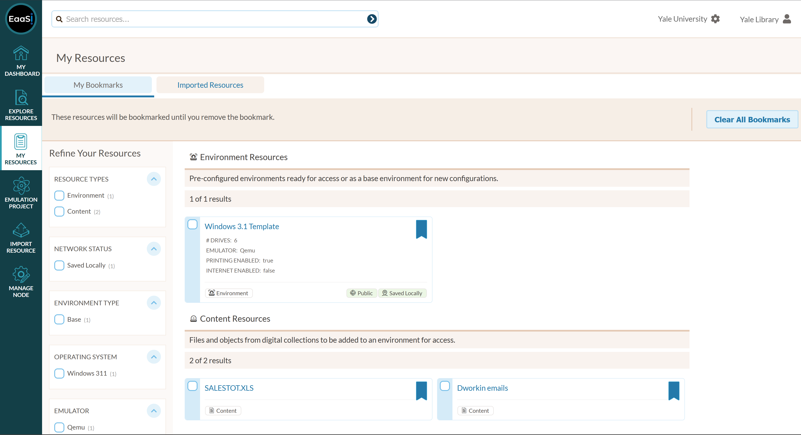

.. My Resources

.. _my_resources:

My Resources
=============

The My Resources page is unique for every EAASI user account. It tracks and displays bookmarked and imported resources by the logged-in user.

As on the :ref:`explore` page, you can use the Refine Your Results page to sort quickly through either My Bookmarks or Imported Resources.

By default, the My Resources page will open on the "My Bookmarks" tab, but users can also navigate to the "Imported Resources" tab to view and track Software and Content resources imported by that account.