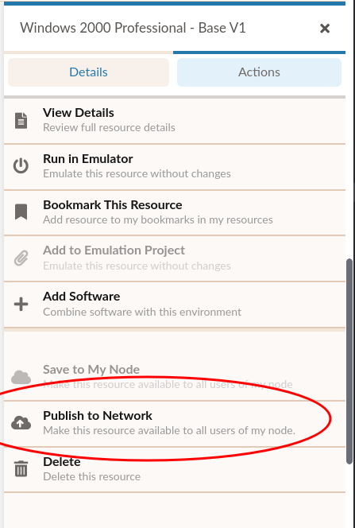
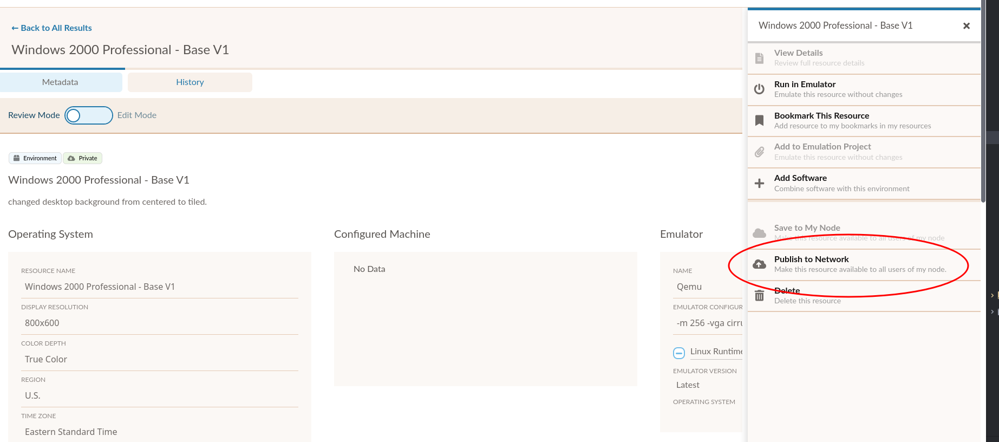
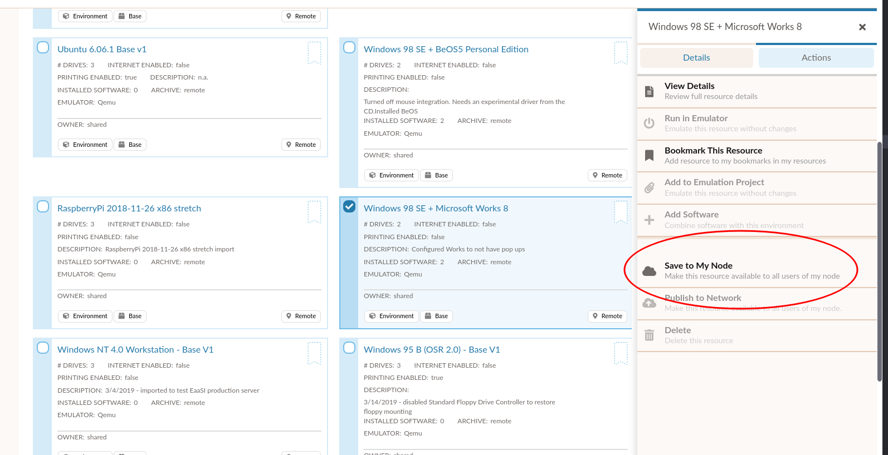
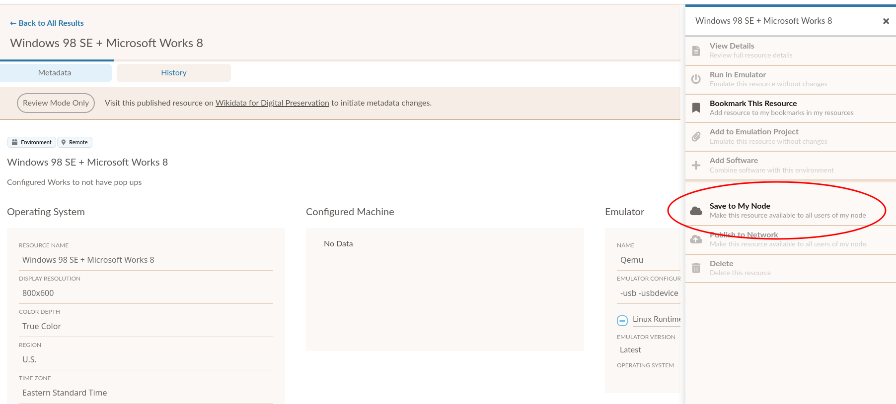

.. Publishing resources

.. _publishing:

Publishing and Saving Resources
*************************************

What resources *can* be published to the network?
===============================================

Environments are the only type of resource that can currently be published and shared between EaaSI nodes. (Software can/must be
shared by first installing it into an Environment and then publishing the Environment)

Also, this does not apply to Content Environments. :term:`Content` and associated Content Environments are assumed to be collection items, unique to each
node/institution, and therefore potentially subject to different terms of access, licensing, etc. than general software copyright. Content resources therefore can not be Published in the EaaSI Client.

What resources *should* be published?
=====================================

.. warning::
  Once published to the network, removing or deleting an Environment may have severe technical repercussions, since
  users at other nodes may have generated derivatives from that Environment, which would break.

  Nodes and users are advised to design and enforce local workflows for
  publishing resources, given these technical restrictions.

When selecting Environments to share with the rest of the network, EaaSI users and admins can
consider questions posed by the `Code of Best Practices in Fair Use for Software Preservation <https://www.arl.org/storage/documents/publications/2018.09.24_softwarepreservationcode.pdf>`_:

  - Did you lawfully acquire your copy of the software included in the environment?
  - Is the software still reasonably available in the commercial marketplace?
  - Are there any limitations present in donation or acquisition agreements that might preclude fair use?
  - What license(s) was the software distributed under?

The resources and environments provided by Yale University Library will hopefully provide illustrative examples for the
type of content that might be appropriate to share, but this will also be an ongoing, collaborative conversation within
the Network.

How to publish Environments
=================================

In a selected Private Environment's Actions menu, select "Publish to Network":

.. _replication:

How to save published Environments to a local node
====================================================

In a selected Remote Environment's Actions menu, select "Save to My Node":

