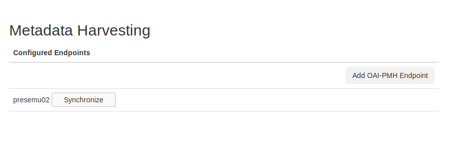
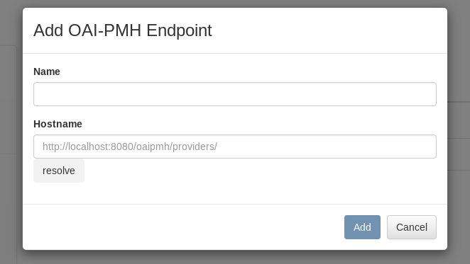
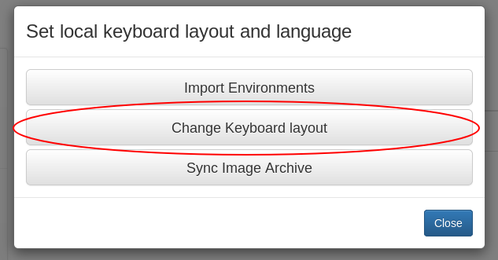
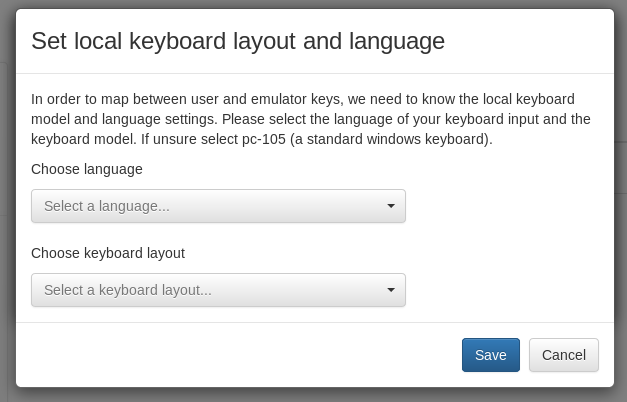

.. Administrative settings

.. _administration_dev:

Administration
**************

.. _OAI-PMH_dev:

Syncing to the Network
======================

Users can fetch metadata from other nodes on the network (that is, synchronize published Base and Software Environments)
using the "OAI-PMH" settings page in the navigation sidebar.

To add endpoints (other nodes) to this page, click the "Add OAI-PMH Endpoint" button.

Details for adding EaaSI network nodes (i.e. the appropriate URLs for each node) will be provided to node
administrators for configuration.

To fetch the available metadata/environments from other nodes, simply click the "Synchronize" button next to the
selected node endpoint. The *Remote* tab on the :ref:`environments overview <environments_overview_dev>` page should update
accordingly.

Other settings
==============

Keyboard layout
----------------

In order to map expected input between the user and the emulator, the EaaSI interface must know the user's keyboard
layout. Under the Settings menu, the "Change Keyboard layout" window allows for choosing the user's appropriate
language and keyboard layout from a number of provided options.

If no options are otherwise selected, EaaSI defaults to English (US) and a generic QWERTY 105-key PC keyboard.
