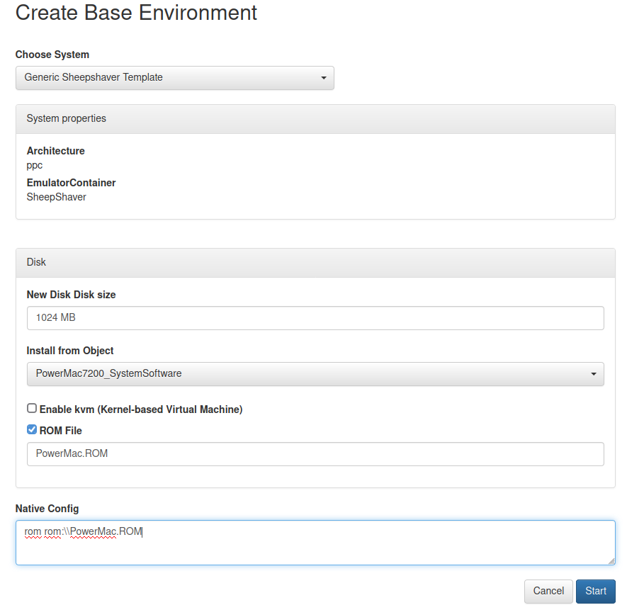

.. Mac considerations

.. _mac_envs:

Special Consideration for Mac/Apple Environments
==================================================

Mac emulation presents additional challenges compared to general PC/x86 systems (e.g. our Windows or Linux environments). Apple operating systems and emulators are often tied to very particular Mac machines/models rather than being able to run on a "generic" emulated processor. For instance, the Mini vMac emulator is designed rather specifically to emulate a Macintosh Plus and handle the operating systems available for that model, while BasiliskII can potentially recreate a slightly broader range of Motorola 68K-based Macs (Quadras, Performas, etc.)

In order to recreate a particular Mac machine, several of these emulators (including Mini vMac, BasiliskII, and SheepShaver) require a "ROM" (read-only memory) file, containing firmware dumped from an original machine's motherboard. So in addition to the emulator container, hardware template, and bootable operating system that are necessary to create any environment in EaaSI, a ROM file must also be provided for Mac environments based on these emulators/templates to run correctly.

.. note::
  ROM files are not provided along with emulators and templates in the open `emulation-as-a-service/emulators <https://gitlab.com/emulation-as-a-service/emulators>`_ repository because they contain proprietary Apple firmware. We cannot distribute these files, except as internal assets within the EaaSI Network.
  
Importing a new or custom ROM file into EaaSI in order to create or import a new Mac environment requires access to the top-level directory of Emulation-as-a-Service (``eaas-home``):

1. Copy the desired ROM file into the ``roms`` directory inside ``eaas-home``.

2. Log in to the demo UI. If you have a bootable hard drive containing a Mac operating system, use the :ref:`Import Environment <import_base_dev>` workflow. If you have a bootable Mac operating system installer (floppy, CD-ROM image), use the "Create Environment" workflow to create a blank hard disk drive on which to install from scratch. Otherwise, all further steps related to ROM and emulator configuration are the same.

3. Choose an appropriate hardware template from the "Choose system" dropdown menu - e.g. "Apple PPC (8.x-9.0)", which specifies a SheepShaver emulator configuration, appropriate for Mac OS 8.x up to 9.0 running on a PowerPC processor.

4. Check the box that says "ROM File", and in the text field enter **the exact file name** of the ROM file you copied into the ``roms`` folder - e.g. ``PowerMac.ROM``. This step allows the EaaS server to import a new ROM file into the system for use with environments.

5. Under "Native Config", specify the name of the ROM file **again** where guided by the template: e.g. the Native Config field should look like ``rom rom://PowerMac.ROM`` This step *associates the newly imported ROM file to the environment*.

6. Click "Start". If the ROM file is indeed appropriate for the SheepShaver emulator and a bootable operating system or installer is found, the Environment should run, and the user can Save the environment for future use.

Note: once a ROM file has been successfully imported and associated with at least one environment, it is available in the EaaS system for use with others. For instance, if a Mac OS 8.5 environment was created with the above workflow, a Mac OS 9.0 environment could be created by using the same procedure above, **but omitting the "ROM File" field.** The user would only have to specify the ``rom rom:\\PowerMac.ROM`` line under "Native Config", since the "PowerMac.ROM" file *has already been imported.*

For more guidance on ROM files (including exactly what kind of ROM files/Mac models are appropriate for use with which emulators and operating systems), you may refer to sites like Emaculation or Macintosh Repository, or contact the Software Preservation Analyst:

  - `Emaculation <https://emaculation.com/doku.php>`_
  - `Macintosh Repository <https://www.macintoshrepository.org/>`_
  - `EG-tech/emulation-resources <https://github.com/eg-tech/emulation-resources>`_
