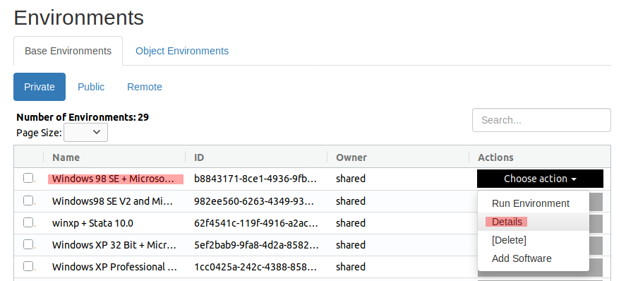
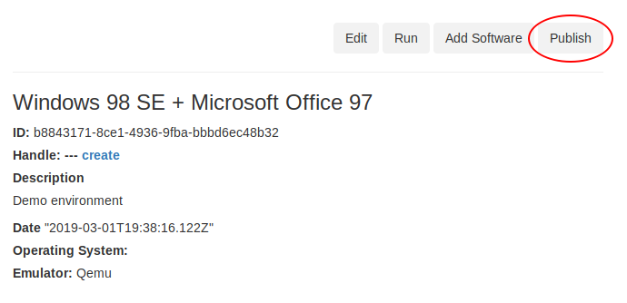
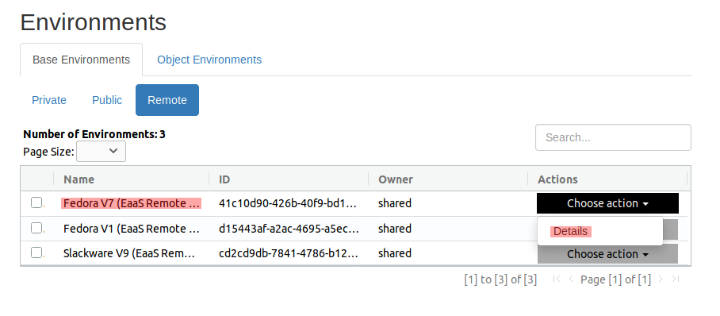
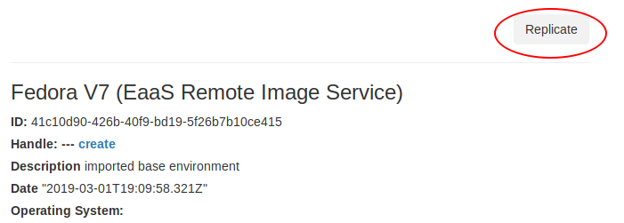

.. Publishing resources

.. _publishing_dev:

Publishing and Replicating Resources 
*************************************

What resources can be published to the network?
===============================================

Environments are the only type of resource that can be published and shared between EaaSI nodes. (Software can/must be
shared in the form of Software Environments)

Also, this only applies to Base Environments: Object Environments can not be published.
:term:`Digital Objects <objects>` and associated Object Environments are assumed to be collection items, unique to each
node/institution, and therefore potentially subject to different terms of access, licensing, etc. than the software we
are preserving and sharing under the guidelines of fair use.

Each node is responsible for determining terms of access to their Objects and Object Environments, within the tools
provided by EaaSI.

What resources *should* be published?
=====================================

.. warning::
  Once published to the network, removing or deleting an environment may have severe technical repercussions, since
  users at other nodes may have generated derivatives from that environment, which would break.

  Nodes and users are advised to use the beta testing period to consider how to design and enforce local workflows for
  publishing resources, given these technical restrictions.

When selecting Base and Software Environments to share with the rest of the network, EaaSI users and admins can
consider questions posed by the `Code of Best Practices in Fair Use for Software Preservation <https://www.arl.org/storage/documents/publications/2018.09.24_softwarepreservationcode.pdf>`_:

  - Did you lawfully acquire your copy of the software included in the environment?
  - Is the software still reasonably available in the commercial marketplace?
  - Are there any limitations present in donation or acquisition agreements that might preclude fair use?
  - What license(s) was the software distributed under?

The resources and environments provided by Yale University Library will hopefully provide illustrative examples for the
type of content that might be appropriate to share, but this will also be an ongoing, collaborative conversation within
the network.

How to publish Base and Software Environments
=============================================

To publish a Base Environment from your local node to the network, locate the selected environment in the
*Private* sub-section of the "Base Environment" tab of the Environments overview page. In the "Actions" dropdown menu,
select "Details":

In the top right corner of the environment detail page, click the "Publish" button:

.. warning::
  Once you click "Publish", you will lose the "Delete" environment option in the *Public* tab. Publishing cannot be
  undone via the EaaSI interface, and it can not be easily undone (if it can at all) by systems administrators or the
  EaaSI development team.

When the environment has been successfully published, it will move to the *Public* sub-section of the environments
overview. After their next sync to the network, other nodes will be able to see and replicate this environment via
their *Remote* sub-section.

.. _replication_dev:

How to replicate published Base Environments to a local node
=========================================================================

In the *Remote* sub-section of the environments overview, locate the selected environment from another node to
replicate to your local node, and select "Details" from the Actions dropdown menu:

On the environment details page, click the "Replicate" button in the top right corner of the screen:

On successful replication, the environment should now be available in the *Public* sub-section of the environments
overview, allowing the user to interact and create derivative environments the same as any locally-imported or created
environment.

The list of environments in the *Remote* sub-section can be periodically refreshed by syncing to other nodes
(see :ref:`OAI-PMH`).
