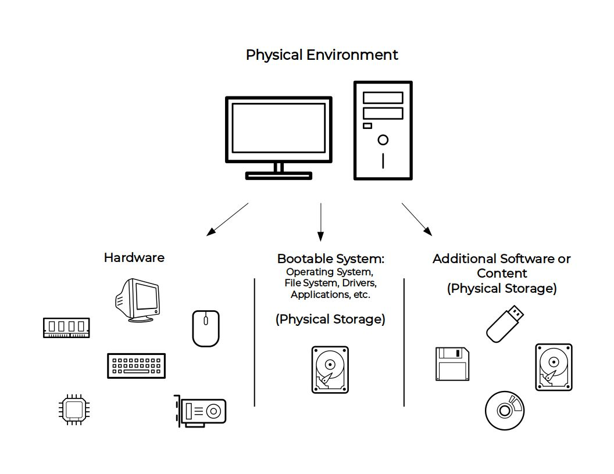
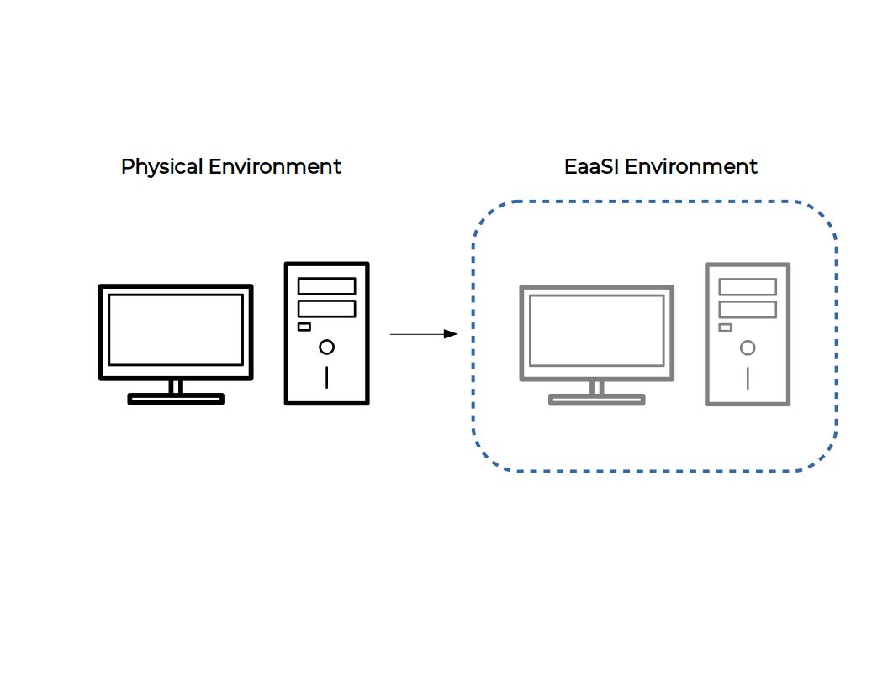
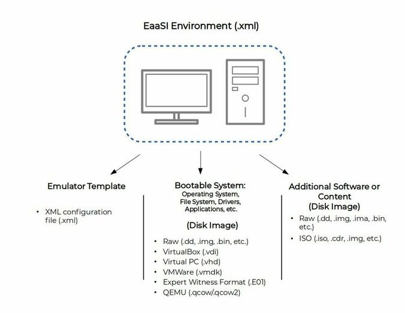
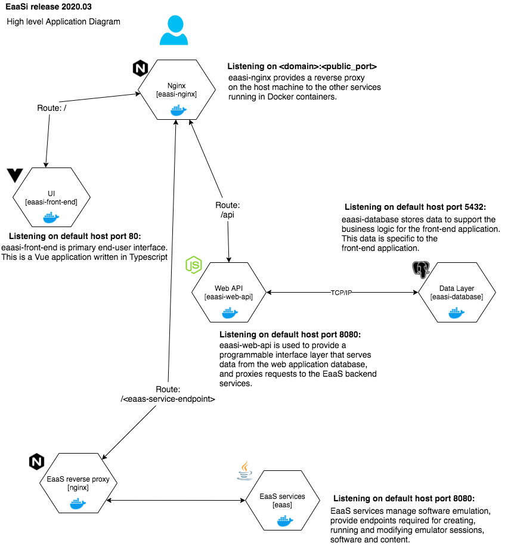
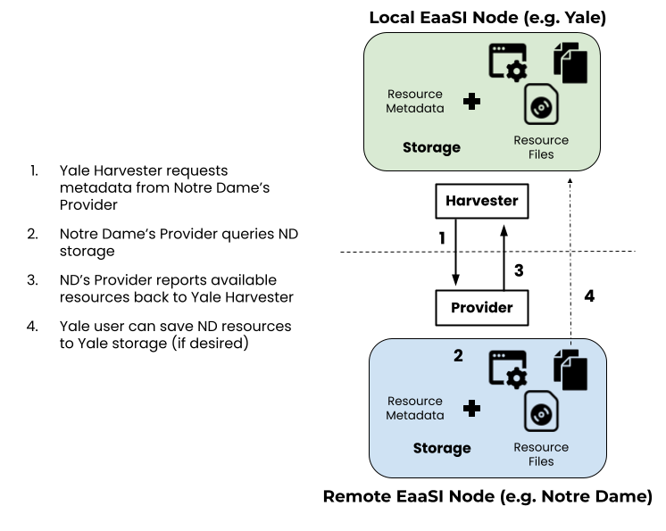
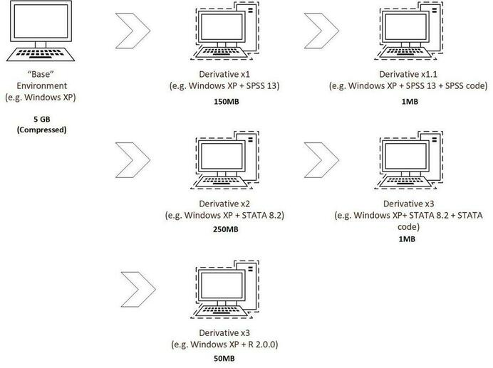

.. Technical architecture

System Architecture
*******************

Emulation-as-a-Service uses configuration templates (stored in XML) to assemble emulated hardware and data
as specified by the user.

The effect is to create in-browser virtual computing :term:`environments <environment>` that mimic the behavior of a physical machine.

When an EaaSI user runs an environment, the configuration file directs the platform to the appropriate emulator
for that system, the hardware settings for that emulator, a disk image containing a bootable operating system, and, if
desired, additional content (e.g. software installation media imaged from a CD-ROM or floppy disk) to mount in the
environment.

.. _node_components:

Node Components
===============

Emulation-as-a-Service is a server software stack composed of a number of modules working together to accomplish the task of emulator assembly and configuration. Currently these modules must be deployed as a monolith (all on one server), but the development team is making advances to deploy the modules across multiple physical/virtual machines for ideal configuration. 

EaaSI stacks(a :term:`node`) contain additional components to allow for sharing :term:`resources <resource>` and metadata across the EaaSI Network, but core functionality is accomplished with the following components:

.. image:: ../images/EaaS_Model.png
  :align: center

Client
----------

An EaaS client provides an web/browser-based interface for users to interact with Emulation-as-a-Service through RESTful HTTP requests. This Handbook is primarily concerned with the "EaaSI Client" designed by PortalMedia that allows for importing, saving, and documenting legacy software and content in emulated computing environments.

.. note::
  There is also the "Demo Client" used by OpenSLX to initially design, implement, and demonstrate new features for the EaaS back-end platform. EaaSI users may still encounter this client at times, such as using the :ref:`"Try EaaSI"<container_setup>` Docker images. Please refer to the :ref:`demo_client` section of this Handbook for questions about using this interface.

Further clients and services based on Environments created with the EaaSI Client are under development within the full EaaSI program of work. More details for using these clients and services will be released as relevant.

The EaaSI Client is built using the Vue.js framework, on a LNPP (Linux-Nginx-PostgreSQL, PHP) stack, deployed via Docker:

Gateway
--------

The EaaS Gateway acts as the API end-point, taking requests from the Client/user and managing all emulation-related resources and permissions. It tracks emulation sessions, calculates necessary computing resources, and locates the resources in storage (disk images, files, XML metadata) necessary to fulfill user requests; then passes this information to the EmuComp to run the emulation.

Emulation Component (EmuComp)
------------------------------

The Emulation Component (EmuComp) module actually allocates local CPU resources to serve emulation sessions, and underlying emulator applications (QEMU, SheepShaver, etc.) are located and installed here. The EmuComp's hardware must be optimized to allow for potentially running multiple emulation sessions.

Storage
------------

The EmuComp locates and mounts resources in file storage as directed by the Gateway. Files in storage include:

- Image Archive: Disk images and XML that make up :term:`Environment` resources (system drives containing bootable software, and the neccesary hardware/emulator configuration desired to run them). All Environment resources in the Image Archive are stored in the `QCOW2 disk image format <https://en.wikipedia.org/wiki/Qcow>`_.

- Software Archive: Disk images and files that make up :term:`Software` resources.

- Content Archive: Disk images and files that make up :term:`Content` resources.

The EmuComp can connect to resources either in local file storage (i.e. on the same server) or networked storage available to the EmuComp over HTTP. Support for deploying and connecting EaaSI nodes to resources in S3-type/cloud object storage is in development.

.. _oai-pmh:

OAI-PMH Synchronization
=======================

The EaaSI network makes use of the `Open Archives Initiative Protocol for Metadata Harvesting (OAI-PMH) <https://www.openarchives.org/pmh/>`_
to request, share and synchronize metadata between nodes.

In addition to the node components listed above, each EaaSI installation contains an OAI-PMH *harvester* and a *provider*. 
The harvester requests metadata (in EaaSI's case, Environment records) from the data providers 
at other nodes; the remote nodes' providers query their local records and return this metadata back to the original harvester.

Using the provided metadata, the harvester can also then find and replicate necessary files (disk images) from the
other nodes on :ref:`request <replication>`.

.. _derivation:

Environment Derivation
======================

EaaS makes use of a snapshot-based file format (`qcow <https://en.wikipedia.org/wiki/Qcow>`_) to avoid redundant copying and storage of full disk images when creating Environments. Any revisions or changes to an environment are isolated and saved in a new qcow file that is linked back to stored and identified separately from the Environment's original disk image. The saved derivative environments are then recreated programmatically to present the full chain of changes at the point that the user requests to run or replicate the environment.

