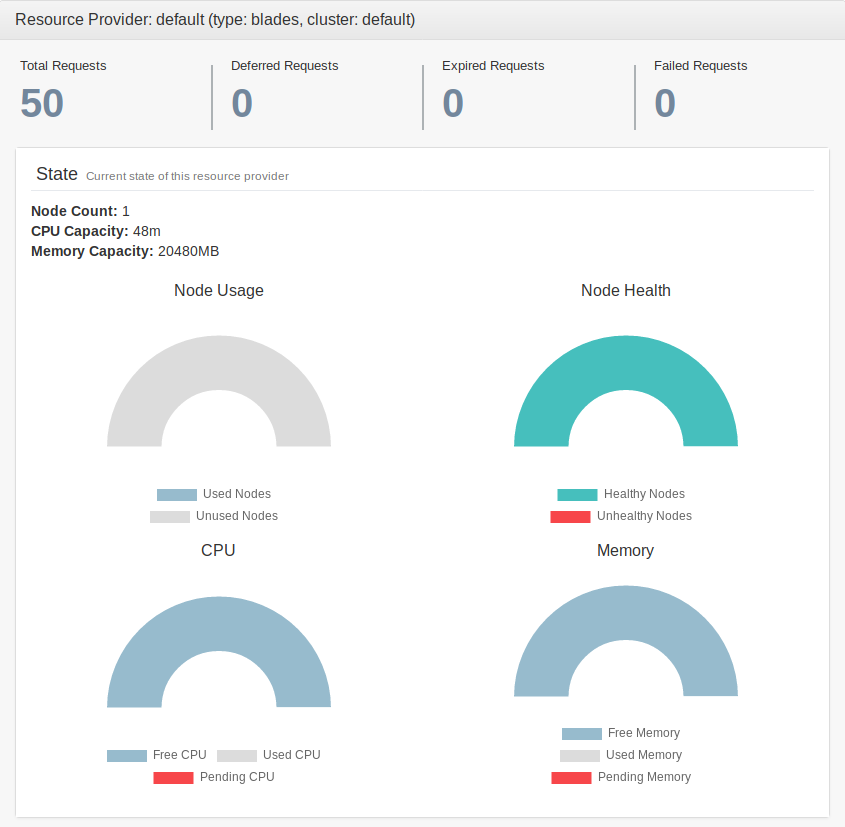

.. Metrics

.. _metrics:

EaaSI Metrics
--------------

The EaaSI platform does not currently provide much in the way of advanced methods for capturing or tracking system usage data. The following are a few recommendations for methods or work-arounds for EaaSI system administrators to acquire some basic insight/metrics in regard to their EaaSI installation.

Demo UI Dashboard
******************

The Demo UI dashboard (usually visible/accessible to sysadmins by logging in at the URL ``https://<eaasi-domain>/admin``) provides basic, though potentially imprecise, information regarding an EaaSI node's usage.

At the top of the dashboard, **"requests"** can be considered equivalent to emulation sessions. "Total requests" indicates a running tally of sessions run by the server, while any numbers in the "deferred", "expired", and "failed" requests fields are indicative of a configuration error in the deployment and sysadmins should investigate their error logs further.

.. warning:: 
    The number of "Total Requests" on the Demo UI Dashboard will **reset** if the server is rebooted or the ``eaas`` service is restarted for any reason, e.g. for troubleshooting. Thus this number **should not** necessarily be trusted as an accurate total of the number of emulation sessions ever run on the server. See :ref:`below <sessions-metadata>` for a way to fetch a more precise version of this information.

**CPU Capacity** and **Memory Capacity** should be quick and accurate summaries of the total computing power available to EaaSI based on the deployed server configuration.

The graphs on the Demo UI dashboard are imprecise, but the "CPU" and "Memory" graphs in particular can be used to estimate the number of active emulation sessions in the node. **These graphs assume that every emulation session will consume 1 CPU core (1000 mcores) and 512 MB of RAM.** So, if the Demo UI dashboard displays "4000 mcores Used" and "2048 MB Used" for CPU and Memory, there are 4 actively-running emulation sessions.

.. warning:: 
    These estimations (1000 mcores and 512 MB RAM per single running emulation session) are **hard-coded** into the dashboard and not actually calculated by polling the server's available/consumed computing resources. The *actual* CPU/RAM consumed by running emulation sessions may be higher. 

.. _sessions-metadata:

Sessions Metadata
******************

The Emulation-as-a-Service application logs minimal, anonymized metadata on emulation sessions to allow system administrators some insight into which Environment resources have been run on their deployment, how often, and for how long.

This metadata is logged to a CSV file located at ``<eaasi-home-dir>/server-data/sessions.csv``. Only system administrators/users with direct (e.g. SSH) access to the server EaaSI is deployed on can access this file; it is not accessible via a public-facing interface (EaaSI UI, Demo UI, or API).

This file logs the following metadata points for *every emulation session ever run on the server* (unlike the request stats on the Demo UI dashboard, this session data persists between restarts of the ``eaas`` service, so represents a complete picture of the server's usage):

    - Timestamp (UTC) for the start of the session
    - Timestamp (UTC) for the end of the session
    - UUID for the user account that requested/started the session
    - UUID for the requested Environment resource
    - UUID for any Content/object resource associated with the requested Environment

System administrators can map UUIDs for Environment and Content resources to human-readable resource names and other helpful/identifying metadata via the :ref:`eaasi-api`.

Using ``stats-sessions.py``
#############################

The OpenSLX team has also created a `simple Python script <https://gitlab.com/emulation-as-a-service/eaas-debug/-/blob/main/stats-sessions.py>`_ to assist with quickly parsing the metadata logged in ``sessions.csv`` to a couple of commonly-requested datapoints.

.. code-block:: sh

    $ stats-session.py [--filename sessions.csv] [sessions/max-sessions]

By default, ``stats-session.py`` will assume the user is running the script on their EaaSI server and run on the file location ``/eaas*/server-data/sessions.csv``. Use the ``--filename`` directive as shown above to specify a different file location/path.

Users can then specify one of two reports to generate from the ``sessions.csv``.

The *sessions* action repeats much of the same metadata contained in the file but presented in a more human-readable form, e.g.

.. code-block:: text

    2021-05-24 12:55:46.025000+00:00	097ccc71-db3d-46d8-b006-8f04766b7100	117.713

Where these values represent:

    - The UTC timestamp for when the emulation session was started, in ISO 8601 format for legibility
    - The UUID for the environment run in the session
    - The duration of the session, in seconds

The *max-sessions* action quickly calculates the **maximum number of simultaneous sessions** for every day that the EaaSI server has been active, e.g.:

.. code-block:: text

    2021-05-25 12:55:46.025000+00:00 4
    2021-05-26 19:12:48.167000+00:00 1
    2021-05-27 01:37:35.529000+00:00 0
    2021-05-28 04:28:34.209000+00:00 7

This information is primarily useful for resource allocation for the EaaSI deployment (i.e. calculating whether more CPU/RAM should be allocated to the server given any patterns of heavy simultaneous usage).

By default, ``stats-session.py`` will simply write these reports as tab-separated values to standard output. If you would like to save the reports, redirect the output to file, e.g.

.. code-block:: sh

    $ stats-sessions.py max-sessions > max-sessions.tsv

