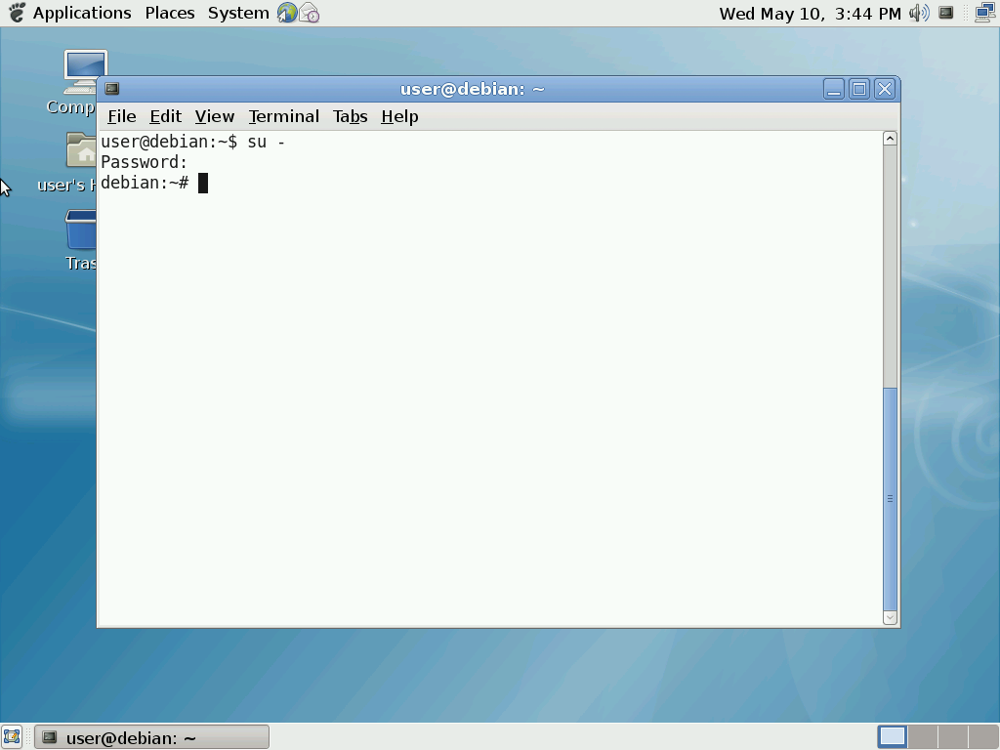
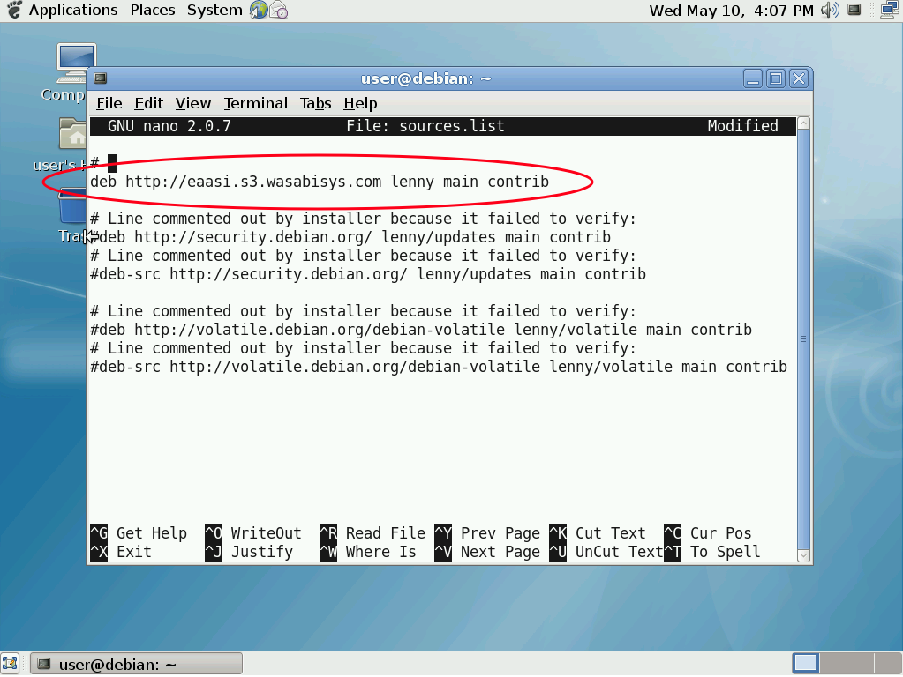
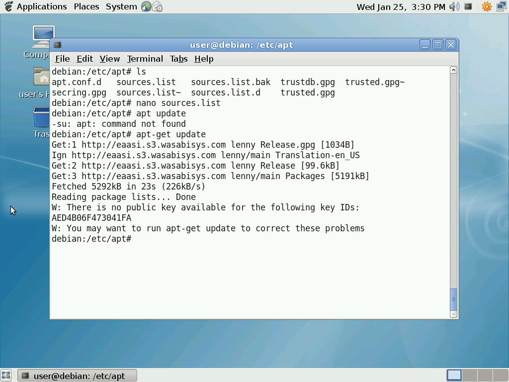

.. Intructions for using EaaSI's legacy open source "mirror"

.. _open-source-repo:

EaaSI Open Source Repository
*****************************

What is the EaaSI Open Source Repository?
==========================================

In the course of creating and configuring various historical open source computing Environments (such as those in the `EaaSI Open Source Software Sandbox <https://sandbox.eaasi.cloud>`_), the EaaSI team has realized that the traditional EaaS model of acquiring and importing installation media as :term:`Software` resources frequently does not align with a much more common, efficient method of distributing and installing open source software adopted over the past several decades: using `package management <https://en.wikipedia.org/wiki/Package_manager>`_ software to fetch and install applications and their dependencies from a public `repository <https://en.wikipedia.org/wiki/Software_repository>`_ (generally an FTP, HTTP/S or rsync server) over the internet.

Using package managers and configured repositories to install open source software has many advantages over manually downloading and importing open source software packages as separate Software objects - namely automated dependency management and configuration that, depending on the complexity of the application, can be quite time-consuming for a user to trace and replicate manually.

Luckily, many open source projects, including major operating systems like Ubuntu, Red Hat, Debian and more, have maintained thorough archives of their relevant repositories, going back decades to early versions of common software and allowing the possibility of EaaSI users running legacy open source computing Environments to use them to install software just as originally intended. Many supportive individuals and organizations have also at various points set up "mirrors" of these repositories, sometimes allowing for faster downloads (thanks to e.g. being located closer geographically to a mirror than the original server) or even continuing access to less-popular software packages and versions when an original repository or project shuts down. Finally, there have been a number of efforts adjacent to the digital preservation, archival, and scientific reproducibility communities to capture open source software via regular snapshotting of popular source code hosting platforms like BitBucket, Google Code, GitHub, GitLab, etc. (such as `Software Heritage <https://www.softwareheritage.org/>`_).

All of these efforts have been critical to EaaSI work thus far. Bu all also  have their own limitations or drawbacks in EaaSI workflows, including:

    - *Changed URLs*: Though some companies such as Canonical and Red Hat may continue hosting their legacy package repositories, at a certain point they often move "archived" packages of a certain age to a different server/URL (e.g. from download.ubuntu.com to archive.ubuntu.com). This breaks the default configurations used by the package managers and setup programs found in legacy open source Environments.
    - *Relying on largesse of commercial enterprises and/or hobbyists*: While certain open source companies or enthusiasts may continue to host legacy packages for now, there is no guarantee that they will continue to do so long-term, posing a threat to the preservation workflows EaaSI facilitates.
    - *Coverage*: Individual projects or distributions may continue to host their own package repositories, but EaaSI users potentially seek and require comprehensive access to a vast range of projects and distributions; seeking out their individual repositories (or a mirror that happens to have captured a particular project's relevant packages/versions) is time-consuming
    - *Compatibility with modern web tech*: Even if legacy package repositories are still technically accessible somewhere on the live internet, they may not be accessible via legacy package managers, web browsers, or other download tools which only understand outdated/obsolete HTTP or encryption protocols; this makes them still *functionally* inaccessible to older Environments in EaaSI, even with Internet Access enabled
    - *Source code vs. binaries*: Source code archives are essential but often do not capture the actually *executable*, compiled version of an open source package (usually referred to as a "binary"); having to compile all packages from source would significantly slow down even automated EaaSI workflows

For these combined reasons, the EaaSI program of work in partnership with `Wasabi <https://wasabi.com/>`_ cloud storage has begun to centralize its own repository of historical open source software at eaasi.s3.wasabisys.com. The aim of the EaaSI Open Source Repository is to

    1. Provide a consistent, stable location for EaaSI users (and others!) to use for configuring and installing a comprehensive range of software in legacy open source computing environments, regardless of age/version.
    2. Put the guidance and maintenance of such an effort directly into the hands of the digital preservation community, creating a binary repository super-"mirror" that can be assembled and tailored to its needs
    3. Further OpenSLX's research and experimentation into automatically redirecting package manager requests from within Environments to the EaaSI Open Source Repository (without the need for manual configuration of repositories by the EaaSI user)

The EaaSI Open Source Repository has begun by targeting as close to "complete" runs as possible for all the official packages ever released for the following projects/distributions:

    - `Debian <https://www.debian.org/>`_
    - `Ubuntu <https://ubuntu.com>`_

Efforts to identify and copy further projects or repository sources can be observed in this public ticket: https://gitlab.com/emulation-as-a-service/eaas/-/issues/3

In the meantime, if you would like to suggest further projects (or ideally, candidate/target URLs!) for inclusion in the EaaSI Open Source Repository, beyond those already mentioned in the ticket above, please post to the `EaaSI Community Forum <https://forum.eaasi.cloud>`_ or write to us at eaasi@yale.edu!

Example Configuration
======================

.. warning:: 
    To use the EaaSI Open Source Repository in an EaaSI Environment, the Environment **must** have "Internet Enabled" in its Environment Options.

Configuring a relevant open source Environment to use the EaaSI Open Source Repository as a source for packages is dependent on the specific usage of the open source operating system and package manager involved. You may have to consult documentation for replacing a package manager's default source repositories/URLs with the EaaSI Open Source Repository's relevant URLs (please give a shout in the Community Forum if you could use help!), but an example is provided below using Debian 5.0 and the APT package management system (version 0.7.20.2).

1. Open a Terminal session; make sure you are either logged in as the system's "root" user or, at a minimum, your user has ``sudo`` rights.

2. Navigate to ``/etc/apt``, which is where APT configuration files are kept.

3. In this directory will be a file named ``sources.list``. Open this file with your text editor of choice (e.g. nano, gedit). Make sure you open this file with ``sudo`` if you are not already root.

4. Find the active, default repositories configured for the package manager during installation of the operating system. There will likely be a number of sources listed; the active ones are those without a "#" at the start of the line of text (those *with* the "#" are "commented out" and will not actively be checked/used by the package manager). Depending on how your operating system was installed in the first place, these repository paths may either point to a URL or to the local file path for a CD-ROM.

5. Edit and replace the active repositories with their equivalents using the URL ``eaasi.s3.wasabisys.com``. (Depending on the age of the open source Environment, you may need to preface the URL with either ``http://`` or ``https://``; the EaaSI Open Source Repository is configured to serve packages over both).

In particular, Debian repository configurations are also specified according to the codename for the operating system release (e.g. 5.0 = "lenny"), and package "groups" that the user within the repository that the user can specify (e.g. "main" and "contrib", the latter offering packages contributed by the Debian community rather than directly supported by the project maintainers).

Save and exit the text editor.

6. Run ``apt-get update`` to check that the configuration is correct and that APT can reach the EaaSI Open Source Repository.

   
7. Run ``apt-get install debian-archive-keyring``; this will remove the public key warning that displays when running future ``apt-get update`` and ``install`` runs.

8. You can now install packages from the Debian archive in the EaaSI Open Source Repository as you please using ``apt-get install [package-name]``; try installing the package ``sl`` for fun!